:::note

Starting with this version, Bloom does not work with Linux and Windows 7, 8, or 8.1. 

:::

## Publish: New Print / PDF {#b1b33127eb2a4f0b9c5192f4f0e61e83}

- No longer uses Adobe Reader

- Now shows booklet instructions below the Print dialog

- Modern design is now consistent with other publishing options

- Part of our multi-year rewrite towards Mac and Linux compatibility

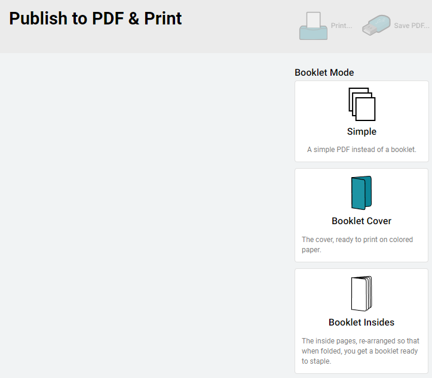

## Publish: New Web Upload {#7c5cf16c9e874d87b6ac3fb2d0001d17}

- Modern design is now consistent with other publishing options

- Part of our multi-year rewrite towards Mac and Linux compatibility

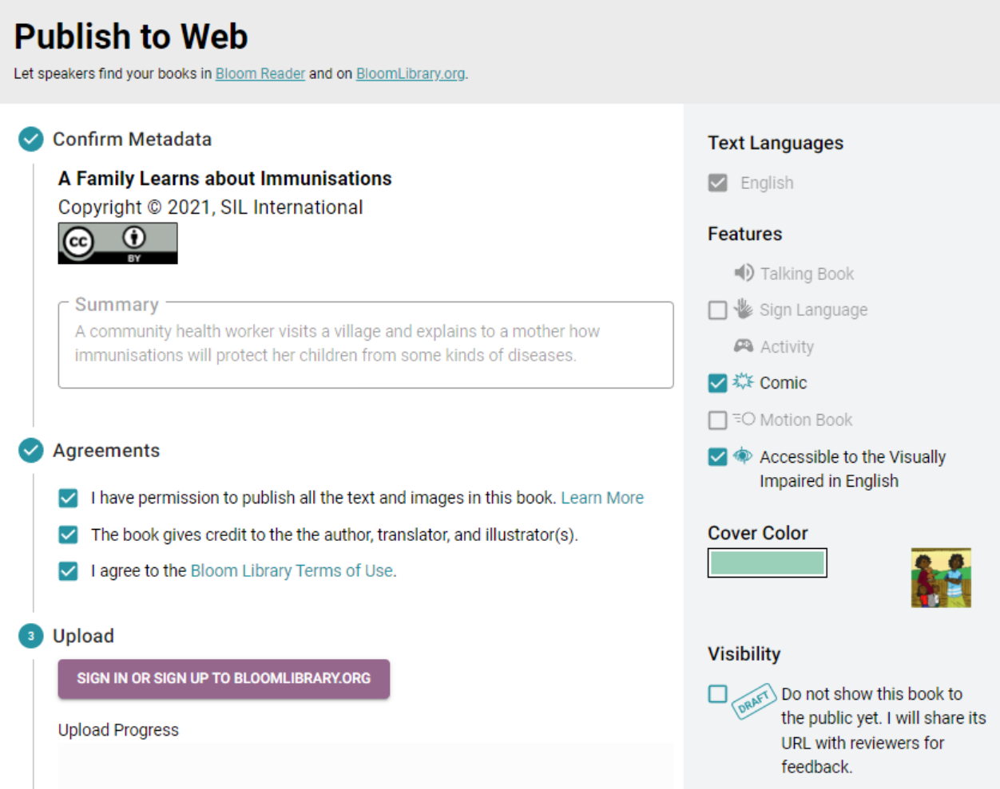

- If your book isn’t ready to meet the world just yet, you can now click the “Draft” button.

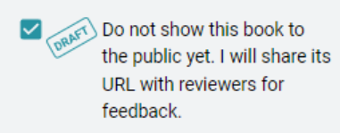

- To turn off the draft status of a book that you uploaded earlier, go to it on [BloomLibrary.org](http://bloomlibrary.org/) and un-tick the Draft button:

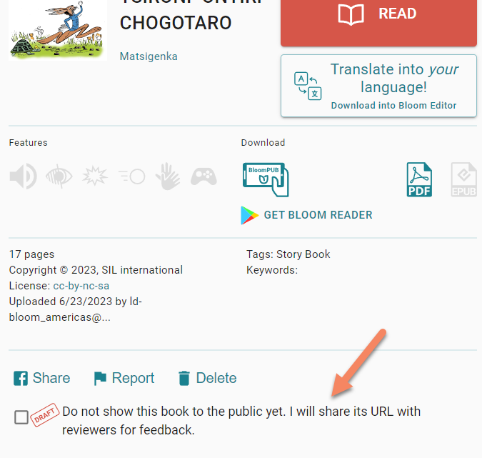

## Publish: BloomPUB Preview {#890c9b0f2a904c43b1f0a04bb886c3ac}

- We have reorganized this screen to work better for users with small screens. The preview portion no longer hides the portion where you can actually save and share your file.

- Bloom no longer constructs a Preview when you go into this screen. Instead, if you want a preview, click the new “Preview” button.

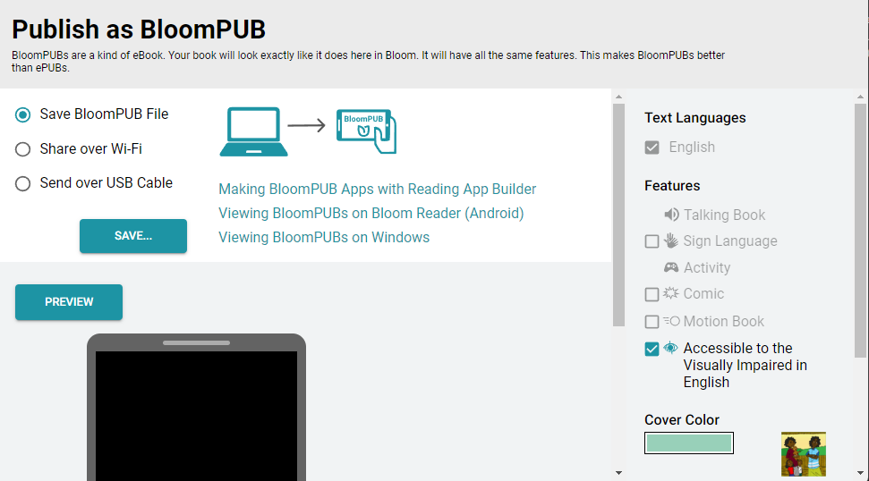

- You can now expand the preview to fill up most of the Bloom Window ([Feature Request](https://community.software.sil.org/t/large-preview-screen-for-bloompub/7491))

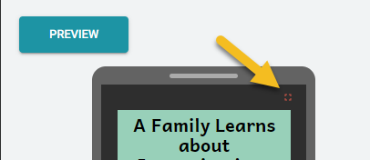

## Publish: ePUB Preview {#b91b3e6bd82845fa82e6bcb2475bdecb}

- As with the BloomPUB Preview, we have reorganized this screen to work better for users with small screens. The preview portion no longer hides the portion where you can actually save and share your file.
- As with the BloomPUB Preview, Bloom no longer constructs a Preview when you go into this screen. Instead, if you want a preview, click the new “Preview” button. ([Feature Request](https://community.software.sil.org/t/pause-epub-creation-in-publish-tab/6447/3))

## Talking Books {#c0887b5c62394606b5aee2a613fd4ae0}

We have renovated the Talking Book Tool “Advanced” section:

- You can now click “Insert Segment Marker” to break up your text into smaller portions for the purpose of highlighting audio. As always, you can also just type in the “|” character.

- These segment markers will be automatically hidden when you’re not using the Talking Book tool.

:::tip

Previously, you had to remove the “|” characters yourself. Now, just leave them in. Bloom will take care of hiding them.

:::

- We made the “Recording Mode” easier to understand and added pop-up tooltips explaining all advanced buttons.

- You can now fine-tune timings created when using Aeneas via the “Split” button ([Feature Request](https://community.software.sil.org/t/songbook-talking-book-audio-timing-file/7535))
	1. Click “Split”
	2. Click “Edit Timings File…”
	3. The file will open in whatever program you have chosen for “.txt” files.
	4. After editing, click “Apply Timings File…” and choose that file again.

- You can now apply timings files created from Audacity:
	1. In Audacity, open your audio.
	2. Tracks > Add New > Label Track
	3. Make segments that match what you have in Bloom
	4. File > Export > Export Labels
	5. In Bloom, “Apply Timings File…”

- You can now show and hide image descriptions (for the blind).

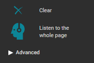

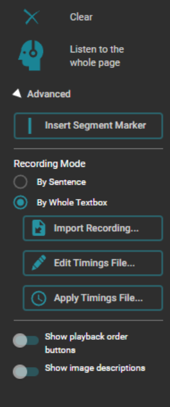

- You can now control both the foreground and background color of the highlight that Bloom uses while playing a talking book. This is part of the textbox style, so to change it, click on the gear icon in the lower left of the text box. Then go to the new “Highlighting” section. ([Feature Request](https://community.software.sil.org/t/easier-customization-of-talking-book-highlight-style/6830))

- Bloom now recognizes Khmer character ។ as a sentence-ending character.

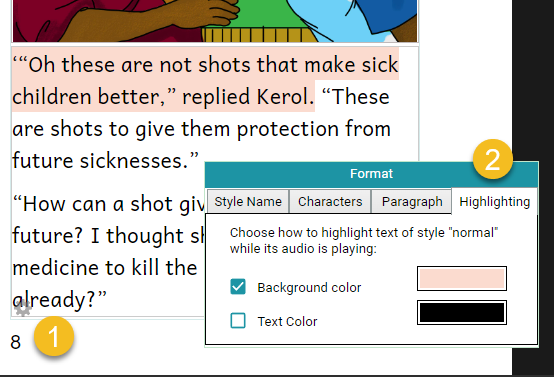

## Palettes {#e2f8f06bfd13497d863967447102c08b}

Bloom collections now remember what custom colors you have created. So whether you are setting text for a style, a text selection, an audio highlight, or an overlay text, you are working with the same palette.  Cover colors are a separate palette.

## Spreadsheet Import/Export  {#19de49c323e94e1ab09a9834ea5bd057}

:::caution

This feature is experimental. You can enable it under Collection Settings:Advanced

:::

:::note

This feature requires a Bloom Enterprise subscription.

:::

- Roundtrip Activities
- Roundtrip Image Descriptions
- Roundtrip colored words
- Importing Overlays now preserves text styles
- On import, remove pages that have been removed from the spreadsheet

## Overlays {#adf1d45d0d474bdfb5ce6c17adf2ed50}

:::note

Creating _**new**_ overlay pages requires a Bloom Enterprise subscription. Translating existing ones does not.

:::

- Overlays now work great in books that can be switched between languages. As you change to a different language, the size and location of bubbles are updated to match what they should be for that language.
- Overlay bubbles now respond better when you change the size/orientation of the book.

## Scrolling Text Boxes in Device Layouts {#ba12c7f8ad9e4d238a970ca36f913f60}

When a text box has more text than can fit, Bloom does several things to draw your attention to the "overflow". However, if you later view the book on the web or in Bloom Reader, we turn on a scrollbar and allow the user to scroll down to see the entire text. This has been true for a while now. With this new version, if you have chosen either of the "Device16x9" layouts, we don't make a big deal out of the overflow. We simply let it overflow and show a scrollbar.

:::caution

Note that for technical/cost reasons, this scrollbar actually takes up some of the box’s horizontal space, whereas during actual playback of the book, the scrollbar hovers above the text. So you won’t get exactly the same line-breaking.

:::

## Templates {#1559a3b827f9482f99829f3a56541daf}

- If you create a template book in your collection, you can now choose “**Make new book using this template”** to add a new book to your collection based on that template.

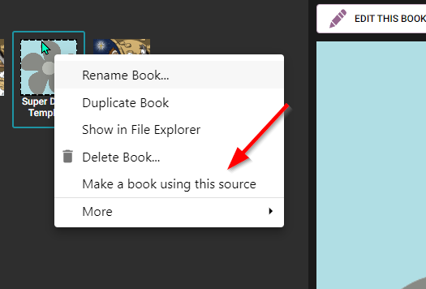

## Team Collections {#833f4ceceea941b284cc08b0259b5661}

- The Book History now includes Import events
- If you report a problem with a book, the Bloom Team now gets the Book History in the report, along with version numbers.

## BloomPUB Viewer {#e3df2921d39a462c92e6fce587b1b0e2}

- Added Full Screen Mode ([Feature Request](https://community.software.sil.org/t/full-screen-feature-in-bloompub-viewer/7301/3))

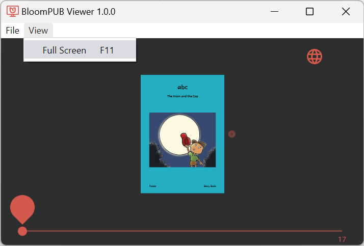

## Bloom Reader {#1e2b555371904177ac67463988de0feb}

- We improved handling of books in Right-to-Left languages. Now, to advance, you swipe left.

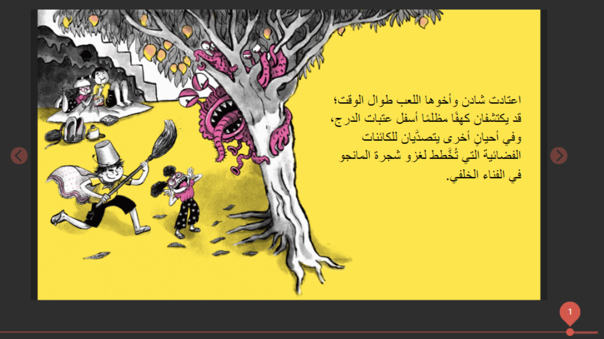

- When switching languages, Bloom now stops any audio that is playing, and starts the page over, playing the newly selected language.

## Bloom Library {#30b8603d705044a0963fd8868611f78b}

- We added a new set of statistics to the “stats” page for each collection.

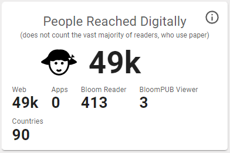

## Major Infrastructure Work {#87cd0515414e4b12a7bb36480049d728}

Much of our effort in this version was on updating Bloom’s “underpinnings”. If all goes well, this work should be invisible to you as a user. We mention it only because you might like to know that we are continually investing in the foundations of Bloom instead of just adding new features.

## The End of Andika New Basic {#652892e660564b8a8414380e1a5b668b}

Bloom’s default font has always been Andika New Basic (ANB), and before this version, we installed it on your computer along with Bloom. ANB is now completely replaceable by the [Andika ](https://software.sil.org/andika/)font, and will no longer be updated by its publisher (SIL). Therefore, in this version we have switched to Andika. As part of this switch,

- Bloom no longer installs ANB (or any other fonts). Instead, Andika is built-in to Bloom itself.

- All books that request ANB will actually be given Andika in the Bloom Editor software, in Bloom Reader, in BloomPUB viewer, and on the web.

- Bloom now also comes with another popular font, [ABeeZee](https://fonts.google.com/specimen/ABeeZee). This does not have nearly the range of glyphs to handle the world’s alphabets like Andika does, but it’s a fine option for languages with only the most common accent characters. See [https://fonts.google.com/specimen/ABeeZee/glyphs](https://fonts.google.com/specimen/ABeeZee/glyphs)

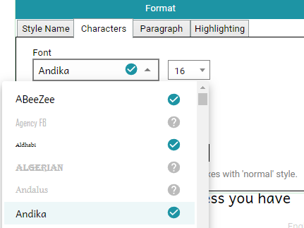

## The End of “Source Collections” {#eec12d6b500e4d4e8003e36007ba14f0}

The _idea_ of "Source Collections" may have had merit, but in practice, too many people were getting confused by them. Therefore, we reviewed all the various behaviors and features related to Source Collections, and for each one, we either created new ways to achieve the same thing or decided that it was not worth keeping.

- We’ve removed the "Choose the collection type" page in the “Create New Bloom Collection” wizard.
- Books are never locked
- You can always give the command to "Make Bloom Pack of Shell Books"

- You can now remove collections under “Sources for New Books” (1, below).

- If you want to show a collection on your machine in the “Sources for New Books”, there is now a button to do that (2, below).

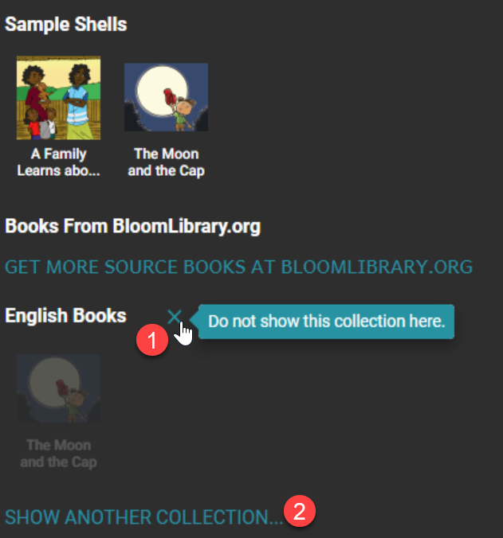

## The End of Bloom Updates for Windows 7, 8, and 8.1 {#45d2af0275fc4ca89ae94264e38dce71}

Bloom 5.4 was the last version of Bloom that supported these operating systems, which Microsoft no longer supports.

## The End of Linux Updates (for now) {#1a23f47c824b43adb6f14c43cf022e0f}

Bloom 5.4 was the last version of Bloom for now. Ideally, in several years, we hope (but do not promise) that we will again have the technology and staff required to ship new releases for Linux (and Mac).

**Technical Details**: Bloom started as a Windows-only application, using .net technologies plus an embedded web browser. Unfortunately, a software key component (_geckofx_) stopped development a few years ago. GeckoFX was the magic that allowed us to embed a Firefox Browser in our .net application. Bloom relies on over a thousand other open-source libraries, and increasingly, we cannot make use of _their_ updates and fixes, because our browser is stuck in 2018. We have only a small amount of resources to spend, and we can't justify spending an increasing amount of it going against the tide. Bloom 5.5 uses a modern embedded browser, _WebView2_ from Microsoft.

We will eventually get Bloom to a state where its UI is no longer a hybrid of .net and browser UI. With each version, we are retiring some .net UI and replacing it with browser UI. When this process is complete, then new cross-platform possibilities will open up, be it a .net/electron or something else. Microsoft may also deliver _WebView2_, for Linux and Mac (they list this on [their roadmap](https://docs.microsoft.com/en-us/microsoft-edge/webview2/roadmap), in a non-committal way).

See also:

[Install Bloom on Linux](/installing-bloom-linux)

## The End of Graphite Font Support {#2741a1296b554bf98d7cb952638cb775}

A software component (_geckofx_) that Bloom has used to support Graphite fonts is no longer being maintained by its author, and the Bloom team does not have the resources to maintain it. Therefore, starting with Bloom 5.5, we are switching to an alternative that is maintained by Microsoft. This has many benefits for us, but one downside is that Bloom will no longer support complex non-roman scripts that require “Graphite” technology. For most non-roman fonts, this will not be a problem. However, Nastaliq and Lanna fonts do require Graphite. As far as we can tell, no one has ever contributed a book to Bloom Library using these fonts, and our analytics tell us that no books are using it with Bloom 5.4. If you need Graphite font technology, please use Bloom 5.4 and also contact us.

## The End of Adobe Reader {#cbc634239daa43189414d19d4d698057}

Bloom no longer uses Adobe Reader, so there is no need to install it anymore if you don’t already have it.

