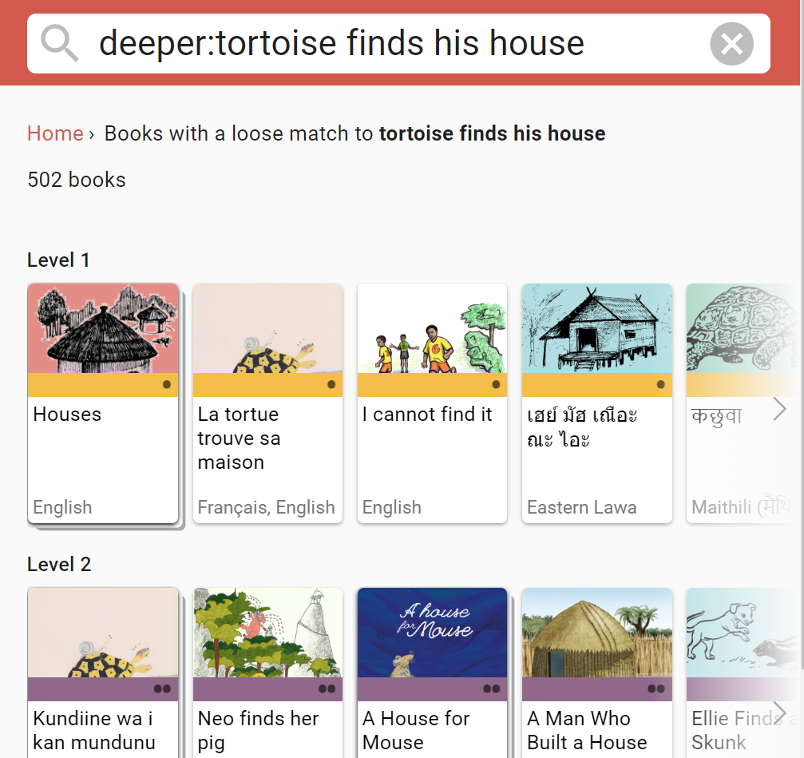
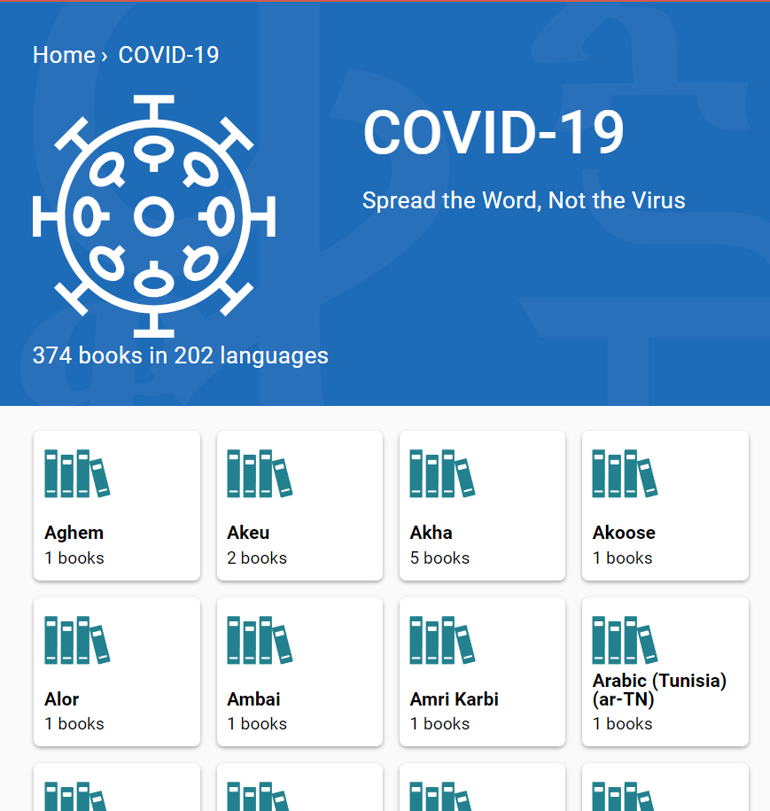

## Collection Tab {#495e77f18305415591b5375d0d1383c9}

### Books on BloomLibrary.org Progress Bar {#1e394c764431430e9a5cab1940b55ae9}

- Bloom now displays an indicator of how many books in your language are currently available on the Bloom Library.  For now, the “goal” is just the Bloom project’s goal, which is 200 books in each language. In the future, we may allow you to change this number to your own goal.

### Books on BloomLibrary.org Badges {#47f1b3df61d243b386fb482cd1275861}

- We added helpful little “badges” to book thumbnails that make it easy to see the status of your book on the Bloom Library.

## Edit Tab {#e17410d3193a4bee9f8cca78ea06c157}

- You can now hold down Ctrl+Shift+space to see all “invisible” characters, such as non-breaking spaces.
- We added a new Book Settings dialog. For now, it lets you control the maximum image size used in eBooks that you create from a book.  The default is HD, but you can shrink that or increase it up to 4k resolution. This setting affects BloomPUBs, ePUBs, and books when they are viewed on BloomLibrary.org.

## Team Collections  {#1ffc2657146a4019ac6a17bc5fefe2c7}

- “Check Out” events are now recorded in book history.

- We added a minimal “Check In All” feature. To use it, Click the “Team Collections” button, “Status” tab, and click “Check In All Books”

### Talking Book Tool {#125ca4c8d6aa42338eec70bd525f7ebc}

- If you have added any sentence-ending punctuation characters in the Leveled Reader Tool settings, the Talking Book Tool will now use those in addition to the universal set of sentence-ending characters.

## Leveled and Decodable Readers {#f1e7802f9103458d8364af8e62716a3b}

In previous versions, there was a menu command in the Collection tab that you could use to tell Bloom if a book was intended to be _leveled_ or _decodable_. This setting could trigger the cover page to convey this information. In this version, we’ve removed those menu items, and instead, there is now a switch in the reader tools:

## Publish {#2991d3cfca2f447693ce8d395f102667}

- We  completed the code modernization in this area. The only difference you will notice is the side bar that lets you choose your publishing target.

## Bloom Library {#97542ddb00634cd98c176d8f49a09d80}

- We improved search by introducing two levels. In the initial level, you will see books with titles matching your search more precisely. If that doesn’t find the book you want, you can then click “Search Deeper” to search in copyright, publisher, parts of the title, etc. For example, if you search for “tortoise finds his house”, you would previously be shown 502 books all of which had something to do with tortoises, houses, or finding. After this change, Bloom Library just shows you one book. Clicking on “Search Deeper” still gives you the full list of 502 books.

- We made it easy for the Bloom Librarian to organize large collections by displaying a card for each language.

- We added a “Branding” column to the Grid. ([Feature Request](https://community.software.sil.org/t/add-branding-to-the-grid-view-in-the-library/8063))

- In some collections, there are a high number of books that are derivatives of each other. We made Bloom Library smarter about choosing which books to show and which to hide. For example, we have 121 [COVID 19 books in English](https://bloomlibrary.org/covid19/:language:en), but we now display just 41 of them. You can still get to the hidden books by opening one of them and clicking on “books that may be translations.” Note that for performance reasons, the top of the page shows the count of the _total_ number of books in the collection.

- We made book thumbnails sensitive to what language you are looking in, so that you are more likely to see a book title in your language, even for books that were uploaded with a different primary language.

## Other Improvements {#058e8f3eee2a41dd8852d755b5b8d789}

- We Improved our OPDS API.
- We improved vertical alignment with overflow in device layouts, but only somewhat. If you are putting large amounts of text in a box such that it doesn’t all fit, we recommend changing the vertical alignment to “Top”.
- We added a message box that invites users to join the [Bloom Community Forum](https://community.software.sil.org/c/bloom/5).
- If you send us an error report we will now receive more information, including your Windows 11 info, drive space, and WebView2 version.
- .bloomSource files now include the .bloomCollectionSettings file, making for a more complete archive.
- Big Books can now have pages in A3, A4, and Letter portait orientation. Previously they were only available in landscape. ([Feature Request](https://community.software.sil.org/t/portrait-format-big-books/8771))
