We are proud to present Bloom 6.0 to you. We finally tackled a few long-standing needs that required re-modeling how some things work deep inside Bloom and our servers. Everyone will benefit from Bloom books that are now a bit more beautiful and professional-looking. If you ever need to update books on BloomLibrary.org, you will notice much quicker updates. Bloom Enterprise subscribers can finally take ownership of all their books, regardless of which team member uploaded them.

## Book Settings {#c29cb0c6a6d44842b1c207b884f34c37}

### Cover Settings {#bcdc092e15674cd4ab897fd5f8a8aad5}

You can now control what information to show on the cover page:

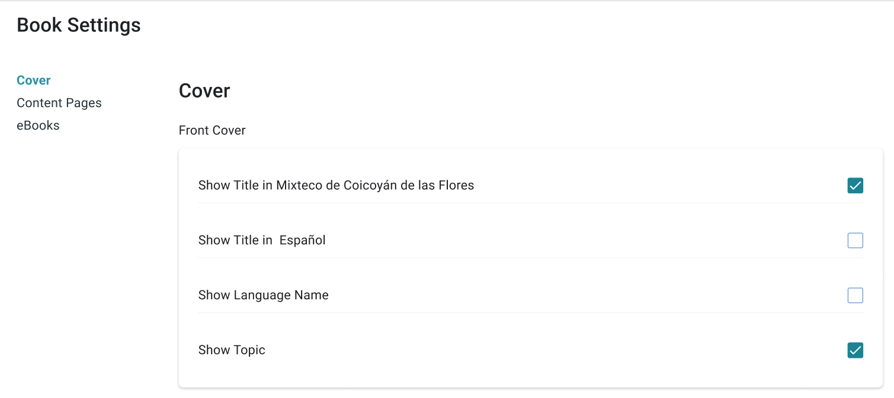

### Content Page Settings: Page Themes {#bd291e96f2d2400d860d1c6636cd8df8}

Previously, _very_ advanced Bloom users could customize Bloom pages using CSS stylesheets. They could also publish template books using these to share their work with others. Bloom 6.0 makes this much easier by letting you choose from a small number of _Page Themes._  Page Themes are a bundle of margins, borders, and other page settings that work together to shape the look of a book.

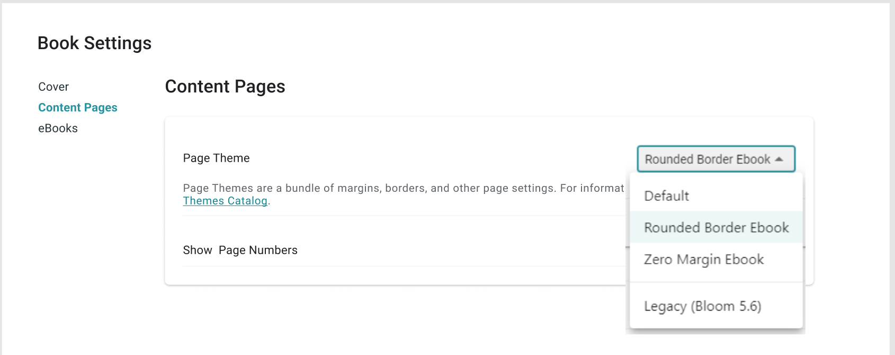

For more information on these themes, see the [Page Themes Catalog](/page-themes-catalog).

:::tip

Very advanced users can still create custom CSS stylesheets if they need to. In fact, we’ve made writing them [much easier](/appearance-system-css). However, we hope this will become a rare practice restricted to experimentation. Anything that can be done with a custom stylesheet can now be moved into a new _theme_ or setting, where it will be available to Bloom users of all skill levels.

:::

### Content Page Settings: Show Page Numbers {#2fa052330ea64f3791781a1919d1e754}

You can now control whether page numbers are visible. Note that with some combinations of book layouts and ebook themes, long texts could collide with page numbers.

### Content Page Settings: Text Padding {#1044bb19df12809a8369dbee37f0234e}

Smart text padding is a new feature in Bloom 6.1. You can see examples of it later in these Release Notes. 

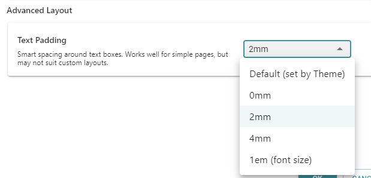

:::tip

The default padding setting from the Default Theme is “1em”, which means it grows in proportion to your font size (approximately the width of the font’s “m” character). Normally this looks great but if you have really large characters, it can be a problem. In that case, choose one of the millimetre (mm) choices.

:::

:::caution

If you have a custom page layout where Bloom isn’t getting the padding right, you can use this control to turn padding off by setting it to “0mm”.

:::

## Margins {#ad8a99c4ae414b74aa742f70491b7e75}

In previous versions of Bloom, the default margins were rather large, especially on small page sizes. In Bloom 6.0, we’ve reduced [the default margins](/margins) for many page sizes. _Page Themes_ (new in Bloom 6.0) can also change the margin.

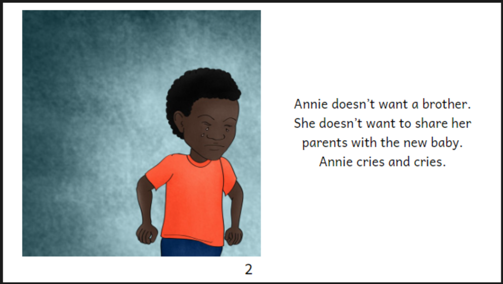

Bloom 5.6 had large margins and always showed a page number.

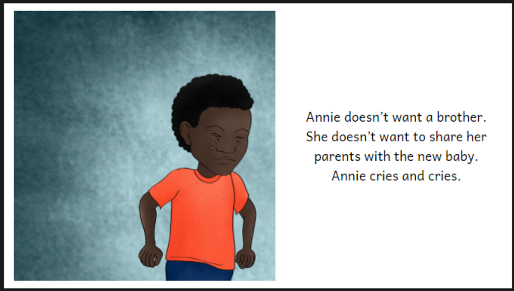

Bloom 6.0 ebook with default theme

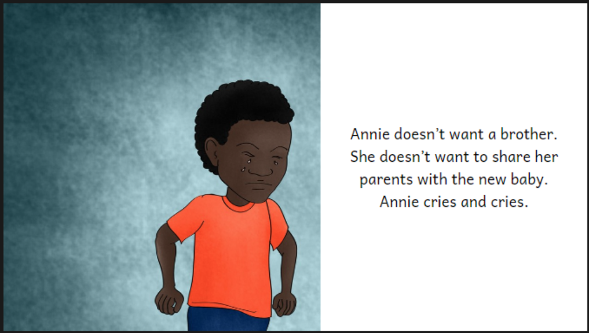

Bloom 6.0 ebook with the “Zero Margin” theme

Bloom 6.0 with the “Zero Margin” theme

:::tip

Due to changes in the margins, you might need to modify the split between the image and text to resize the image for an ideal fit.

:::

### Front and Back Cover Margins {#bb5d8a2d9d934e31b88ba11637c9d67f}

The smaller default page margins affect the front and back covers as well as the inside pages.  This results in the various cover elements such as titles, pictures, credits, and logos moving slightly and possibly becoming a bit larger.  (The changed text wrapping of the title is discussed below.)

Bloom 5.6

Bloom 6.0

## Padding {#02bad6edddbd4ab0be35b0f744a68e1b}

In previous versions of Bloom, text was often very close to images:

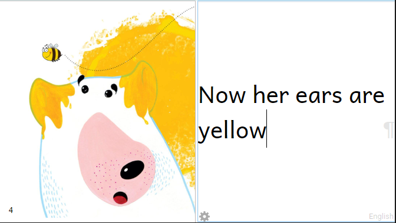

Bloom 5.6, text is too close to the image and edge of page.

Bloom can now add padding to text boxes so that they will look a lot better. This “smart padding” appears as a light blue area when you’re editing. It is smart in two ways:

1. It considers page margins so that less padding is added if it's not needed to separate the text from the edge of the page.

2. It grows as the font size grows.

:::note

In multilingual books, the padding will be based on the font size of the first language.

:::

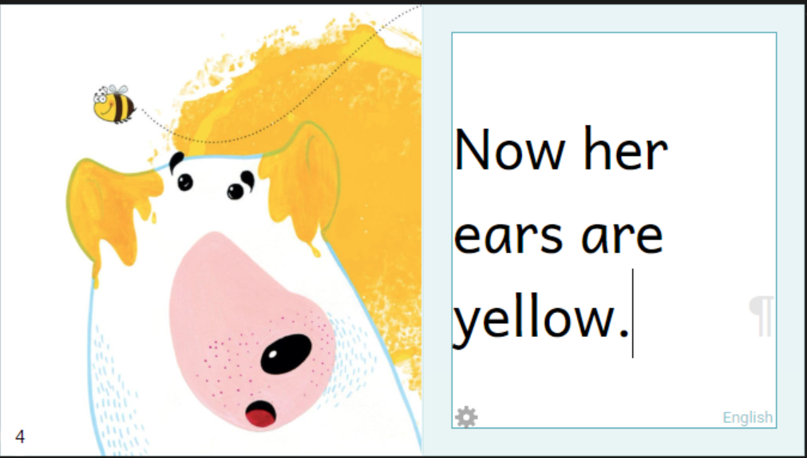

Bloom 6.0, Bloom adds padding around the text. It can tell that there is no page margin here, so it adds padding next to the edge of the page, too.

You can now click in the dark area outside of the page in order to hide all the markup. This helps you see the page just as your readers will see it.

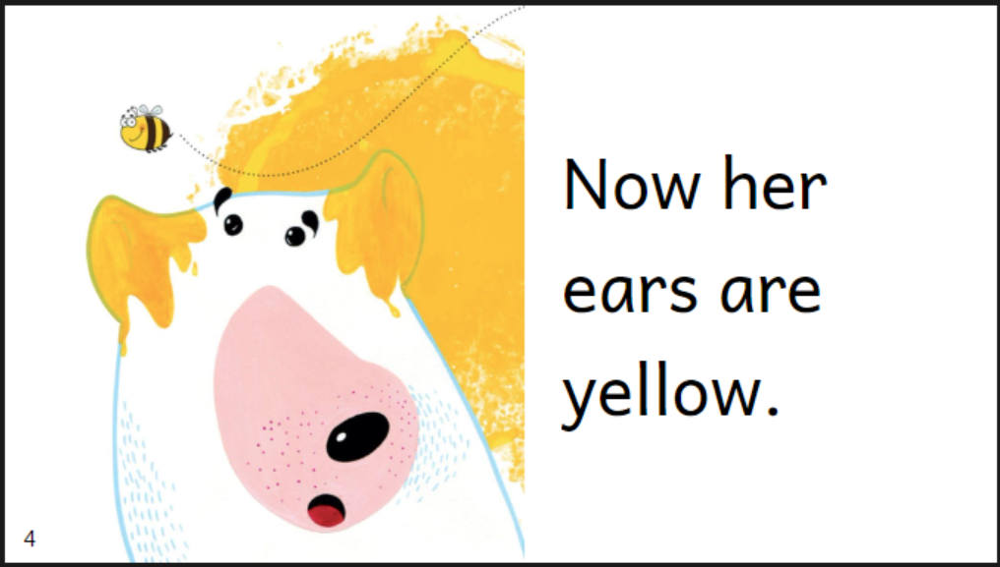

In Bloom 6.0, if you click outside of the page, all the extra editing markup disappears so that you can evaluate how your page will look to readers.

You can control the size of the padding in the Text Padding control:

:::caution

While Bloom tries to be “smart” about applying padding, it’s actually quite fragile. It often fails to apply padding to text boxes that have been added via “Change Layout”. If this happens to you, you have a couple options:
1. Turn Text Padding off by opening the Book Settings and set “Text Padding” to “0mm”.

2. If you are an Enterprise Subscription customer and you have a template page that needs to work with padding, create a Problem Report showing the problem and we’ll fix Bloom to handle your template page.

:::

## Edit Tab {#7989dbabeb354bffb02132c00ae8a4af}

### Text Formatting {#fcd9a64087fe49f4836dbc7b28dacb47}

In overlays (comics), you can now control how much padding to add on the left and right:

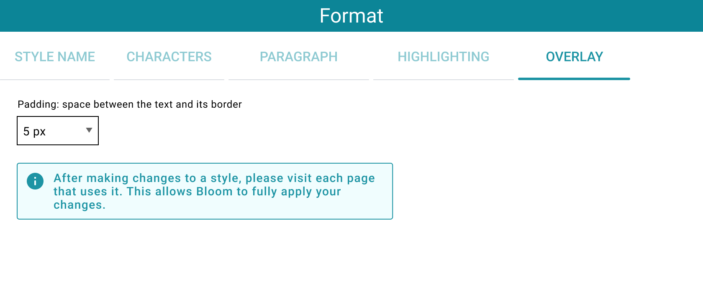

### Justified Alignment ([Feature Request](https://community.software.sil.org/t/justified-text-alignment/8091)) {#2b21fd203ff546adabfb4f7ed73d3156}

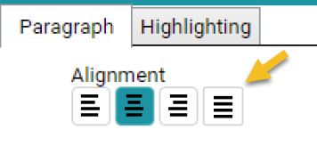

### Text Wrapping {#30ac975047114e1593170902683743d3}

We’ve made Bloom smarter about where to wrap text, leading to a more balanced and appealing typography.

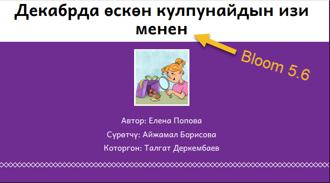

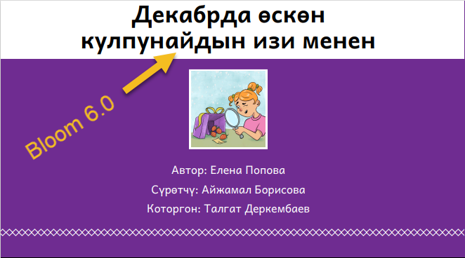

Bloom 6.0 makes titles look more balanced.

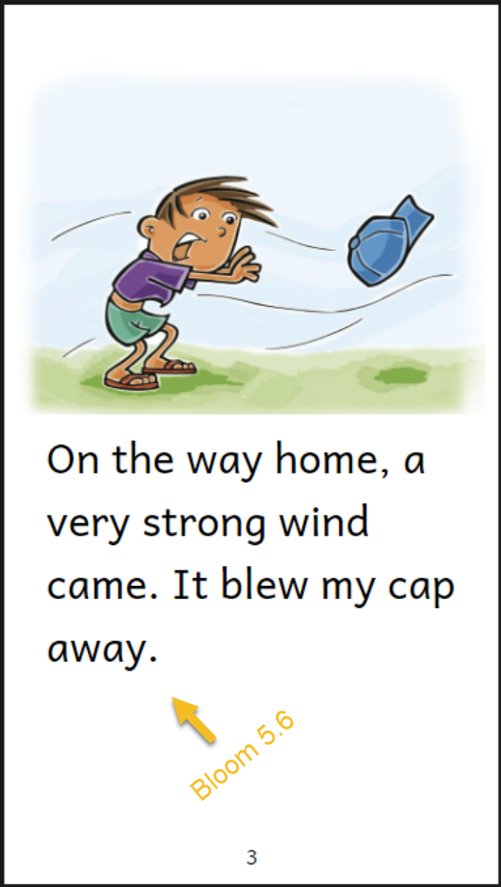

Previously, a single word could be stranded on its own.

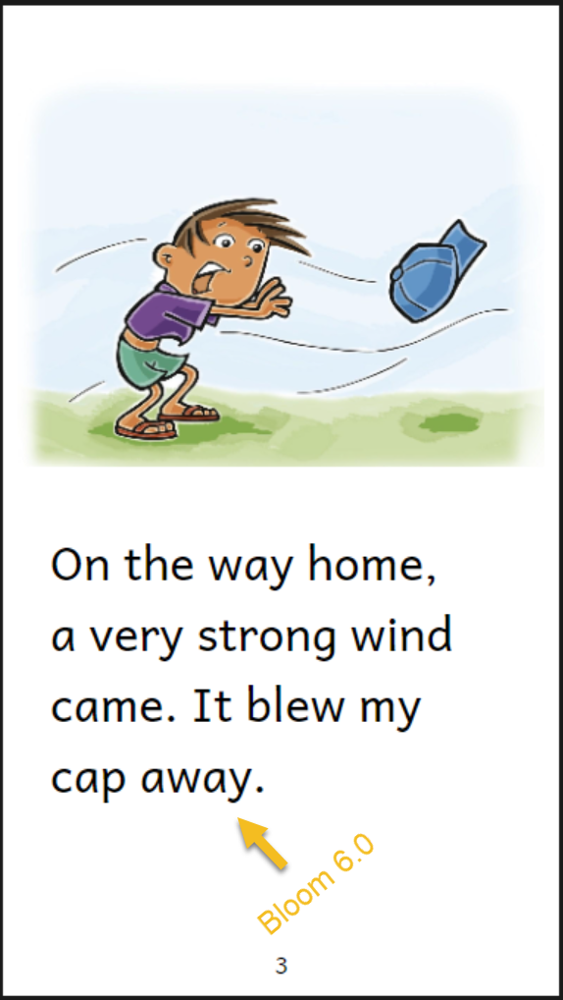

Bloom 6.0 uses smarter text wrapping.

:::tip

This smart wrapping would be confusing if it was on while you tried to type in your text. Therefore, you need to click out of a text box in order to see the final text wrapping.

:::

### Picture on the Right {#bf52c033e9d84e17bb470ea5db91771b}

We’ve added a new page layout choice, “Picture on the Right”.

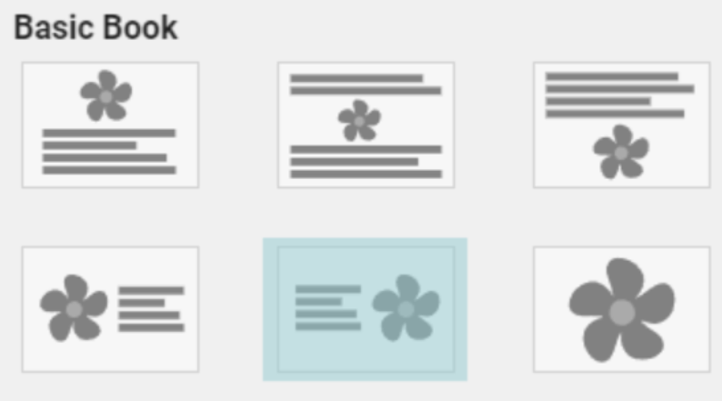

## Bloom Library {#c80de714dea74eeaacd333db2fa0ee58}

### Improved User Interface for Book Uploaders {#042f7008ce844e5f81386e611f110ff9}

The person who uploaded a book always had a few extra things they could do to control the book. We’ve now gathered these together in a single cluster of controls:

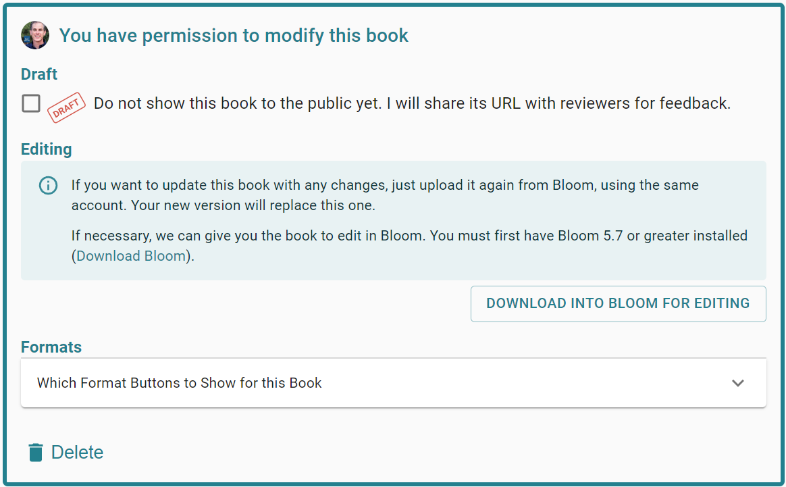

### “Download Into Bloom for Editing” Button {#5e996d28e7a94c07928a6f8a1e6f04dd}

Sometimes, you may want to improve a book you or a colleague uploaded but no longer have easy access to the original Bloom files. Now, you can click “Download into Bloom for Editing.” This will open your Bloom Editor application with a new collection containing only this one book. If the book depends on a Bloom Enterprise Subscription, you will not have to re-enter it. If the subscription has expired, it will work anyway.

### Editing Permissions on Your Bloom Library Collections (Bookshelves) {#286550b872b54090831f78c3e11c90d4}

Bloom Enterprise subscribers often work in teams, with different people uploading books. Previously, only the person who uploaded a book had any control over it. We can now tell the Bloom Library who each collection’s “editors” are. The following table shows what Collection Editors will be able to do:

|                    | 5.6                                  | 6.0 Timeframe                                                                                                                                  | 6.1 Timeframe                                                     |
| ------------------ | ------------------------------------ | ---------------------------------------------------------------------------------------------------------------------------------------------- | ----------------------------------------------------------------- |
| Original Uploader  | Draft Delete Control Formats | Download into Bloom for Editing                                                                                                                |                                                                   |
| Collection Editors |                                      | Delete Download into Bloom for Editing Re-upload without changing the listed “uploader” Re-upload and become the listed “uploader” | Draft Control Formats Assign to Collections (Bookshelves) |

When you re-upload a book, Bloom checks with you to make sure it does what you intend. In Bloom 6.0, we added (1) a check to bring it to your attention if you’re about to change the book’s branding and (2) the option to become the official uploader:

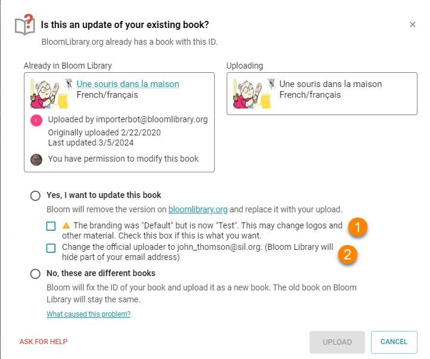

## BloomPUB Viewer {#9f34e37cfdef4ecab8d4aa38737a0bfc}

BloomPUB viewer can now open .bloomSource files (used for archiving) and .bloom files (used for Team Collections).  You should not distribute those for viewing, but sometimes it’s helpful to quickly look inside one of them.

:::caution

BloomPUB Viewer versions 1.0.7 and 1.0.8 had a bug that prevented them from updating to new versions. Please install the latest from [bloomlibrary.org/bloompub-viewer](https://bloomlibrary.org/bloompub-viewer).

:::

## Other Improvements {#f0c7b7116e3d459295ff6dee92c89f2e}

- Book Uploading:
	- **Incremental uploads**: If you upload a book to update it, only the files that have changed will be uploaded. This allows, for example, large sign language books to be updated without having to send all the videos to [BloomLibrary.org](http://bloomlibrary.org/) again.
	- **Incomplete upload protection**: previously, a book upload that didn’t fully complete could leave a book missing some files. Now, a new book won’t appear until all the files have been uploaded successfully. Similarly, an update of a book won’t take effect until all changed files have made it to our server.
	- **Improved security:** We improved security around uploading and deleting books.
- We added some new messages to help when Microsoft OneDrive appears to be causing problems.
- A page can now have multiple Sign Language videos. One will start when other is finished. There is no way to change the order, so please create the videos in the order you want them to play.
- In the Edit tab, Bloom has a chooser that lets you control which languages are shown in text boxes that are set to “auto”. To clarify what this chooser does a bit, it is now disabled when it won’t affect anything on the current page.
- We added a place to enter one or more administrator emails in Collection Settings: **Team Collection**.

- In the **Collection Tab**, we’ve added a small control that pops up some technical information about books:

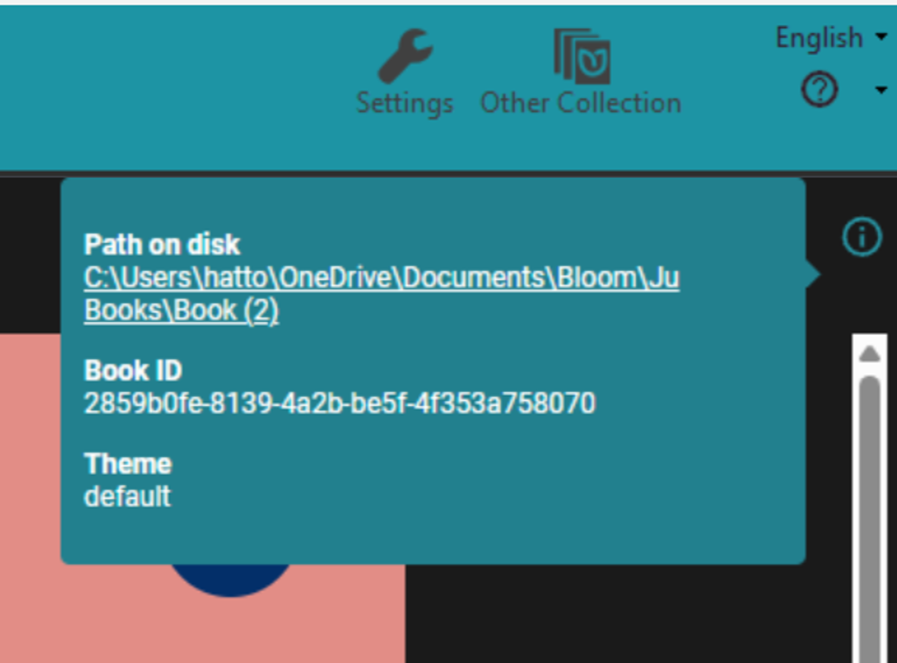

