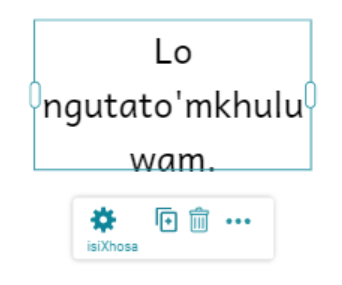
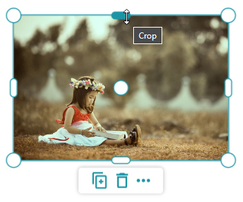
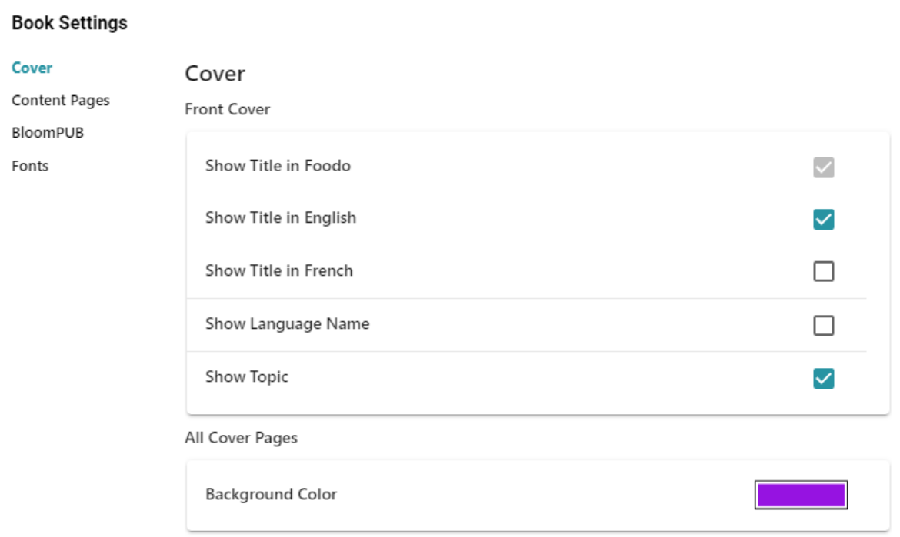
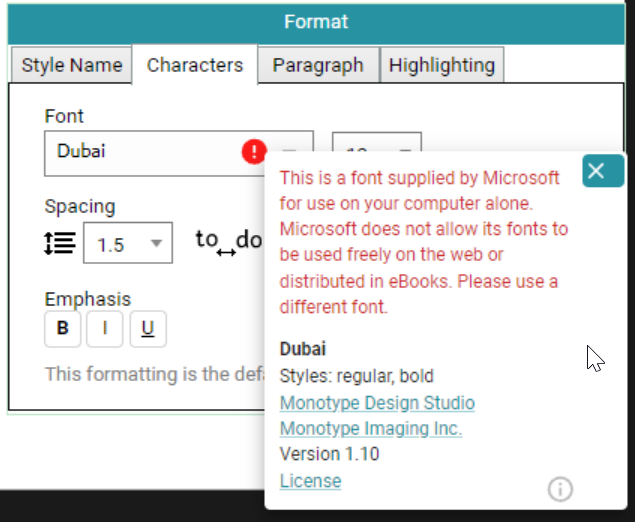
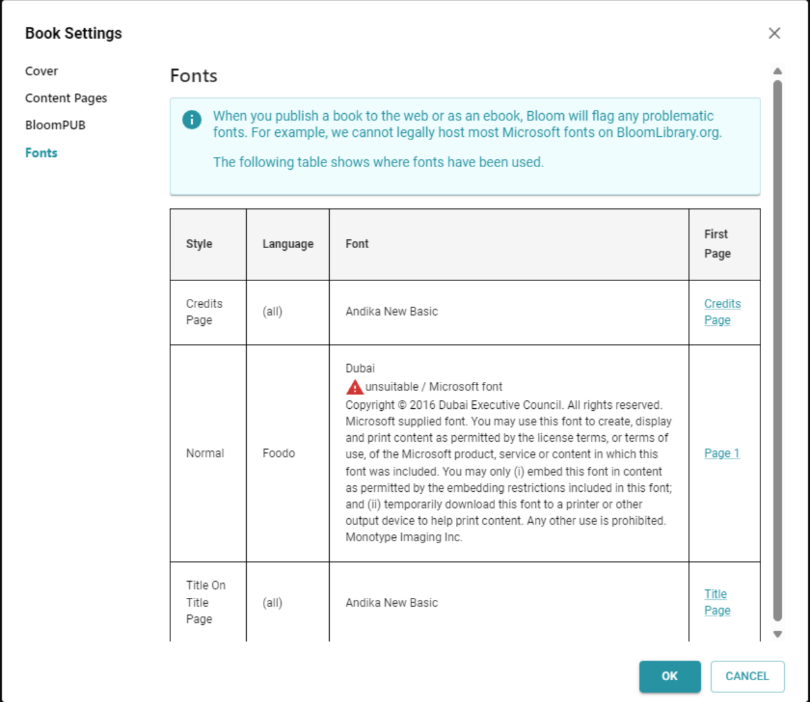
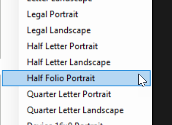
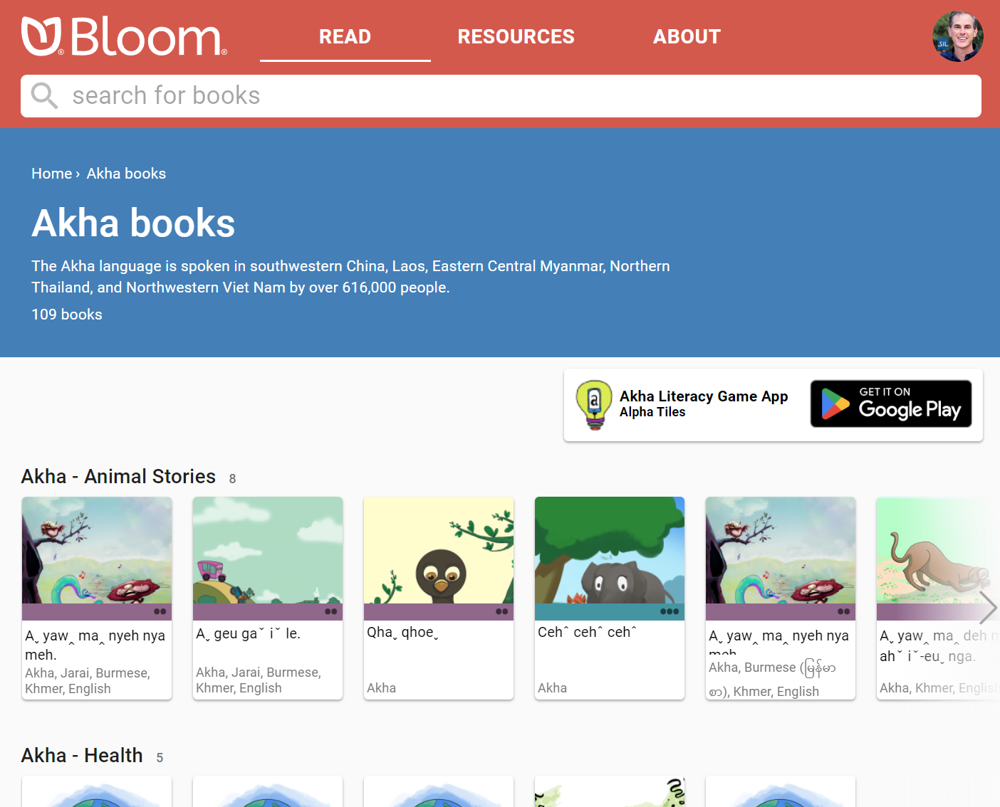
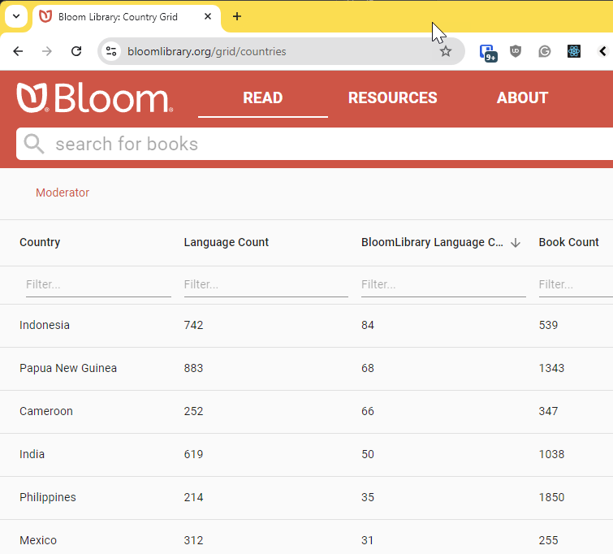

## Improved Overlay Tool {#5fa3e7bb2b8b45af8b88ac591a80f351}

We’ve made it easy to move, crop, and manipulate overlay items. They now operate more like those in modern graphics programs such as Canva.com and Microsoft Designer. We made these improvements as part of our work towards a new feature called “Bloom Games”, coming in Bloom 6.2.

For a menu of options, click the “…” button or just right-click on the element.

## Cover Color {#f3abdcc748d44c189b654dd489f535f1}

We moved the control for setting a custom cover color from the Publish screens to Book Settings, so that you can set the color you want before you’re ready to publish.

## Font Suitability {#c4fd9e98056547aa89e2df3274e52467}

We’ve made it more obvious when a font’s license does not allow redistribution.

In Book Settings, you can now see all the fonts used in a book and check on their suitability for use in Bloom Reader, BloomLibrary.org, Reading App Builder, and every other digital platform.

## Half Folio Paper {#844989a56c0a49e1a71ca145215ea36e}

You can now specify a half folio paper size, which is popular in Colombia.

## Alpha Tiles Links {#6355bf84d8c44ce2af8ba80b253b73ef}

BloomLibrary.org can now include a link to your [Alpha Tiles](https://alphatilesapps.org/) app at the top of your language page:

## Language and Country Grids {#2252b625fad74e9b81a2a255ca214a0f}

We’ve added two new grids for finding and counting things on BloomLibrary.org. You can now view [books](https://bloomlibrary.org/grid/books), [languages](https://bloomlibrary.org/grid/languages), and [countries](https://bloomlibrary.org/grid/countries). Note that where a language is found in multiple countries (e.g. English), we assign it to just one for display purposes. Otherwise the count of languages in a country becomes unhelpful, as they include all the languages in modern use there, not just the languages that are indigenous to the country.

## Sign Language Videos {#f41a1ed868cf47d9aa37b973f31366a2}

Some Bloom Sign Language book creators requested a few improvements to video playback:

- Videos now include standard playback controls, so you can start over without having to wait until the end.
- Videos no longer hide when finished.
- We fixed video replay functionality.

## Custom language names in collections with many languages {#c0a1979938414886b0a1e316420e678c}

Bloom has a “default” name for each language, which you can customize when you pick the language. Before this version, Bloom could remember these custom languages for just the L1, L2, L3, and Sign Language. However, if you are importing more than 3 languages via Spreadsheet Import, Bloom would forget how you want to display those other languages.

We are addressing this in two stages.

1. In this version, Bloom Collections will remember any number of custom language names. However, if you use the “Look up Language Code” tool — for example, to print with one of those other languages — you will have to re-enter the language the way you want to see it.
2. Later this year, Bloom 6.2 will include a brand new Language Picker that will be able to preserve your customized language name.
