## New Subscription Options {#1fa4bb19df12814cac6cd6410c4e7fd2}

We now offer three subscription options: **Free (Bloom Basic)**, **Bloom Pro**, and **Bloom Enterprise**.

- **Bloom Pro** is designed for individual users who need access to a few advanced features beyond the free version.
- **Bloom Enterprise** is intended for organizations managing large-scale projects or multiple languages. It includes the most powerful tools for customizing books, managing program-specific Bloom Library pages, and accessing project analytics.

We are pleased to continue offering many Enterprise features **freely to local communities** creating books with their own resources. If your project is fully funded and managed by your language community, you may qualify for a free license; see [Bloom Subscriptions](/about-bloom-subscriptions) to learn more.

Features that require our staff to do custom work (such as branded templates, private shelves, or custom analytics) are limited to Enterprise subscribers.

Each subscription includes access for a defined number of users:

- **Bloom Pro**: 1 user
- **Bloom Enterprise**: Organization-wide access (unlimited seats)

## New Language Chooser {#1fa4bb19df128151bd8cc161aa4ba3ed}

Subscription Tier: Free

We’ve replaced the old language chooser with a new one that makes it easier for people to find their language and script:

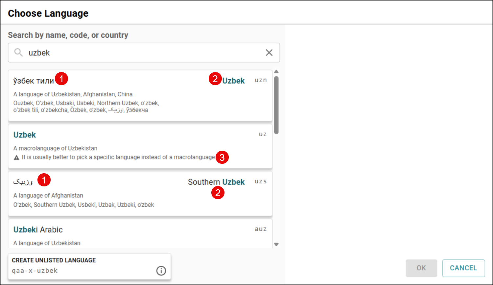

1. The name as used locally.
2. The name as found externally (for example: in standards like ISO 639-3).
3. A notice discouraging the use of macrolanguages when a specific variety is known.

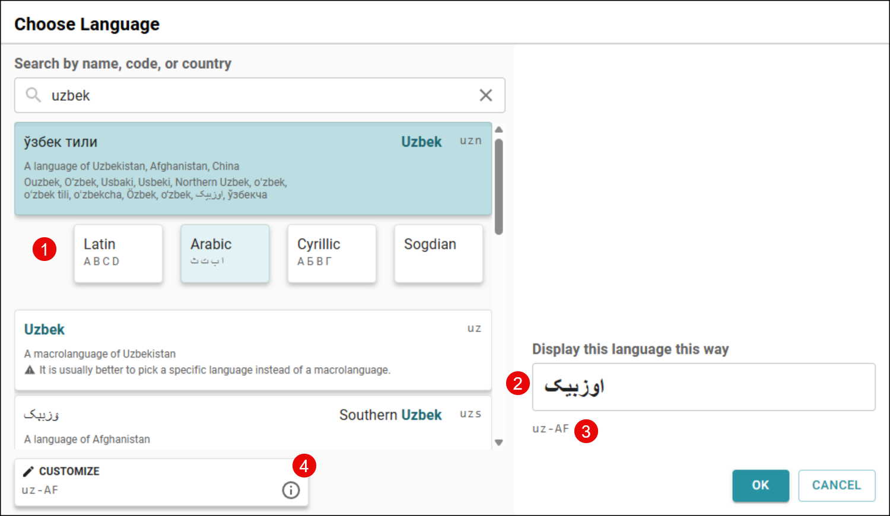

1. Once you choose a language, if it has multiple scripts, Bloom prompts you to choose a script.
2. Bloom fills in the display name using the selected script. You can change this if you want the language displayed differently.
3. You can see the language tag that will be used, based on your choices.
4. If you need to customize the tag further, there’s a button for that.

## Image Cropping and Positioning {#1fa4bb19df128148a045d4930e2629e8}

Subscription Tier: Free

In Bloom 6.1, we added new cropping and positioning tools for “overlay” images. Now in Bloom 6.2, these features are available for _all_ images, allowing you to quickly crop and position images without external tools. We’ve also added a handy “Expand image to fill space” button.

For example, let’s adapt a page designed for print to look great in eBooks. First, in the **Book settings**, we change the theme to “Zero Margin eBook”. Notice that this leaves unsightly gaps above and below the image:

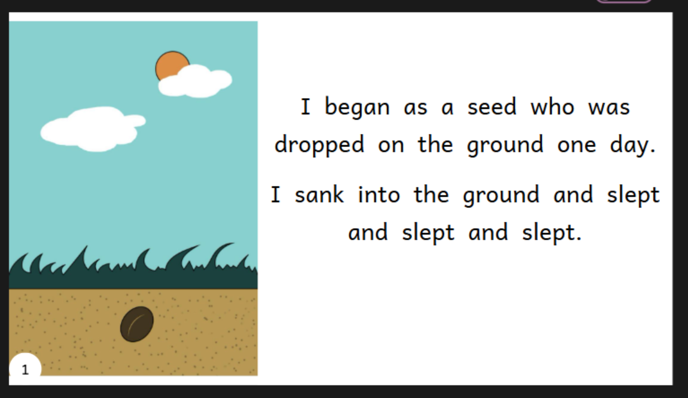

Clicking our new button:

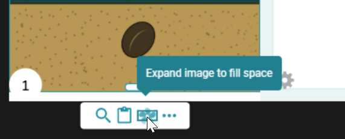

We get:

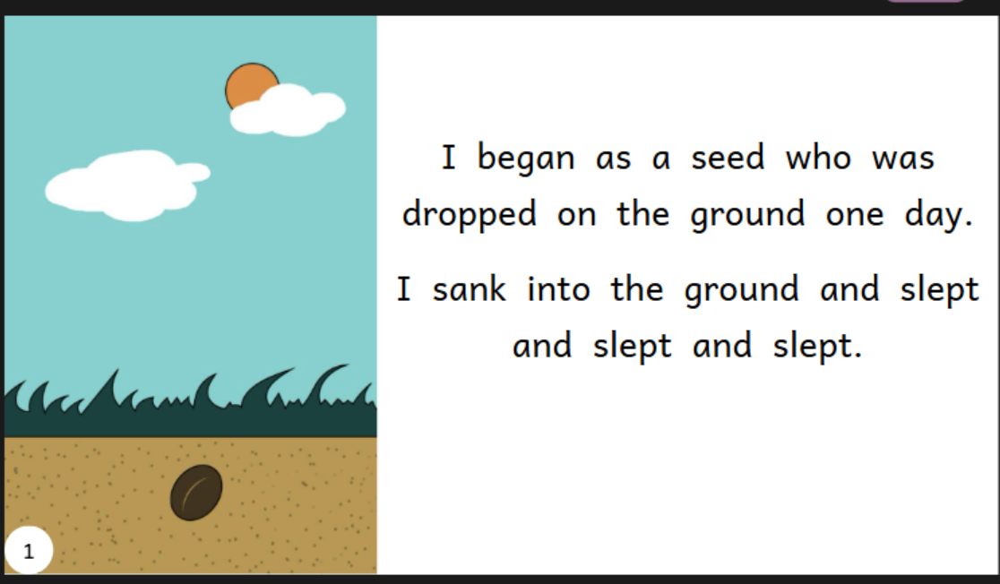

Perfect! Bloom automatically zooms and crops the image to fill the available space. If you don’t like the automatic zoom and crop, you can use the circle in the middle of the image to adjust it:

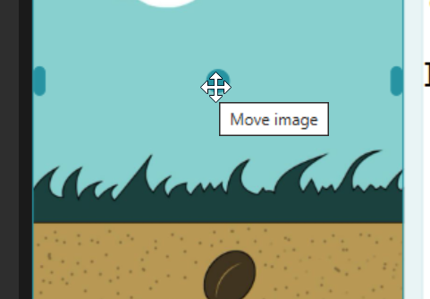

## Image Alignment Guides {#1fa4bb19df1281a1af80e825a91ab915}

Subscription Tier: Pro and Above

In Overlay pages and Games, we’ve added simple visual aids to help you align objects:

1. Objects now snap to a 10-pixel grid. To override this, hold down CTRL while moving the object.
2. Red guide lines appear to show what other objects are aligned with the object you are moving.

	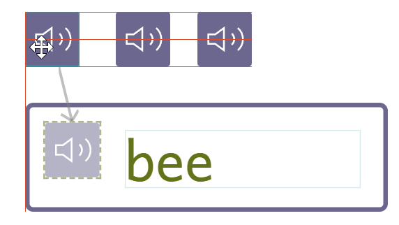

3. Green bars indicate which objects are the same height or width as the object you are resizing.

	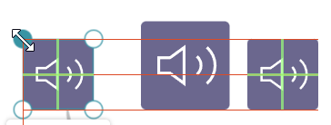

## Full-Image Covers {#1fa4bb19df1281089a9cde312ab1629c}

Subscription Tier: Pro and Above

Walk into any bookstore, and you’ll notice children’s books rarely feature a title, then an image, then author/illustrator credits neatly separated. Instead, they typically showcase one beautiful image with colorful and stylized text placed on top.

In areas where under-resourced languages compete with dominant languages, the attractiveness of a book can subtly influence the perceived prestige of the language itself. To help narrow this gap, Bloom 6.2 takes a first step towards enabling “professional” looking covers. In the **Book settings**, you can now tell Bloom to fill the front cover with a single image.

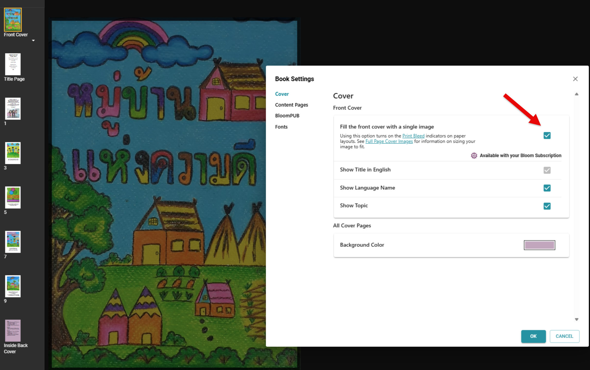

One current limitation is that translating the book makes replacing the original title difficult. In a future version, we plan to add the overlay tools to cover pages. This will allow you to use an image without text and position the title and other information directly on top of it.

## Easier Talking Book Alignment {#1fa4bb19df128183b7a6ddda4d9bbced}

Subscription Tier: Pro and Above

Usually, creating a talking book in Bloom is simple: press a button and speak each sentence or clause. During playback, the text is highlighted section by section as you hear it.

But what if you’ve imported a single recording of the entire page, perhaps a song? You need a way to tell Bloom which bits of text correspond to which parts of the audio. Previous versions offered automatic alignment with Aeneas (requiring significant setup for some languages) or manual alignment using Audacity (a separate program to install and learn).

Bloom 6.2 introduces a much simpler option: the **Adjust Timings** tool.

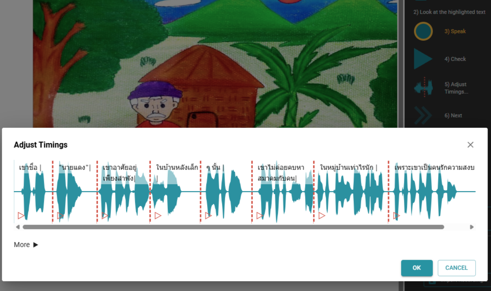

This new tool does two things:

1. It makes an initial guess at alignments based on dips in the audio volume.
2. It allows you to drag the separators to correct any mistakes in those guesses.

You can still use Aeneas or Audacity if you prefer, accessible via the “More” menu:

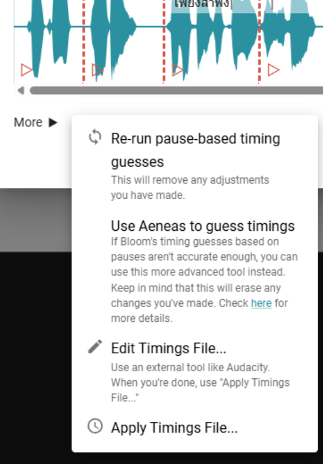

## Easier Games {#1fa4bb19df128184838af0ff8348ab3f}

Subscription Tier: Pro and Above

Starting with Bloom 6.2, we are adding new interactive page types to help students engage with book content. We’ve invested significant effort into a new game-building experience designed to unleash your creativity. With many changes already implemented and more planned, we’ve dubbed these “Bloom Games.”

Unlike activities created with external HTML5 game builders like Active Presenter, activities built natively in Bloom offer several advantages:

- They don’t require external software or extensive training.
	- You can use Bloom’s Talking Book tool to record words and letter sounds.
	- You can use Bloom’s music tool to add background music.
- They are readily localizable when your book is translated into other languages.
- They send anonymous results to [BloomLibrary.org](http://bloomlibrary.org/), allowing you to see how students are doing.
- They open instantly and use Bloom’s familiar page-turning interface.

Bloom 6.2 includes six new template game pages, in addition to the activities from previous versions:

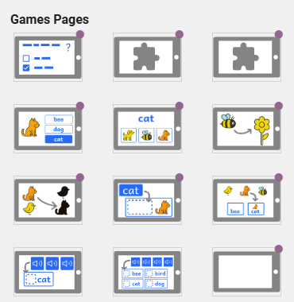

💡 You can try out some sample games, such as the ones below, on [BloomLibrary.org](https://bloomlibrary.org/book/zpORtuVlDN). (Click “READ” after loading the page.)

For this release, the games added involve dragging one or more objects to one or more targets, like this example:

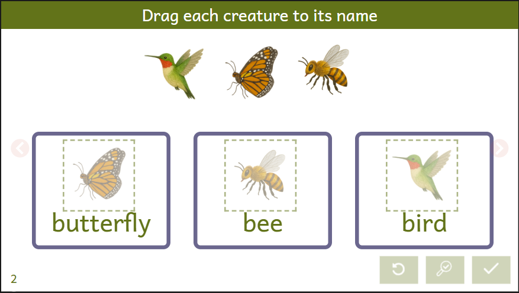

Here’s how to set up a game page:

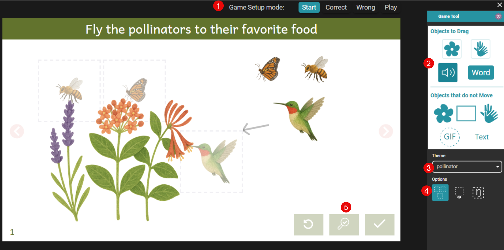

**Key:**

1. Use the “Game Setup Mode” tabs to configure what happens when the student answers correctly or incorrectly, and to try out the game.
2. Drag desired items into your game page.
3. Choose a color theme.
4. Use these options to customize game behavior:
	1. Keep all targets the same size to prevent students from using size as a clue.
	2. Show drag targets during play.
	3. Show the correct answer even during play.

Individual items also have options, such as the sound played when a student touches them:

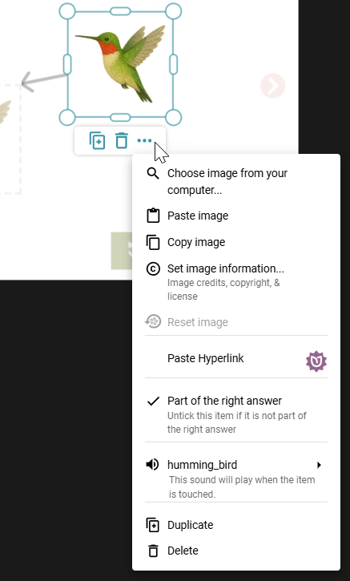

💡 We have found [https://elevenlabs.io/](https://elevenlabs.io/) great for creating sound effects, and [OpenAI’s ChatGPT 4o](https://chatgpt.com/) outstanding for creating copyright-free game art.

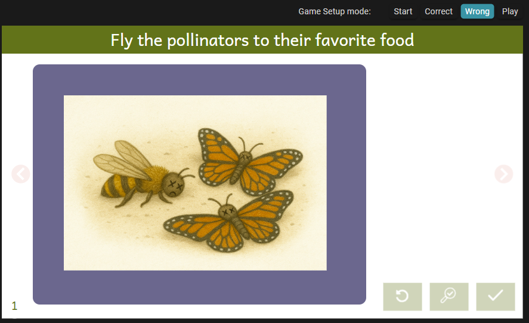

Here are the prompts we used to create the images for the pollinator game:

> Help me design and illustrate a simple interactive education game labeled “Drag the pollinators to their food”. First, what are 3 pollinators and the plants that they prefer that we could illustrate?

> Great. Now create the illustrations for those 3 animals and one containing the 3 plants. Illustrate in a children’s book style. Each illustration must have a transparent background and be in its own file.

> These are great. Now we need an image for what happens if the pollinators don’t have food. Using the images above for reference, show some dead butterflies and bees on the ground.

There are currently many types of games you cannot yet create in Bloom. In subsequent versions, we plan to keep adding game types, including:

- Customizable multiple choice (in addition to the existing “Quiz” type)
- Spelling
- Matching

Let us know which ones you’d like us to prioritize!

## The Playground Template {#2684bb19df12805eb53de8a2dd25a042}

To help Basic users try out advanced features, we have added a new book template called “Playground”:

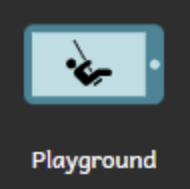

You can use this source book to explore all the features Bloom offers with a subscription. It’s a greeat way to try out advanced tools and layout options before upgrading.

:::note

Books created with this template will include a watermark and cannot be printed, published or distributed.

:::

## Improved Image Pasting  {#2464bb19df1280d8aa0ac32fb646a973}

We’ve simplified pasting an image onto a page. If you are editing a page in Bloom and have an image on the Windows clipboard, clicking Bloom’s Paste button, or typing CTRL+V will now paste the image onto the empty page. If the page already has an image, a new overlay image will be created (if your Bloom subscription allows it).

## Bloom Reader (Android) {#1fa4bb19df1281d09b50eb107b1f03ae}

- Bloom Reader is now much smarter about how to alphabetize your books.
- URLs found in books will now open in the default browser.
- Images can now be used as interactive links.
- Images can now play sounds when tapped.

## BloomPUB Viewer (Windows) {#1fa4bb19df12810ea37bc24e93530bec}

- **Recent Books Buttons:** Added buttons for quick access to recently opened books.
- **Drag-and-Drop Support:** You can now drag and drop books directly into the BloomPUB Viewer for easier access.
- Support for links between books.
- Images can now be used as interactive links.
- Images can now play sounds when tapped.

## Advanced Notes: Custom Game Themes {#1fa4bb19df12812e8089c6da344621b1}

A convenient way to customize game themes from within Bloom is not yet available. In the meantime, if you’re comfortable with a bit of technical work “under the hood,” you can use [this online tool](http://tools.bloomlibrary.org/game-theme-editor) to generate custom CSS. Use the “Copy CSS” button to copy the code to your clipboard, then paste it into your `customBookStyles.css` (located in the book folder) or `customCollectionStyles.css` (in the collection folder). Reload the book (or restart Bloom) for your theme to appear as an option.

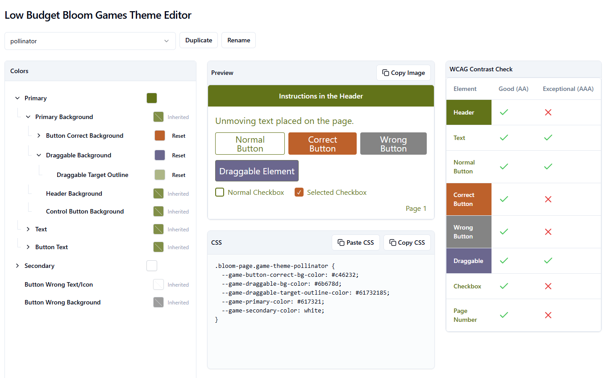

💡 If you create a theme, please share it with us!

## Advanced Notes: Custom Codes with the New Language Chooser {#1fa4bb19df12813eabcff562c65eee50}

Sometimes, a language isn’t yet listed in the [Ethnologue](https://www.ethnologue.com/) database. When this happens, the new Language Chooser now provides a button for creating a valid custom code:

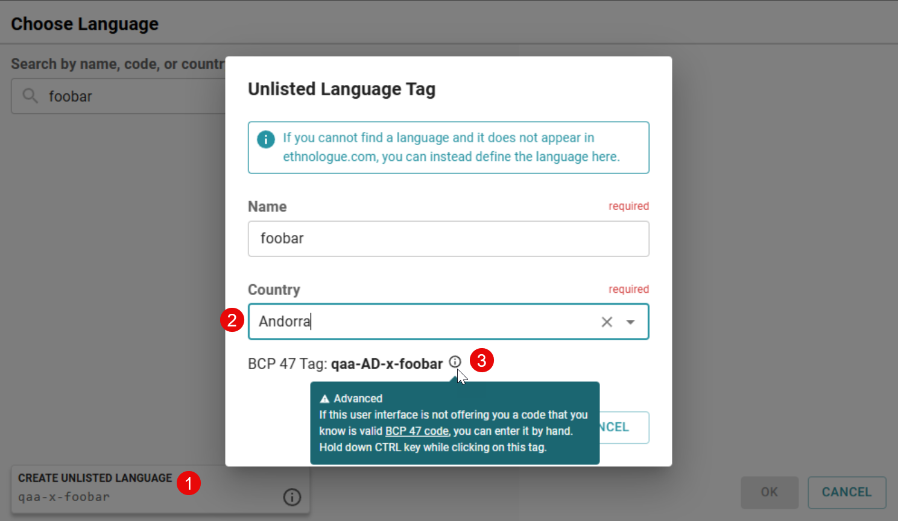

1. This button appears if there are no standard matches found. We simplify the options, typically offering “qaa-x” rather than a full qaa-qtx range.
2. We require you to specify a country to make the code slightly more identifiable.
3. If absolutely necessary, this option allows you to enter a code manually, though we still ensure the custom code follows formatting rules.

## Advanced Notes: Steps Towards “Bloom Apps” {#1fa4bb19df1281e1b3fdd14a150b0cfb}

We are collaborating with SIL in Thailand on an experiment to create mobile apps containing collections of books and games, with a user interface configurable within Bloom itself. This project leverages the following new Bloom 6.2 features alongside SIL’s Reading App Builder to create what we hope will be useful and engaging educational tools:

- Books can now contain links to other books. Links can be standard inline text hyperlinks or interactive images.
- After following a link to another page or book, you can jump back to your previous location.
- A page can contain a grid of thumbnails linking to a set of books. Clicking a thumbnail jumps you to that specific book.

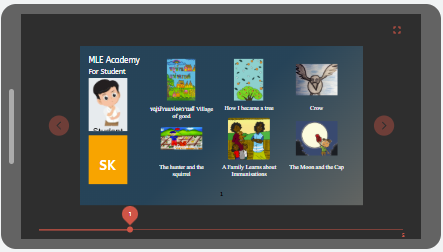

The BloomPUB Viewer also supports these features. To use them, place all the relevant BloomPUB files together in the same directory.

