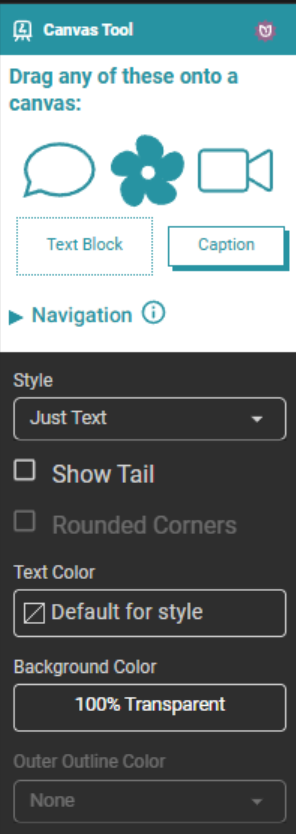
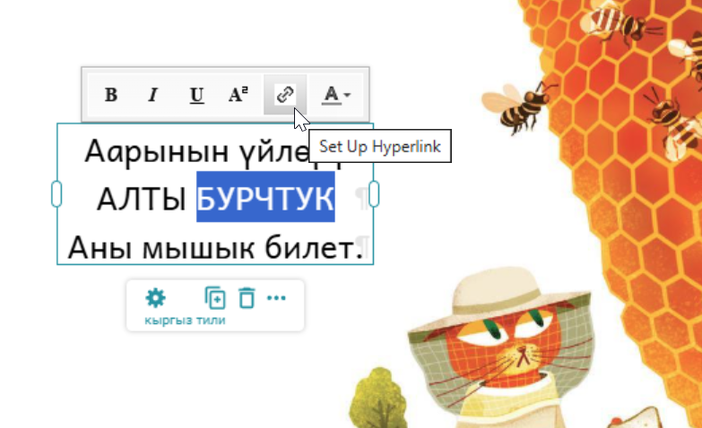
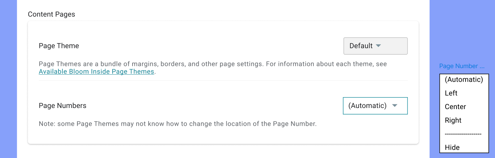
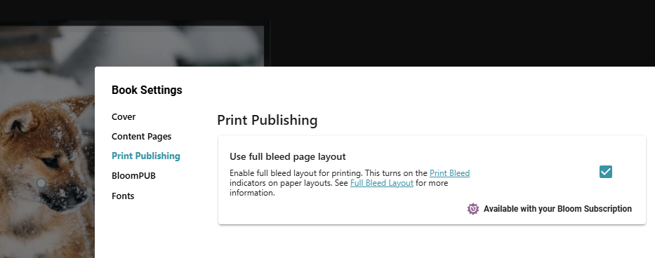
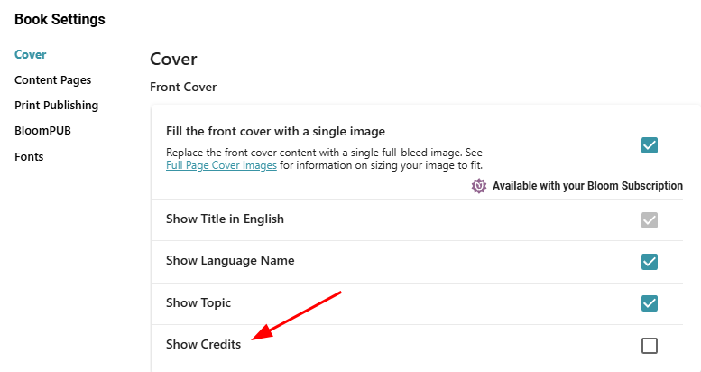

## “Overlay” is now “Canvas” {#29a4bb19df128038ac80c66e228db2aa}

When Bloom first allowed you to drag things like speech bubbles, the idea was to put them on top of images. We called these objects 'overlays'. But now you can place things on the page even if there is no background image. The word 'overlay' no longer fits well, so the Bloom program now calls these areas 'canvases'.

- We have renamed the “Overlay Tool” to the “Canvas Tool”.
- When designing the layout of a page, you can now select _canvas_ as one of the types.

## Navigation Objects {#29a4bb19df128066a642dfd2bd4c5504}

You can now add buttons that jump the reader to a web site or a different pages in the book. They can even jump to different books (see Bloom Apps, below).

### Easier Hyperlinks {#2bc4bb19df12803880abe6efb5a485c4}

The way to set the target of a simple “inline” hyperlinks has changed. Select the text you want to be the hyperlink, then click on the link icon. This will open a tool that will let you specify a website URL, a book in the app, or a page of any book in the app.

## Bloom Apps {#2bc4bb19df128043b83be037cfc1e7f0}

Bloom excels at providing many ways to publish your book: paper, web, _Bloom Reader_ (Android), _BloomPUB Viewer_ (desktop), ePUB, and [_Kolibri_](https://learningequality.org/kolibri/about-kolibri/)[.](https://learningequality.org/kolibri/about-kolibri/) 

You can also bundle multiple Bloom books into one custom mobile apps using [_Reading App Builder_](https://software.sil.org/readingappbuilder/). In this Bloom update, we've made these apps better by adding new ways to move around: book grids, buttons, and links between books. We now call mobile apps that use these navigation features "Bloom Apps”. 

Bloom Apps can have books and games, of course. What’s new is that they can have buttons and links that can take the reader between tables of contents (if you have more than one), pages in a book, or between books. As you move from one place to another, a 'Back' button will appear, just like the back button in your web browser.

:::tip

How to Build a Bloom App
Build the parts of your Bloom App in the Bloom Editor app. Test it out in the Publish tab and in BloomPUB viewer. When you’re happy with how it is working,  SIL can help you publish a mobile app for Android and iPhones and iPads. Or, if you have technical skills, you can use Reading App Builder [_Reading App Builder_](https://software.sil.org/readingappbuilder/) to do it yourself.

:::

### Book Grids {#29a4bb19df1280a294dfdb03694ddec7}

A 'Book Grid' is a Table of Contents that shows small pictures and titles of books. Readers can click these to go directly to a book in the app. Usually, you would create a 'TOC' book that includes a page with a Book Grid, and this TOC book would be the first 'Book' in your app.

The books in a Book Grid must be part of your current _collection._ A grid can contain all the books in the collection, or a subset.

## Page Number Position {#29a4bb19df128042b49bd740100c58a5}

## Foundational Work {#2714bb19df12806797e6fca50c9d42ab}

Have you ever had pour resources into the parts of your house that you take for granted? Plumbing, wiring, the roof, the foundation… all of these things age over time. They aren’t exciting things to spend your money on, but if you want your house to last, you have to replace bits of it occasionally. It turns out that the same is true of software like Bloom, which is now 14 years old! In this version, **we’ve modernized 23 key underpinnings** in order to keep Bloom healthy and prepared for the future. Four of these changes move us closer to our goal of a **cross-platform Bloom**. 

Mostly, you should not notice any difference, but here are few areas where things have changed:

### Installer {#2994bb19df12808694cde01e3f1075bb}

- We switched to a modern installer system.
- The Bloom installer no longer support “all-users” option.

### System Requirements {#2994bb19df1280199e68e3fb1f42196e}

- Bloom now requires Windows 11 and computer with a 64 bit processor.

### Image Toolbox {#2994bb19df1280b2b561fc2979557fef}

- We have removed the scanner and camera buttons from the top of the screen. We recently modernized the underpinnings of Bloom and these old buttons didn’t survive transition. We think that they were rarely, if ever, used.

## Language Codes {#2994bb19df1280bf9028d77c04d4cd50}

Occasionally you may find that there is some questions about the actual language code of a text box or a source bubble suggestion. We now show the code of text boxes in the Format tool (1). If you hover over a source tab, you will now see its language code (2). 

# Full Bleed {#3024bb19df12805793efca1b18da9b91}

You can now turn on Full Bleed layout from the Book Settings.

If you have this turned on but need to make a PDF without it, use this new setting in the Publish / PDF screen:

:::tip

In a future version of Bloom, we plan to finish off generalized Full Bleed support with a new “Edge to Edge” theme that supports all paper sizes and layouts.

:::

You can use this with “Fill the front cover with a single image” setting:

If you don’t want any credits on the cover, you can free up that space with the new “Show Credits” setting:

# Games {#3024bb19df12805998a6dba5e2d588e3}

You can now control the “Correct” and “Wrong” sounds in all game types, not just the drag and drop ones.

