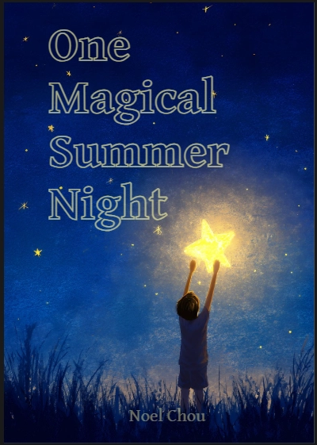
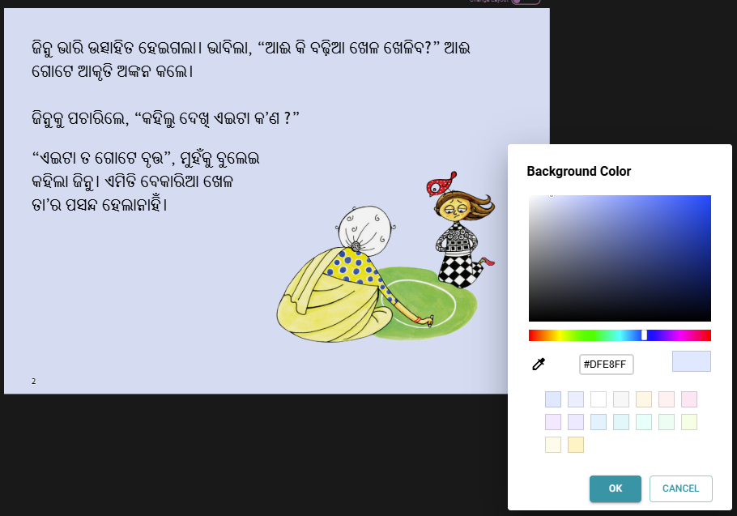
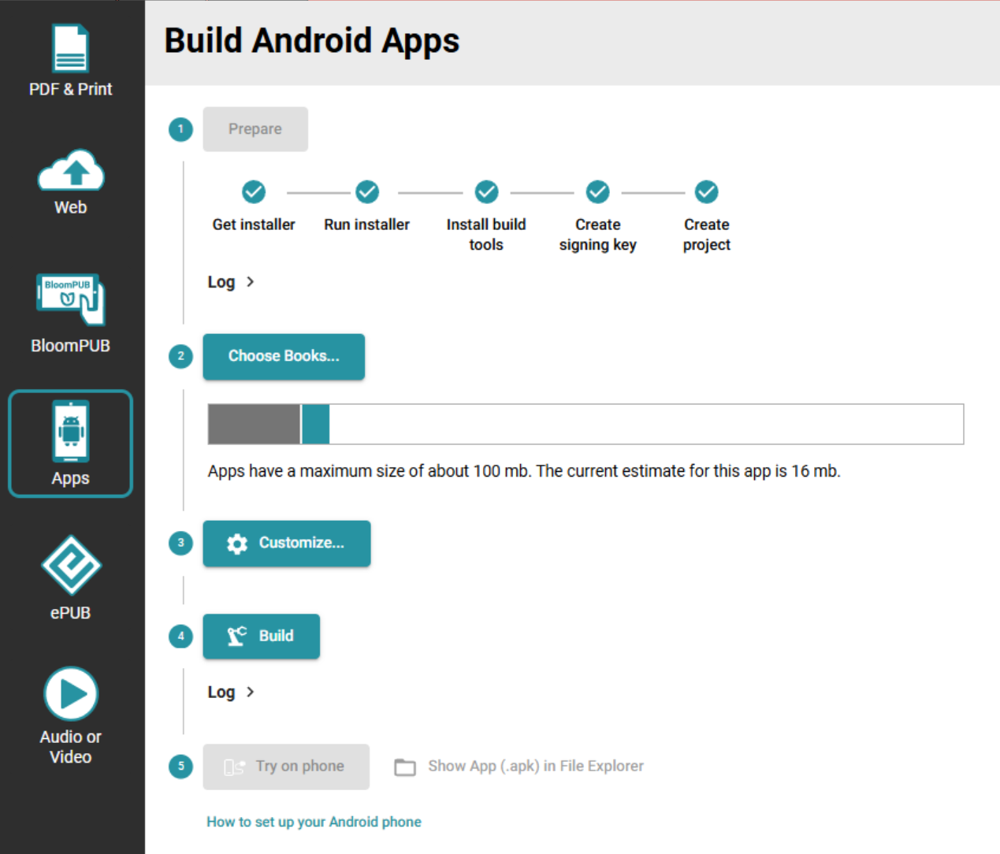
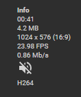
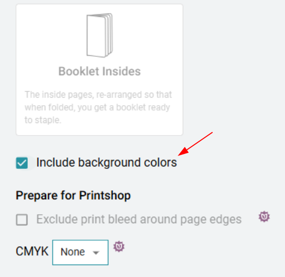

## Custom Front Covers {/* #3594bb19df1280e78d0bebce32b04e46 */}

Subscription Tier: Pro and Above

You can now switch the front cover into a “Custom” mode in which all of the cover’s elements (title, author, illustrator, image) become movable canvas items. Once unlocked, you can:

- Drag and resize each element independently.

- Move different language versions of the same field to different locations.

- Add additional text boxes and images.

Now you can make the kind of “professional” cover layouts you find in commercial children’s books, where the title and credits are placed artistically over a single full-cover image. This feature also works on the back cover.

To help make good-looking covers, the Canvas Tool now lets you set a color for “Outlined” text.

For more information, see [Custom Covers](/p/3894bb19df1280afa0a5d69a9901ac99).

## QR Codes {/* #3594bb19df12807e8af4c1e00454481b */}

Bloom now places a QR Code on the “Made with Bloom” badges on the back cover. When scanned or clicked, they take you to the books for the L1 language on BloomLibrary.org. Use the advanced tab of Collection Settings to localize the text shown below the QR code.

## Page Background Color {/* #3594bb19df1280fba4fbcd1c7fa9c497 */}

You can now set the background color of pages more easily.

## Color, Eyedropper, and Transparency {/* #3594bb19df12805eb6eef59dfc2bc168 */}

We’ve made several improvements to the color picker:

- **Eyedropper tool.** All color pickers now include an eyedropper that lets you sample a color from the page.
- **Transparency slider.** Color pickers that affect text now have a transparency slider with a percentage indicator. A small amount of transparency can make text easier on the eye when there is a background color.

## Bloom Apps {/* #3594bb19df128028a5a5f0d695b0d303 */}

Subscription Tier: Pro and Above

In Bloom 6.3 we introduced “Bloom Apps”, which use book grids and links between books. In 6.4:

- **Navigation links work on** [**BloomLibrary.org**](http://bloomlibrary.org/)**.** Books that contain navigation links to other books now work correctly when read on [BloomLibrary.org](http://bloomlibrary.org/), not just inside an app or BloomPUB Viewer.
- **Re-use of GIFs and sounds.** Bloom Apps can grow large quickly, especially when many books share the same game animations and sound effects. Bloom now de-duplicates these assets across the books in an app, dramatically reducing app size.

## (Experimental) App Builder Integration {/* #3594bb19df12803ebfd1dabd8ac2299e */}

Subscription Tier: Pro and Above

Once you enable it (Collection Settings / Advanced), the Publish tab now shows a tool for making Reading App Builder apps, right from within Bloom! At this point it can make an APK and put it on your phone. In future versions, we hope to give you a way to get the app all the way to the Play Store. If you would like to see us move forward with this experiment, please get in touch so that we can understand your needs.

## Imported Videos are Re-encoded {/* #3594bb19df1280d996fec56d419854af */}

When you import a video into a Bloom book, Bloom now automatically re-encodes it to a reasonable size and bitrate. This solves a common problem in Sign Language books, where high-resolution source videos would otherwise make the book too big to distribute or fit many of them in a single app.

## Sign Language Videos are Muted {/* #3594bb19df12801da32ffaa607748a9b */}

If your collection has a sign language specified, Bloom now removes the audio track on import. This avoids both the annoyance of background sounds and any privacy risk from conversations the deaf creator may not have realized were being recorded in the background. When a video has been muted, the Sign Language tool shows a “no-audio” icon as in the following:

## Background Colors in PDFs {/* #35e4bb19df12802d9447cbe656a3b489 */}

When you publish to PDF, you can now choose whether to include the page background colors and the cover background. This is helpful both when you want a printed book to match the digital design, and when you want to save ink by leaving backgrounds white at print time.

## Other Improvements {/* #3594bb19df1280d2a84dec8c974d9deb */}

- The little notification messages that pop up at the bottom of Bloom (we call them “toasts”) have been updated with a modern look.
- **Better font info for non-current languages.** The Book Settings dialog now presents font information for languages that aren’t in the current collection in a clearer way, so it’s easier to understand which font is being used where.
- **Cleaner Custom Game template.** The “Custom Game” page no longer has a fixed Instructions header, giving you a truly blank slate to design from.
- We made many changes that move us towards our eventual cross-platform (i.e. mac) goal.
