## AI Image Editing {/* #f1b79df9a99347ec8b047287d541475a */}

Subscription Tiers: Pro, Community, and Enterprise

Bloom now lets you use AI to work with images.  You can upgrade or localize the images in your book, or create new ones. 

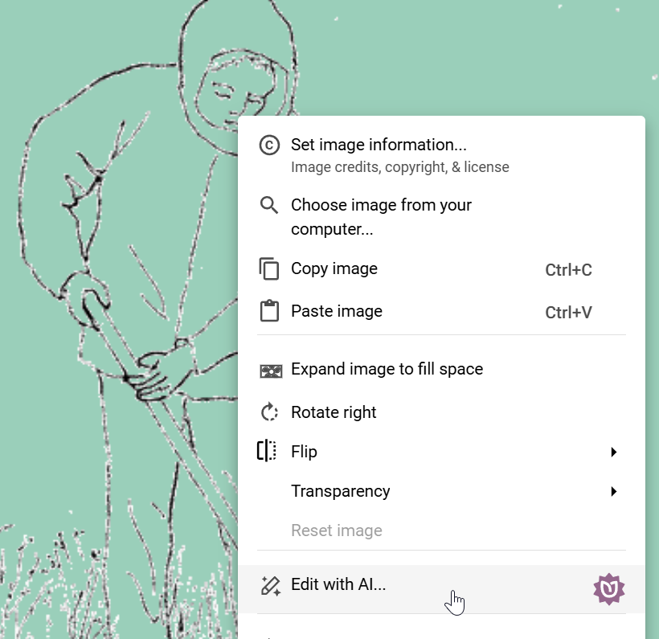

We currently offer 15 tools, starting with the simple “Improve Quality”:

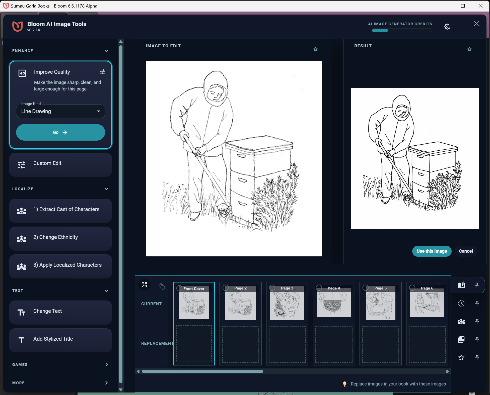

With the Change Text tool, you can finally translate even fancy text on covers:

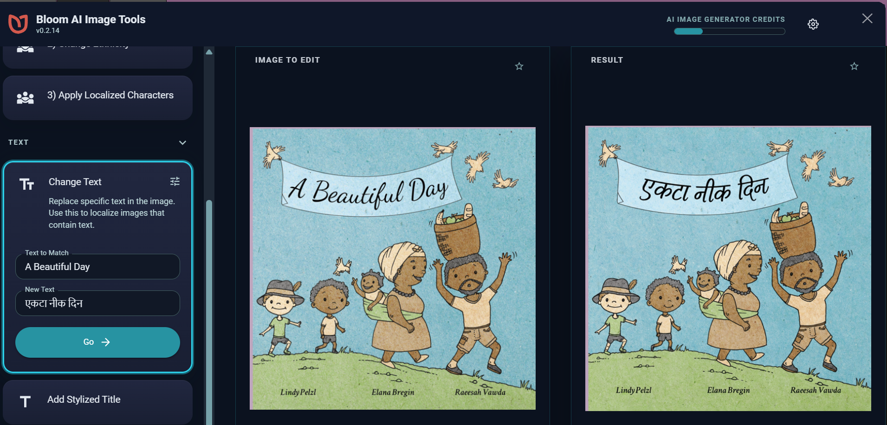

When creating new images or editing old ones, Bloom offers a number of styles to choose from:

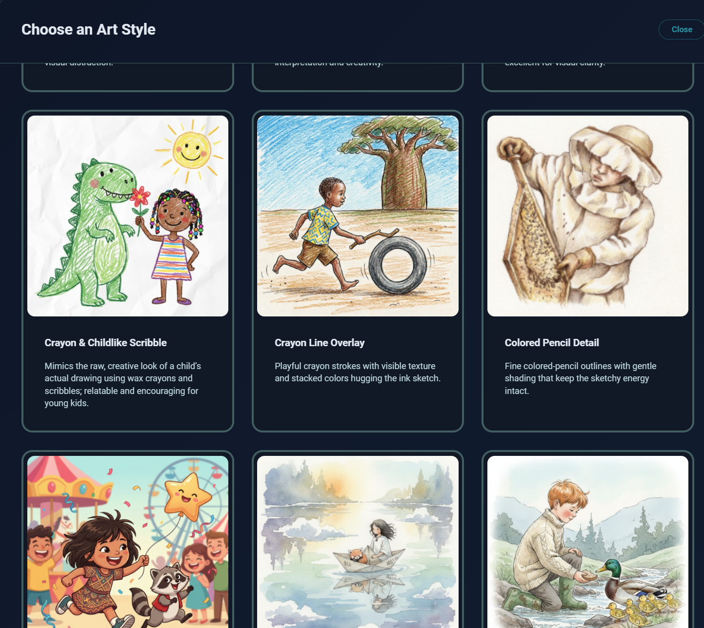

You can also provide “reference images” which can be photos or drawings from the local community. The image generate will use these to help make the people and things in your images look familiar.

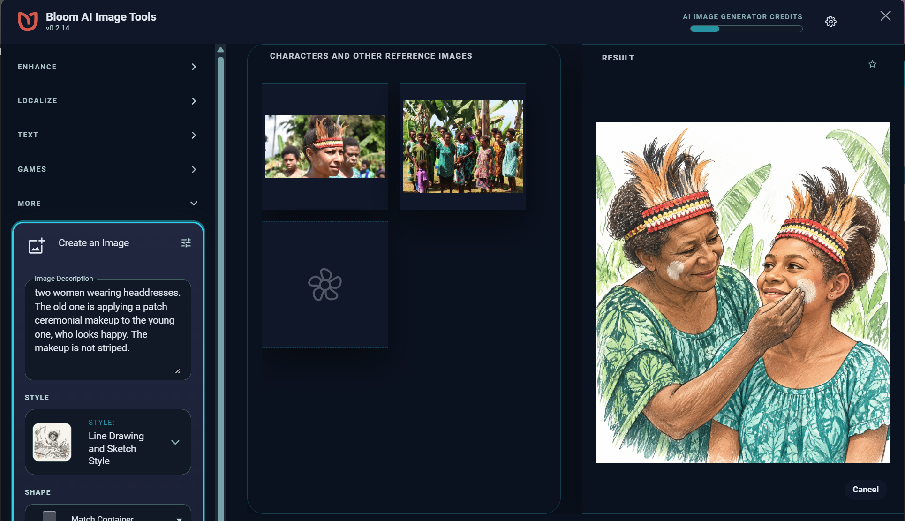

Edited images keep their credits (copyright, creator, and license). Bloom provides the very latest image generators from Google and Open AI, and they are very cheap at less than US $0.01 for new image, about US $0.06 for editing an image. However, we can’t pay this for you, so you’ll need to purchase credits through “Open Router”, our AI provider. There is a US $5 minimum.

## New Image Chooser {/* #36edf3a414c1446f9f2220d920cdc2e4 */}

We have rebuilt the window you use to find and choose images. It has a modern look, is easier to use, and displays crisply on high-resolution screens. If you’re online, you can search two popular sources of free images. The best thing: when you use and image, Bloom automatically preserves the copyright and credits of the image.

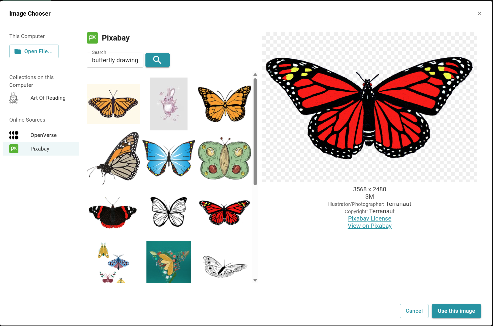

## New Line Art Transparency Setting {/* #3d84bb19df1280dc9dc8d3e4338340f2 */}

Bloom now does a much better job with black-and-white line art. It will automatically predict when if the image should be shown with a white background or directly on background color. If it guesses wrong, fix it with this menu:

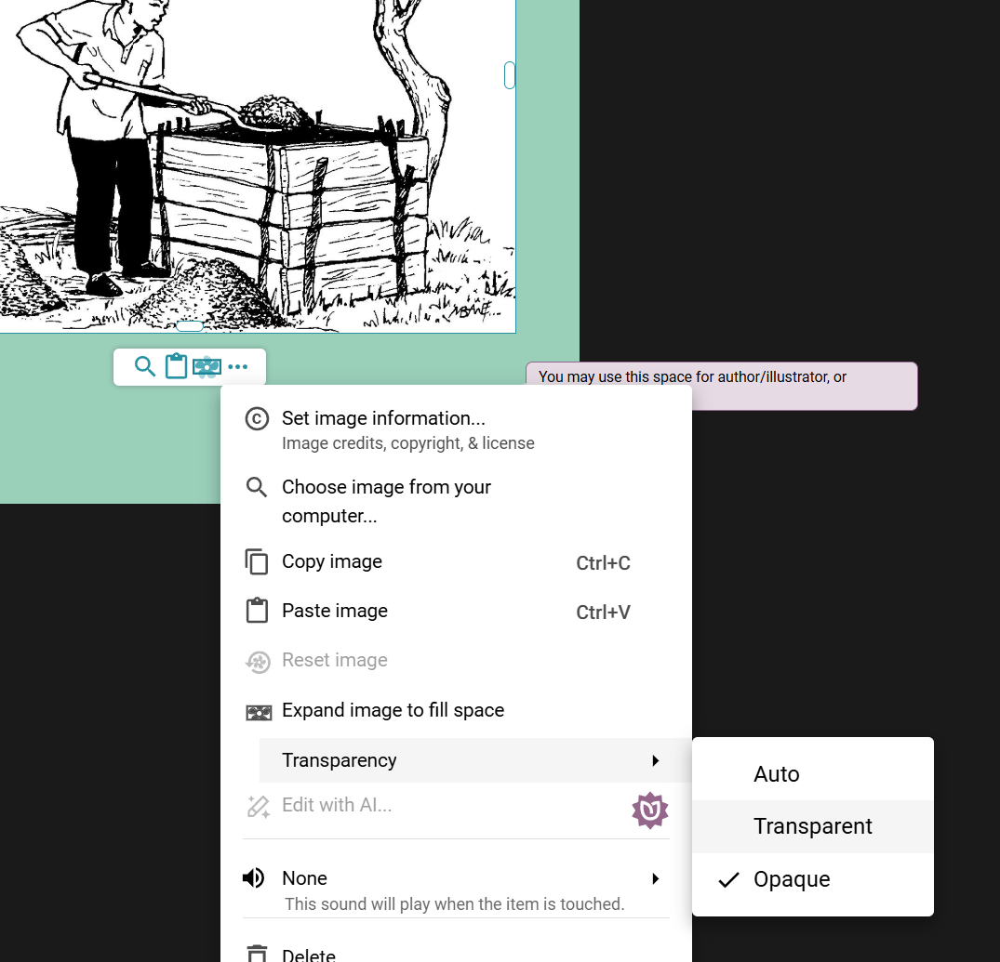

## Easier Image Credits {/* #6b75c87ed79d46548cbac8f952f15694 */}

When you set the copyright, creator, and license of an image, Bloom now offers to reuse the information you have already entered for other images in the book. You can also apply the information to every image in the book at once. And we dropped the annoying dialog that used to interrupt this workflow.

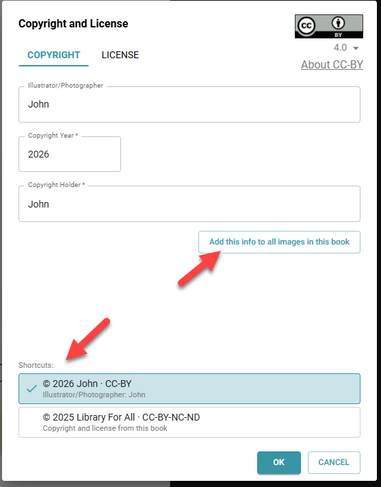

## Improved Collection Chooser {/* #3dc4bb19df12806fa5c6d8ba521b274c */}

We modernized Bloom’s new collection chooser and made it tell you more about the status of your collections.

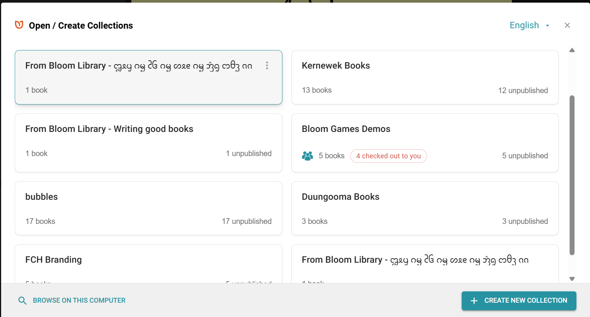

## Sign In to Bloom {/* #f6eec689123e4127a9d6632db934868e */}

You can now sign in to your [BloomLibrary.org](http://bloomlibrary.org/) account right from Bloom’s main screen. Even if you are later offline, Bloom can remember who you are. Bloom doesn’t do much with this yet, but it will make some things simpler in the near future.

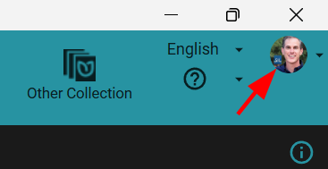

## **Improved Page Size / Layout menu** {/* #3dc4bb19df128064a8f5ca012a0d724b */}

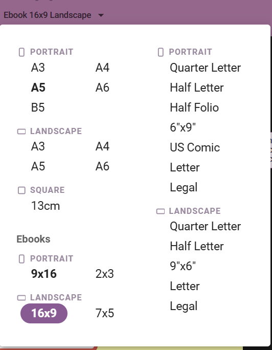

## Other Improvements {/* #c7feb429f7e246e68569575c94040e97 */}

- Some kinds of cleanup used to happen only when you visited each page in the Edit tab. Now the “Bring Book Up to Date” command does that cleanup for you, page by page.
- When you choose a language and script for a collection, Bloom now knows whether that script is written right-to-left and sets up the collection accordingly.
- **Sharper display on high-resolution screens.** Bloom is now fully “DPI aware”, so text and UI are crisp on high-resolution and mixed-resolution multi-monitor setups. This also fixes eyedropper color accuracy on such setups.
- **Remove character formatting.** A new command in the text formatting toolbar lets you clear character formatting (like stray bold or italics) from selected text.
- **Source text bubbles remember your last two language tabs**, so comparing sources is less fiddly.
- **BloomPUB Viewer** now works on Linux.
- The [docs.bloomlibrary.org](http://docs.bloomlibrary.org/) documentation site has been upgraded. It now includes AI-powered search.
- We made changes that move us towards our eventual cross-platform (i.e. mac) goal, including rebuilding the Image Toolbox and Open/Create Collection screen with cross-platform technology.
