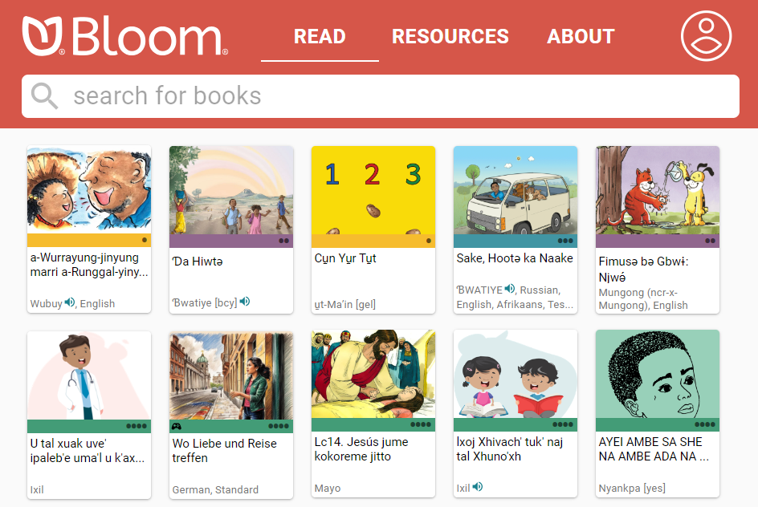

# The Bloom Platform {#955ffbdd4f3a467580fc005bcf18b218}

[**Bloom Editor**](/bloom-platform#070f565a9a73475790b49a7ccd258ace), [**Bloom Library**](/bloom-platform#9d03d5c0220e48129b86b0958ff59386), [**Bloom Reader**](/bloom-platform#e383b07bf8834fb494a7f7cd4a6268eb)**,** and [**Bloom Enterprise**](/bloom-platform#eea85bb74a564973bd5c70b2e90f1504) comprise the Bloom **Platform**. 

The Bloom Platform is an integrated approach to book-making which provides a robust and sustainable means for language communities to author, translate, publish, and distribute books for themselves in the language they speak or sign.

## Bloom Editor {#070f565a9a73475790b49a7ccd258ace}

[Bloom Editor](https://bloomlibrary.org/page/create/downloads) is a software program for authoring, translating, and publishing books and sharing those books with your community through Bloom Library. Bloom Editor runs on the Windows and Linux operating systems. 

Bloom Editor is designed for ease of use. Bloom is so simple that if you can type and use a mouse, then you can make a book!

But despite its simplicity, in recent years, Bloom Editor has increasingly become a feature-rich desktop editor capable of producing beautiful print and electronic books. And where a simple, printed book is not enough, Bloom Editor makes it easy to add narration, sign language, and audio image descriptions for the visually impaired.

To view all of Bloom Editor’s features, see [this page](https://bloomlibrary.org/page/create/page/feature-matrix) on Bloom Library.

## Bloom Library {#9d03d5c0220e48129b86b0958ff59386}

[Bloom Library](https://bloomlibrary.org/read) is a unique website that has more than 20,000 free books in 900+ languages. Books can be read online or downloaded in various formats for offline reading. The library interacts directly with the Bloom Editor for uploading and downloading books. The library also works with the free Bloom Reader Android app.

Key to Bloom’s success is the generosity of local authors and organizations who freely share their openly-licensed books with the world, so others, in turn, can benefit from these materials and translate them into their languages.

Uploaded books are displayed using a “book card”. The book card shows a thumbnail image of the book’s front cover. Below that is a colored banner and 1-4 black dots to indicate one of four reading levels recognized by Bloom: 

1. First words and phrases
2. First sentences
3. First paragraphs
4. Longer paragraphs

Special book features and the list of languages represented in the book are also indicated on the book card.

## Bloom Reader {#e383b07bf8834fb494a7f7cd4a6268eb}

[Bloom Reader](/about-bloom-reader) is a free Android app that allows readers with Android devices to enjoy Bloom books offline. Books published to Bloom Reader can include all of Bloom Editor’s advanced features: edge-to-edge images, synchronized audio narration, language switching (for books published with multiple languages), sign language video, audio image descriptions, and page navigation.

To get books onto a device that has Bloom Reader installed, users can either download from Bloom Library, transfer books directly from the Bloom Editor to their devices, or share from one device to another.

Organizations interested in mass distribution of Bloom books to a people group can transfer books onto SD-cards.

## Bloom Enterprise {#eea85bb74a564973bd5c70b2e90f1504}

**Bloom Enterprise** is a special service for organizations that need additional program and publishing features. For more information about Bloom Enterprise, see [About Bloom Enterprise Index](/about-bloom-enterprise).

