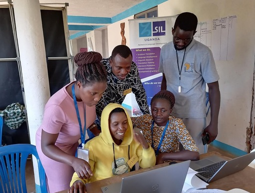
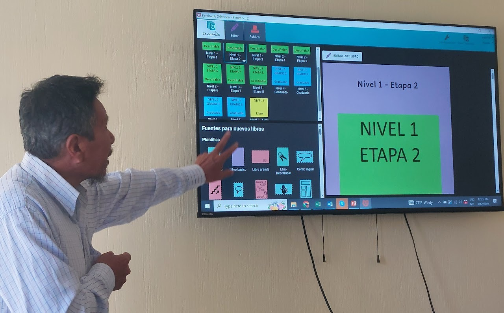
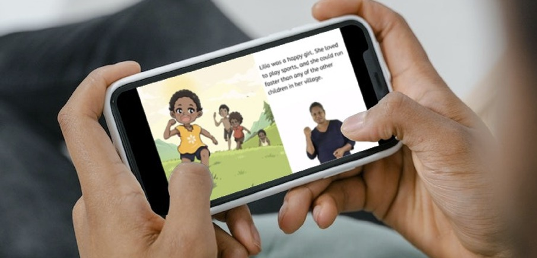
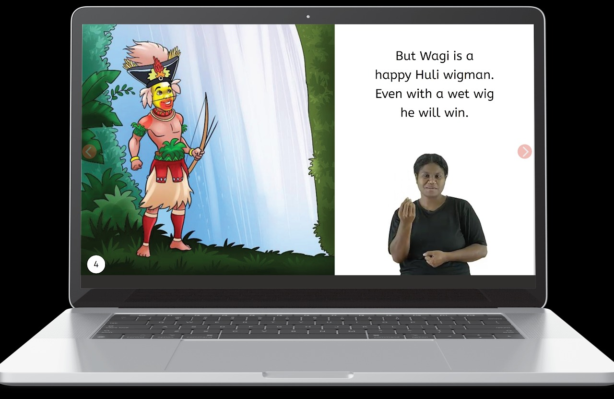

## **Easy to Use** {#2d888740b26a418fa1715cbeb58b5a74}

Bloom was designed for people who have modest exposure to computers.

- New books are always created from templates or existing books, streamlining the creation process.
- Writers can choose from a variety of pre-designed page layouts or design their own.
- Text is formatted by styles and therefore is consistent throughout a book.
- The interface is simple and uncluttered, but more advanced tools are readily available.
- A variety of one-click publishing options are available.

## **Adapt Existing Books** {#67072a52c9784be8ac043576a385d53f}

The online [Bloom Library ](https://bloomlibrary.org/)has more than 22,000 books, all of which are available to download and adapt. Book creators can use the layout and images "as-is" or modify them, and the interface provides the source text for each text box for the writer's reference. Writers can upload their books to Bloom Library and share them with others to read or adapt.

## **Decodable or Leveled Books** {#9e318d205f614a419e03ed735512f04b}

Educational programs that teach children to read often need decodable or leveled text that matches the student's current level of reading skill. No other software provides tools to help writers write those challenging types of text. The Decodable Text Tool monitors what is being typed and gives a visual alert to the writer if they have used a letter that has not yet been taught. The Leveled Text Tool alerts writers to text that is too complex for a given reading level. Even if you don't use Bloom to publish your books, if you're writing decodable or leveled text, you need to use Bloom.

## **Consistency Across Your Library** {#ca7477506b634c38bba30f59f41dde15}

Literacy specialists can design book templates that include specific page layouts and text formatting to help writers develop books that are consistent. This is particularly valuable in a project where decodable and leveled books are being created.

## **Publish in Many Formats** {#0318da9deb714edba3ead038aeb07250}

A single Bloom book can be output to PDF, ePUB, BloomPUB, and video. Bloom allows you to include any combination of text, images,  narrated audio, and sign language video in your books—and even on one page! Multimedia Bloom books can be read online, in the free Bloom Reader Android app, or in an ePUB reader. The Talking Book and Sign Language Tools enables authors to add the audio and video media to their books.

## **Inclusive Books** {#172211663f6a41d2bbf842b4d3e2f166}

Books for the visually impaired need to have descriptions of all images and audio for all text. They should also adhere to the EPUB 3.2 standard. Bloom has tools to create these books, including an Impairment Visualizer Tool to see what images may look like to people with various types of visual disabilities, an Image Description Tool to add text descriptions of the images in a book, and an accessibility checker to make sure that the book meets accessibility standards. The Talking Book Tool enables authors to record narrations of all text in accessible books.

Books for the Deaf include sign language video. Deaf authors can use the Sign Language Tool to add video to Bloom book pages. One can record directly into Bloom using a computer's video camera or import pre-recorded video clips. Resulting books can be read online, in the free Bloom Reader Android app, or in an ePUB reader.

