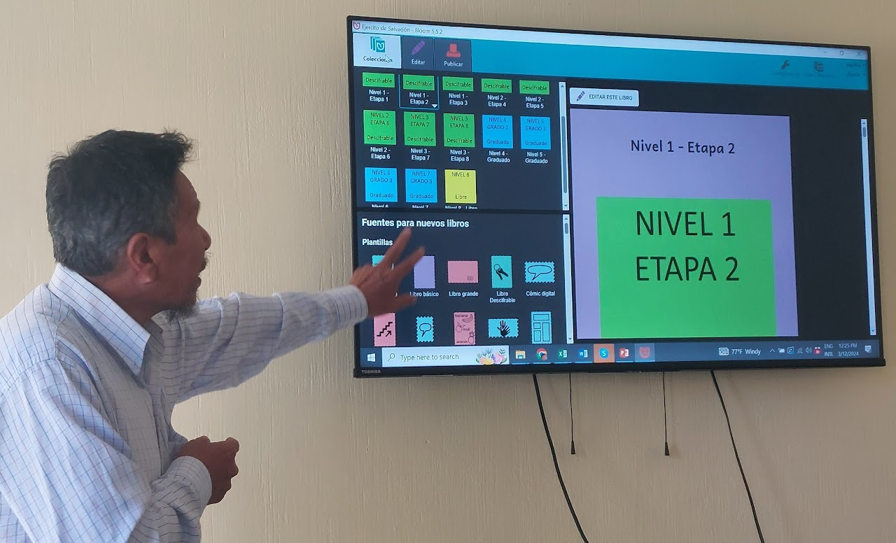

Bloom is more than just a software tool; it's a powerful catalyst for change in marginalized language communities worldwide. Developed by [SIL Global](http://www.sil.org/), Bloom equips communities with the training, tools, and resources they need to create literature that reflects their unique contexts, values, and aspirations.

**Here's where Bloom stands out:**

[Empowering Local Communities](/why-use-bloom#dd89410298f44cf6861b1d484360c821)

[Offline. Accessible. Inclusive.](/why-use-bloom#e508676fa39d405f86ff812d3444f401)

[Specialized Literacy Tools](/why-use-bloom#d6bd0bf437ae47cf9cef52b7e262e8be)

## **Empowering Local Communities** {#dd89410298f44cf6861b1d484360c821}

Bloom empowers communities by providing the means to **create culturally relevant literature**. It bridges the gap between oral traditions and written forms, ensuring that the stories and knowledge of generations are preserved and passed down. Currently being **used in over 200 countries** and territories, Bloom facilitates book production and publishing that are often self-sustaining.

## **Offline. Accessible. Inclusive.** {#e508676fa39d405f86ff812d3444f401}

Optimized for offline use in remote areas, Bloom makes it possible to create and distribute both digital and printed materials without the need for constant internet access. This is crucial for regions where connectivity is limited or unreliable. **Bloom supports over 830 languages, including Sign Languages**. This inclusivity ensures that everyone, including the Deaf community, has access to literature in their own language.

## **Specialized Literacy Tools** {#d6bd0bf437ae47cf9cef52b7e262e8be}

Bloom offers unique tools to support literacy specialists and educational programs in creating **consistent, level-appropriate reading materials**. Its customizable templates help ensure consistent book design, which is crucial for projects involving decodable and leveled books.

Bloom is the only software that provides tools for writing these challenging text types. The Decodable Text Tool monitors text for letters that haven't been taught yet, while the Leveled Text Tool identifies overly complex text for a given reading level. These features make **Bloom indispensable for writing decodable or leveled text.**

