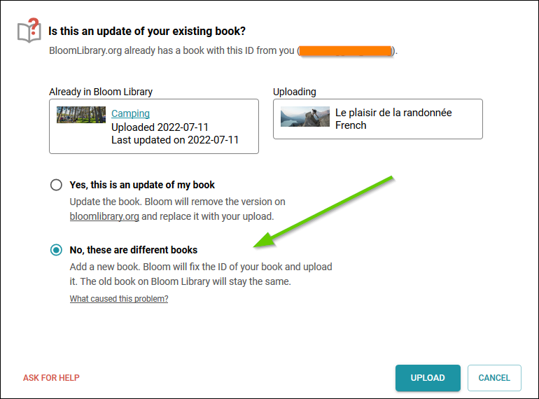

There are only three approved ways to make a book in Bloom. 

1. Make a brand new book from a book template, such as the Basic Book template.
1. Make a book using an existing book in Sources for new books, typically, to translate it into another language.
1. Duplicate an existing book.

## Book IDs

When you make a book using any of the above Bloom-approved methods for making books, the Bloom Editor will generate a unique number and assign that number to your book. This “book ID” is unique and it will follow that book _wherever_ that book “lives” even when it is uploaded to the Bloom Library.

## Consequences of using Windows Explorer to make a new book

If you use Windows Explorer to make a new book by copying a book folder from one collection into another collection, then the two books will have the _same_ ID. This could cause confusion later on.

The problem will surface when you upload the two books sharing the same ID to Bloom Library, Bloom will then present you with an opportunity to correct this problem and assign a new ID to your copied book. 

You will see a dialogue like this:

In this example, based on the two _different_ thumbnail images and the _different_ titles of these two books, we can safely determine that they are indeed different books. So, we select the second option, “No, these are different books”. In other cases, however, it may not be so obvious that they are different books. 

To avoid this problem, here is the key point to remember:

:::tip

To ensure that all of your Bloom books receive a unique book ID, it is important to _only_ use the Bloom Editor – not Windows Explorer – to create a book, duplicate a book, or make a derivative.

:::

