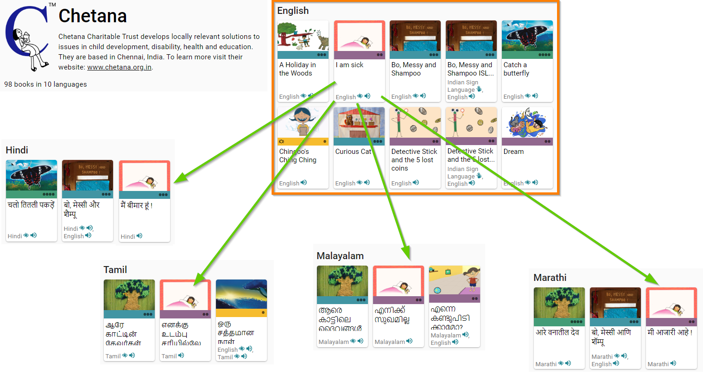
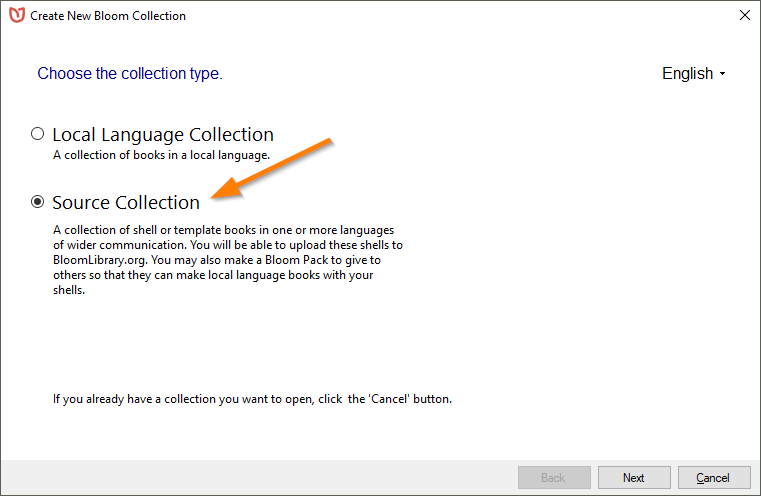
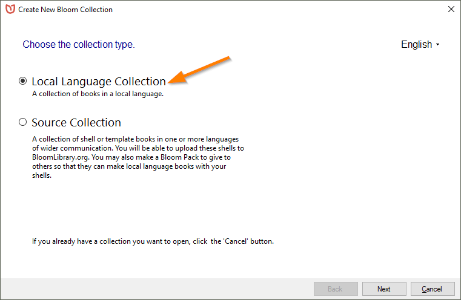
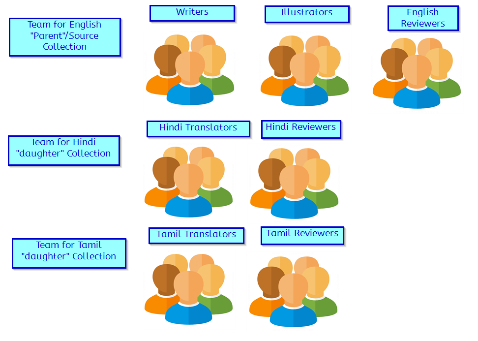
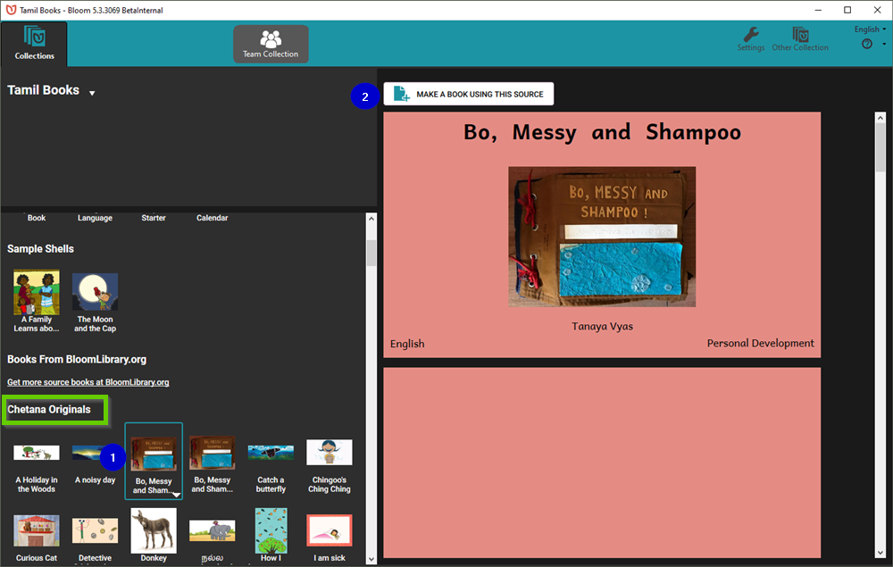
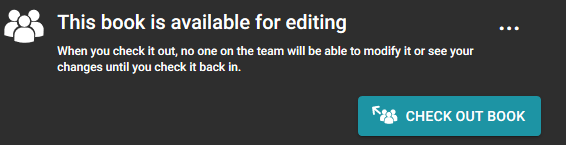
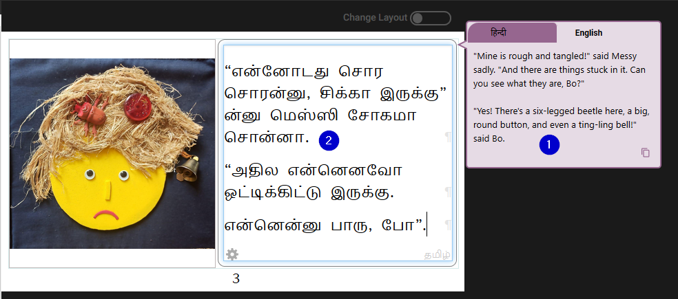
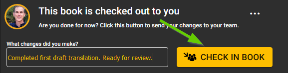
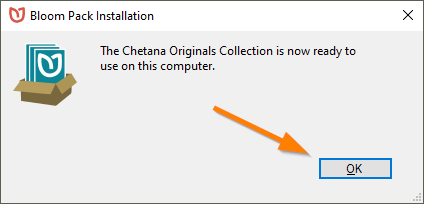

Throughout the years, a number of organizations have used Bloom to make a set of self-authored books and oversee the translation of these books into other languages. Most commonly, these organizations employ the following simple workflow:

1. _New_ books are authored in a particular chosen majority language such as English, French, Russian, Hindi, etc. This “SOURCE” collection of _original_ books constitutes a type of “parent” collection.
1. The books in the parent collection are translated into a variety of other local languages in various “daughter” collections.

Chetana, for example, is an avid user of Bloom and they chose to write their original titles in English, and the various translations they have published (currently in 9 other languages) are _derived from_ that collection of original editions. 

Here is a sampling of [Chetana’s home page ](https://bloomlibrary.org/chetana)on Bloom:

In the following, we will present the steps for setting up the Bloom Collections for the Chetana project.

## Setting Up your “parent” collection

The project leader and administrator will first set up the parent collection. This collection of original titles — your organization’s “original editions” — should be set up as Bloom “Source Collection”:

All of the other Bloom Collections — the “daughter” collections — should be set up as “Local Language Collections”.

After setting up your Bloom collections, your workflow will differ depending on whether or not you have reliable internet; it will also depend on whether your organization holds a Bloom Enterprise Subscription. 

Since Chetana has good internet and has an Enterprise subscription, we’ll begin with that scenario.

## Workflow 1: Organizations with reliable Internet _and_ an Enterprise subscription

Organizations with reliable internet and an Enterprise subscription will want to take advantage of Bloom’s powerful collaborative tool: Team Collections. 

Team Collections enables multiple people to collaborate together on Bloom books in a convenient, disciplined and safe way using Dropbox’s cloud services. In a Team Collection, team members can “sign out” books. When they do so, they indicate to the rest of the team that they are working on the book, and while the book is signed out, other team members are prevented from accidentally editing that book, thus erasing their work. In this way, the Team Collection system allows books to be edited in a safe and disciplined way.

The Team Collection must be set up by a chosen Team Collection administrator. The administrator will control the overall Bloom settings for the books in their charge.

After creating all of the Team Collections, the administrator will share the resulting Dropbox folders with the respective members of each particular language team. For the “parent” collection, this will be the writers, illustrators, and reviewers for the “parent” language, which for Chetana, is English. 

For the daughter collections — say the Hindi collection — there will be translators skilled in English to Hindi translation, as well as Hindi reviewers or proof-checkers, and perhaps others.

As soon as a new original title has been added to your parent/source collection, and this title has been _thoroughly_ reviewed and checked and double-checked and triple-checked… it is ready to be translated into other languages! 

So, open up any of your daughter collections. Now, because your main parent collection of originals was flagged as a “Source” collection, Bloom will display all of those books on the Administrator’s computer in the bottom left panel under **Source For New Books**. Scroll down past **Templates**, past **Sample Shells**, and past any books in the **Books From** [**BloomLibrary.org**](http://BloomLibrary.org) section, and you will see your parent collection and its books. 

(1) Choose and book, and then click on (2) MAKE A BOOK USING THIS SOURCE:

Doing this will create a **Bloom-approved** copy of the original book and add it to the daughter collection. 

:::tip

Warning: If you use Windows file explorer to create a copy of a Bloom book, that will lead to many problems; that copy will _not_ be a “Bloom-approved” copy of your original book.

:::

At this point, the book will be “checked out” to the administrator. Typically, the administrator might then immediately check the book _back in_ so that the translation team can begin its translation.

The new book will be uploaded to the cloud using the Dropbox service, and then downloaded/synced to the computer of other team members. 

Once the synchronization is completed, the team members will be noticed that there are updates available. After restarting Bloom, the book will become available for editing:

The newly added book to the Tamil collection is now available for editing and can be Checked Out. Using the original English text as a guide (1), the translator can type in the Tamil translation (2) into the book.

After the translation is complete, the translator can add their change comments, and check the book back in. 

The above is the _typical_ workflow for organizations with reliable internet and an Enterprise subscription. 

Additional guidance would be needed if your books are going to be subdivided according to reading level.

## Workflow 2: Organizations with unreliable internet, or organizations with no Enterprise status

If the internet is not reliable for your team, then Bloom’s Team Collections will not be a viable option. In this case, the project coordinator will need to carefully manage by various other means (USB keys, external hard drives, zip files, etc.) the creation, checking, revision, and publishing of new book titles.

Once a collection of original titles are ready to be translated, Bloom does offer a means to bundle those files together in a package. 

Click the arrow beside your collection name:

And then choose “Make Bloom Pack of Shell Books…”

Distribute the .BloomPack file to your colleagues to copy to their computer. They should then click on that file. Bloom will then install that Source collection on their computer.

Once installed, that collection will appear in the Source For New Shells section, and they can begin the translation process.

