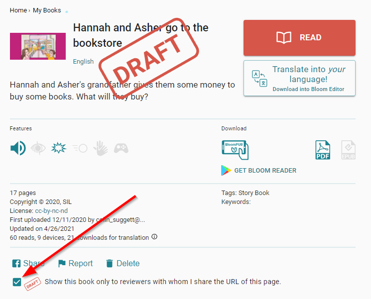

One very powerful feature of Bloom is its ability to harness the generosity of its global user-community – book-creators from all over the world – who allow their original works to be freely translated into other languages. And so, a user in (say) India, can create a beautiful book using Bloom, upload it to the Bloom Library, and make it available to the entire world to freely adapt and translate into other languages. 

It’s wonderful. 

However, this powerful feature comes with an important caution because once people start downloading and making adaptations of your books, any mistakes or glitches in your original book will be _propagated_ to those adaptations.

For this reason, _before_ publishing original works to the Bloom Library, you should ensure that everything in the book is absolutely perfect: spelling, formatting, logos, copyright, licensing, credits, acknowledgments, audio, etc.

If your book is _not_ yet ready to show to the entire world, but you need some way to share the book with others for review, you may consider uploading it to Bloom Library, and marking the book as a draft:

