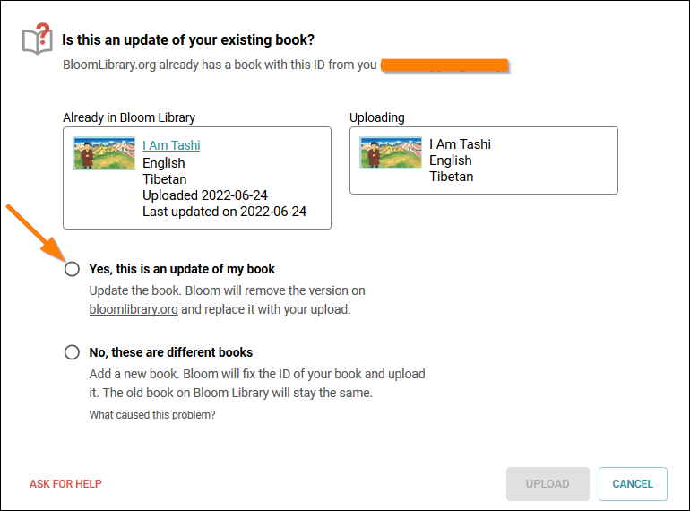

Several organizations like to publish their books to the Bloom Library in _multiple languages_. We encourage this, but also want to outline two different workflows or approaches and discuss the resulting ramifications of using each approach.

## Method 1

Publish one single book to Bloom Library which contains multiple embedded languages for your original title

**Advantages**:

- There is only one book folder on your computer to manage for each original book title.
- When published to Bloom Library, your book will automatically become visible in all of the embedded languages.
- It is easy to “tweak” your book and republish it just once, and for that to immediately affect _all_ versions of your book in the various languages on Bloom Library.
- The Bloom Reader version of your book (online or offline) can be viewed in any of the published languages and switched using the built-in language chooser.

**Disadvantages**:

- The online PDF of the book will only be available in a single language.
- The exact same structure of the book – sizing of images and number of pages – must suit all of the languages.

:::tip

Regarding the “tweaking” mentioned above, if your book is not yet ready to show to the entire world, mark the book as a draft.

:::

Legitimate “tweaking” of an already published Bloom book might include things like _adding_ or improving the audio narration, or perhaps adding a forgotten book acknowledgment, or some other minor change.

## Method 2

Publish one source language book, and then create derivative copies of the book in other languages

**Advantages**:

- An online PDF will be available for _each_ language.
- The structure of the book – sizing of images and number pages – can be adjusted to suit each individual language.

**Disadvantages**:

- You cannot easily “tweak” all versions by republishing once since there are multiple copies of the book which each need to be corrected.

Now that you understand the advantages and disadvantages of these two methods, let’s talk about how your workflow would differ for each method.

## Workflow for Method 1

For this method, you will create just _one_ Bloom collection on your computer which will serve as a “master” collection and it will hold _all_ of your books in _all_ the languages you desire. When you wish to Edit a book in a different language, you will simply switch languages in your collection’s Language Settings. Bloom will then reboot and open your collection in the new language.

Repeat this process until you have completed adding all the languages you desire for a given book.

Once you are ready to publish your book, set your language setting back to the language you want the book’s PDF available in.

Click Publish, then Web. Under Upload Text, select the check boxes for each language you want to become available for your book and be sure to select Narration if you want your audio to become available.

If, at a later date, you need to update your book for any reason, you will need to upload the book again. When you do so, Bloom will present a screen showing the book already in Bloom Library compared with the one you are uploading. If the thumbnail and title match, then click on “Yes, this is an update of my book”.

## Workflow for Method 2

In Bloom, create a separate Bloom collection for _each_ language your organization is working with.

Then, for each new book you author, you will need to decide which language will be considered the “source” or the “original” language for the book in question. That language choice need not be the same for each book, but if you think you will sometimes be using (say) English as the “original” language for one title, and (say) “French” for some other title, then you will need some system to keep track of where your original book is located, otherwise, you may run into some confusion should you need to revise your book at a later date.

Once you’ve decided the language choice for your new book, open the corresponding language collection and create a new book in that collection. When completed, upload your book to the Bloom Library.

Versions of that book in other languages can then be done by you (or someone else in your organization) by downloading that book from the Bloom Library into the appropriate language collection and translating it. This book is called a “derivative” and Bloom assigns this “derivative” a unique book ID, different from the original book. So, when this “derivative” is uploaded to the Bloom Library for the first time, it will not replace the original – it will stand on its own.

