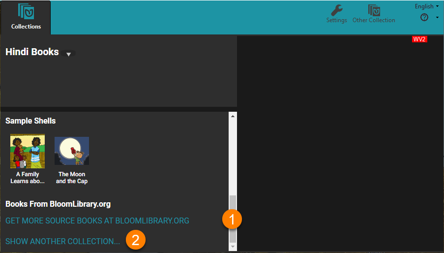
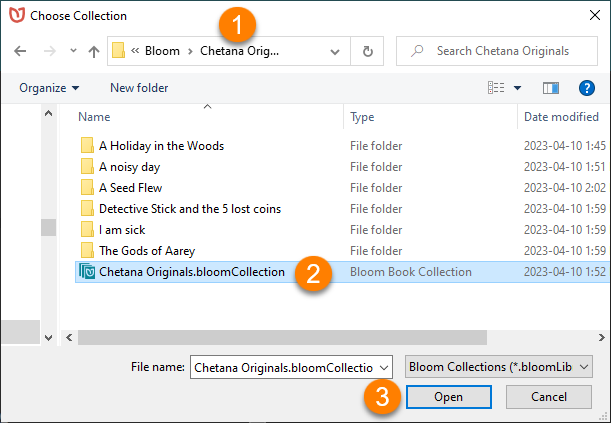
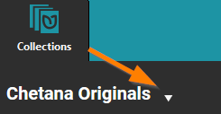

A number of organizations have used Bloom to make a set of self-authored books and oversee the translation of these books into other languages. Most commonly, these organizations employ the following simple workflow:

1. _New_ books are authored in a particular chosen majority language such as English, French, Russian, Hindi, etc. This collection of _original_ books constitutes a type of “parent” collection.
2. The books in this “parent” collection are translated (and/or adapted) into various other local languages in various “daughter” collections.

Chetana, for example, is an active user of Bloom. Most of their original titles first begin as an English publication. Following this, Chetana makes copies of these English books and adapts them into various other languages, such as Hindi and Tamil.

Here is a sampling of [Chetana’s home page](https://bloomlibrary.org/chetana) on Bloom:

In the following, we will present the steps for setting up the Bloom Collections for the Chetana project.

# Make your “parent” collection visible to other collections {#4476b39998c04d9f8ec37fc1d98c0f7e}

After your “parent” collection is established and you are ready to start making adaptations of those books into other languages, you need to make your parent collection visible to these other collections.

1. **In the bottom left quadrant of Bloom, scroll to the bottom of the screen.**
2. **Click on** **SHOW ANOTHER COLLECTION…**

Bloom will open **Windows Explorer** to the Bloom folder. There you will find all of your Bloom collections.

1. **Open the collection folder you want to become visible.**
2. **Find the file ending with** **`.bloomCollection`** **and click on it.**
3. **Click** **Open****.**

Your chosen “parent” collection will now appear in the bottom left quadrant under **Sources For New Books**. It will be listed after the section **Books From BloomLibrary.org**. 

# Make an adaptation of a book {#b0222b901f3c4af4ac57db65f9050812}

To make an adaptation of one of your books:

1. **In the bottom right quadrant, scroll down past Templates, past Sample Shells, and past any books in the Books From** [**BloomLibrary.org**](http://bloomlibrary.org/)**, until you see your parent collection and its books.**
2. **Select the book.**
3. **Click** **MAKE A BOOK USING THIS SOURCE**.

:::tip

Warning: If you use Windows file explorer to create a copy of a Bloom book, that will lead to many problems; that copy will _not_ be a “Bloom-approved” copy of your original book.

:::

# Working with colleagues {#52fa9df6e98f42dd97b2b88c4e0114d2}

There are two different workflows depending on whether or not you have reliable internet and a Bloom Enterprise subscription. Since Chetana has good internet and an Enterprise subscription, we’ll begin with that scenario.

## Workflow 1: Organizations with reliable Internet _and_ an Enterprise subscription {#f32406d0e7af4191acf23a018a9810b0}

Organizations with reliable internet and an Enterprise subscription will want to use Bloom’s powerful collaborative tool: [Team Collections](/team-collections-intro).

Team Collections enables multiple people to collaborate together on Bloom books in a convenient, disciplined, and safe way using Dropbox’s cloud services. In a Team Collection, team members can “sign out” books. When they do so, they indicate to the rest of the team that they are working on the book, and while the book is signed out, other team members are prevented from accidentally editing that book, thus erasing their work. In this way, the Team Collection system allows books to be edited in a safe and disciplined way.

Please refer to [Working with Team Collections](/working-with-team-collections) for further details. 

The above is the typical workflow for organizations with reliable internet and an Enterprise subscription. Additional guidance will be needed if your books are going to be subdivided according to reading level.

## Workflow 2: Organizations with unreliable internet, or organizations with no Enterprise status {#c80ed9e840f246569ffea4cf5d5269ba}

If the internet is unreliable for your team, Bloom’s Team Collections will not be a viable option. In this case, the project coordinator will need to carefully manage by various other means (USB keys, external hard drives, zip files, etc.) the creation, checking, revision, and publishing of new book titles.

Once a collection of original titles are ready to be translated, Bloom does offer a means to bundle those files together in a package. 

Click the arrow beside your collection name:

And then choose **Make Bloom Pack of Shell Books…**

Distribute the `.BloomPack` file to your colleagues to copy to their computer. They should then click on that file. Bloom will then install that Source collection on their computer.

Once installed, that collection will appear in the Source For New Shells section, and they can begin the translation process.

