# Intended Audience {#083c791f8c894a268cbc3b1ba8a95d0b}

This material is intended for Literacy Specialists who will use Bloom to create Decodable and Leveled Reader templates. Those templates will be bundled up and given to authors who can then use them to make books that fit within the constraints of each template.

### See Also:  {#00852dc759a74b7db30de10e618a6d47}

[Using Pre-made Reader Templates to make Decodable and Leveled Books in Bloom](/using-pre-made-reader-templates)

# What you should already know {#e3573f1979b243a69024029bc8ff0e6b}

Although Bloom is easy to learn and use, there are a lot of parts to it. So we will not be explaining _everything_ about the program in this document. Instead, we assume that you have at least used Bloom a little bit. You should have already learned to make a new Local Language Collection and experimented with making a new book using the “Basic Book” template.

This document will not try to teach you principles related to selecting the order in which you will introduce letters and sight words to new readers. Instead, we assume you have plan, and just need to learn how to implement that in Bloom.

# What you will learn {#a4ae986eab46428fa6dd907b1651f604}

You will learn how to create a collection of templates at various levels/stages and for various purposes (decodable or leveled).

It may not at first be obvious, but if you think about it, you will realize that the parameters of decodable books, in particular, must be set up to match the orthography and vocabulary of an individual language. So the collection of templates you create will be for a single language.

Finally, you will learn how to create a “Reader Template Bloom Pack” file that you can give to authors of this language, so that the templates you have created will be available to them.

Before we begin, let’s make sure you know what we mean when we use some key terms:

# Definitions {#de1c82ac5cf3400e9c8880e5b8b8b620}

A _**Decodable Reader**_ is a book that carefully limits the letters and words used so that it fits what a new reader is ready for. In Bloom terms, Decodable Readers each have a _stage_ that defines which letters and sight words are appropriate. We use the word _stage_ so that we don’t get it confused with the _levels_ of _Leveled Readers._

A _**Leveled Reader**_ is a book that is written specifically for a student who is at a certain stage of reading development. A number of factors go into making a book appropriate for a given level.

A _**Reader Template Bloom Pack**_ is a file that bundles up one or more templates from a _Local Language Collection_ into a single, easy-to-share file. Once a colleague has installed Bloom, double-clicking on a Bloom Pack causes Bloom to wake up and unbundle those templates onto his or her computer. The next time they run Bloom, they’ll see that those templates are now available for making new books. If you give them a new version of the Bloom Pack, your new stages, levels, and vocabulary will replace the old ones.

## Creating a Local Language Collection to hold your templates {#4df9252fdee3422ab9d8ef83c6bf972e}

A _**Local Language Collection**_ combines two things. First, it is a folder on your disk that contains other folders, each of which has all the parts of a single book or template book. As you use Bloom, you add books to your collection. We are focusing here on local language collections because the rules for decodable reader stages and leveled reader levels are specific to a single local language.

Second, a Local Language Collection in Bloom has a set of Decodable Reader Stages, and a set of Leveled Reader Levels. Because the rules belong to a collection, and not just to an individual book or template book, you don’t have to repeat what the rules are each time you make a reader. Whenever you make a reader in the collection, you will be able to say “this book should fit Decodable Stage 1, or 2, or 3”, etc. Bloom will look up what the letters, words, and other rules are for that stage or level, and the book you are working on.

So let’s get started by making a new Local Language Collection. If you already have one, with, for example, some local language books, you still should make a new one. The reason is that all of the books in this new Local Language Collection will become templates for authors. So the only books that you want to appear in this collection are decodable and leveled reader templates.

## A. **Make a Local Language Collection** {#e34895cc4dea48fd879dfda23a44bbc4}

Do these steps:

1. Click the **Other Collection** button. It is on the toolbar near the top right corner of the Bloom window.

	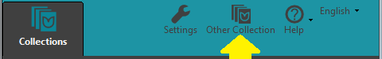

The Open/Create Collections dialog box opens.

3. Click

**Create New Collection**

The Create New Bloom Collection dialog box opens. Then do these steps:

- Click **Local Language Collection**.
- Click the **Next** button.
- Click the search box, and then type in the name of the language.

	

- Click **Next**.
- Choose a font and select any script options that you need for this language.
- Click **Next**.
- If you want to, you can click the country box, and edit the country list.
- Click **Next**.
- If you want to, you can edit the collection name.
- Click **Next**.
- Click **Finish**.

## B. **Make a Decodable Reader template** {#5040ccca330b47808f9c66f1c001da3a}

1. In the **Collections** tab, look for **Sources for New Books**. There you see **Templates**. Click the one that is called **Decodable Reader**.
It looks like this: .

	

1. Click the **Decodable Reader** template.

In the right pane, you see a button that looks like this:

	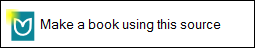

1. Click the **Make a book using this source** button.

Now you should see the Decodable Reader Tool. It is on the right side of the Bloom window.

	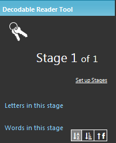

1. In the **Decodable Reader Tool**, you see the **Set up Stages** link. Click that link.

Now you can set up the decodable reader stages.

## C. Set up the Decodable Reader stages {#d128fcd11b854fdb938ac0ca2c7144db}

The first task is to tell Bloom about your alphabet. You do this in the **Letters** tab.

1. Click the **Letters** tab. It looks like this:

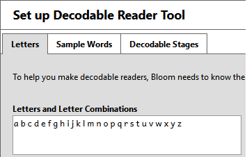

1. Click the **Letters and Letter Combinations** box.
1. If the letters that appear in that box are _not_ the same as the letters in your alphabet, you need to delete them.
	- Select those letters with your mouse and then press the **Delete** key.
1. In the box, type the following things that are part of your language:
	- All of the letters.
	- All letter combinations.
	- Any other word-forming characters, like dashes, apostrophes, hyphens.

The second task is to tell Bloom the words you want it to suggest. You do this in the **Sample Words** tab.

1. Click the **Sample Words** tab. It looks like this:

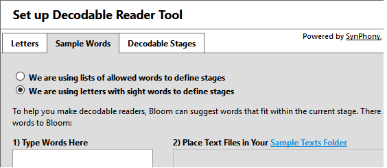

The default selection is **We are using letters with sight words to define stages**. For this exercise, do not change this selection.

The first box is called **Type Words Here**. It is a box where you can type words you want Bloom to suggest.

The second box is called **Place Text Files in Your Sample Text Folder**. You cannot type in this box. It shows file names. These are files of word lists or longer paragraphs of text. If these files are correctly saved in the **Sample Text** folder for the book, then Bloom can read the files and make suggestions. You see the suggestions in the **Decodable Reader Tool**.

Bloom will suggest words from both of these places.

Let’s first type words in the **Type Words Here** box.

1. Click in the **Type Words Here** box. Type a word. Press your spacebar key to enter a space. Then type another word. You can do this for as many words as you want.

Next, let’s put a text file in the Sample Text folder. You can have many files in the folder but let’s do only one right now.

	Notice that in the label **Place Text Files in Your Sample Text Folder**, you see two different colors.

1. Click in the **Sample Text Folder** link.

This opens your computer’s explorer window to the Sample Texts folder for this collection.

You need to have a file available with a word list or a sample text saved as a UTF-8 Unicode *.txt file. Microsoft Notepad works well for this. Microsoft Word also works.

While the details about UTF-8 are beyond the scope of this training manual, here are the basic steps you need to do:

- If you have files in Microsoft Word, use **Save As…**.
Click the down arrow in the **save as type** box to see the options.
Choose **Plain Text (.txt)**.
Then, the **File conversion** dialog box opens. Choose **file encoding**, and then click **UTF-8**.
- Save the file in the **Sample Text** folder. If the folder is open, you can drag-and-drop the file from another folder.

Note: If you have a large file of sample words, Bloom may take a very long time to process them. During this time, it will be unresponsive. You may even see the following dialog box appear:

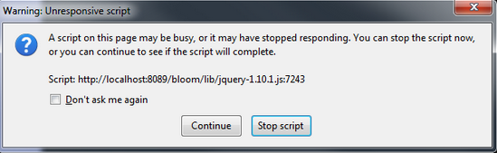

Select the “Don’t ask me again” checkbox, and then click “Continue”. The next release of Bloom will do away with this waiting. In the meantime, here’s a tip for avoiding most of the delay. Avoid adding large numbers of words (for example, above a hundred) until you have finished setting up your stages. Then go back and add the rest of the words. You may still face a delay while the words are processed, but you only have to wait once. 

You should be able to see names of the files in the **Place Text Files in Your Sample Text Folder** box. Now, Bloom can find your file and suggest words.

At this point, you might be asking yourself, “Do I really need to do all this for every template?” No, you only do it once for all your work in a language. All of this setup is part of the Local Language Collection, so it is usable by any book you make in your collection.

The third task is to set up the stages. You do this in the **Decodable Stages** tab.

1. Click the **Decodable Stages** tab. It looks like this:

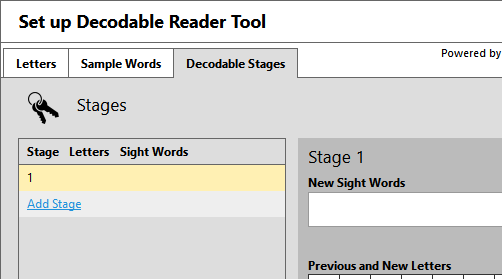

Stage 1 is the first stage. You can add more stages. But first, add letters to Stage 1.

1. In the **Previous and New Letters** area, you see a grid of letters. These are the letters you added in the **Letters** tab. Click the letters you want to introduce in this stage. If you do not see a letter you need, click the **Letters** tab again and add the letter there.

Notice that the letters you clicked get a colored background. Also, notice that those letters appear in the left pane.

If you saved a file in the **Sample Files** folder, words that use the letters in Stage 1 appear in the **matching words** pane. It is on the right side of the tab.

Now, you can tell Bloom about any sight words you want to use in this level.

1. Click the **New Sight Words** box. Then type the words, separated by a space.
1. Now it is time to add another stage. To do this, click the **Add Stage** link.
1. In the **Previous and New Letters** area, you see a grid of letters. Click the letters you want to introduce in Stage 2.

Notice that you cannot click the letter you already introduced.

1. In the **New Sight Words** box, type the sight words to introduce in Stage 2.
1. Do the steps above to add Stage 3, Stage 4 and Stage 5.
1. Click **OK**.

Now your local language collection knows about the decodable stages you want. It knows the letters and sight words you want to introduce. Bloom can now suggest to you.

At any time, you can go back in and work on your stages. Remember, these same stages will be available in any decodable reader you make in this collection. They don’t really “belong” to the book you have open.

### Experiment with using decodable stages {#6f4f1d5c75da45ca8960e630cc287bdb}

In another document designed for authors, we will go into details about using decodable templates to make books. We won’t go into detail here. But at this point, you’ll probably want to play around with your new stages.

1. Here are some of the controls and information you see in the **Decodable Reader Tool**.
- The Stage control. Here is an example:

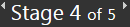

Click the arrows  to move from one decodable stage to another when adding the text for the book.
The arrows are on the sides of the Stage control. To move to a lower stage, click the left arrow. To move to a higher stage, click the right arrow.

- **Letters in this stage.** Under this label, you see letters that are intended to be used in words in this stage.
- **Words in this stage**. Under this label, you see suggested words. These word are in the files in the **Sample Folder**. They are also words that typed in the **Words** tab. The suggestions use the letters you set for this stage.
- Buttons you can use to sort the words in this stage. There are three buttons:

	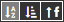

	- The first button sorts the words alphabetically.
	- The middle button sorts the words from shortest to longest.
	- The last button sorts the words by frequency.
	Frequency is based on how many occurrences of the words appear in the files that are in the **Sample Text** folder. For this reason, if you save larger paragraphs or real text you can see the most common words. By contrast, if you only save word lists, each word probably occurs only once.
- You can open a file that shows all the letters and words you have available for suggestions in Bloom. There is control for this.
It looks like this:

	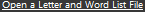

It is a link you can click.
If you click this link, Notepad opens with a file that Bloom created. It lists all the stages, and each set of letters and words you have set for each stage. If you change any of the letters or words, click link again to open an updated file.

1. For this training exercise, set this decodable reader book to Stage 1.

Later we will make Bloom Pack from this template.

Normally, you would want to make five or more templates, with each one of them set to a different stage. Then, the person who receives the Bloom Pack will have templates set for each of the stages. That person could then make books for each stage without the need to change the stages or any of the files in the **Sample Texts** folder.

1. In the **Pages** pane, on the left side, click the **Front Cover** page. The top box is where you put the book title. In this box, type Decodable Stage 1.

Then, the person who receives this template will know what stage it is for. If you made a template for each stage, you could name them Decodable Stage 2 and so on.

### D. Set up the Leveled Reader levels {#1669ed99b57c4d2da0798f49c2cf8b84}

Setting up the Leveled Reader Tool is not too much different from setting up decodable stages. In fact it is easier. There are 6 levels already set for you. You can use them as they are or change them.

The first task is to make a **Leveled Reader** template.

1. Click the  **Collections** tab.

	

1. Look below **Sources For New Books**. Click the **Leveled Reader** template.
It looks like this:

	

1. Click the  **Make a book using this source** button.

1. Now, next to your document, you will see the Leveled Reader Tool:

	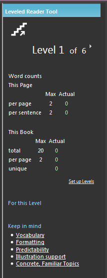

Notice that there are numbers that keep you informed about the number of words by pages and for the book. Also, there are links that provide information. The one link we need to use now is the **Set up Levels** link.

1. Click the **Set up Level** link. It opens the **Set up Leveled Reader Tool** dialog box. It looks like this:

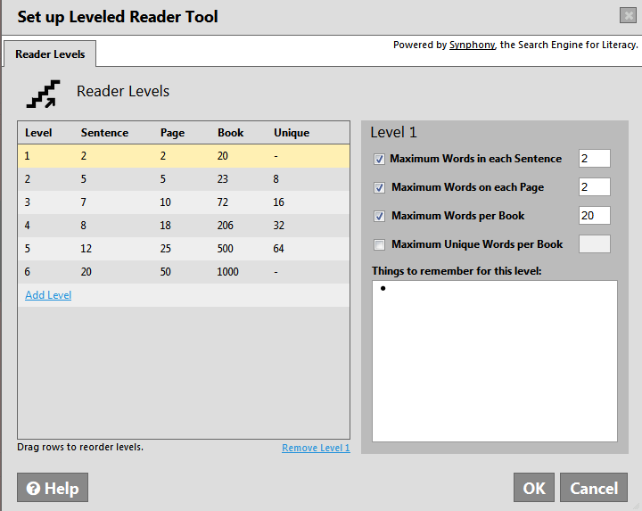

1. To _change_ a level, click that level in the _left_ pane. Then, do the any of the following in the _right_ pane:
	- To remove word count criteria from the current level, click the check box that has a checkmark. This clears the check box.
	- To add word count criteria to the current level, click the checkbox that does not have a check mark. This selects the checkbox.
	- Select a number that sets a Maximum value. Then type a new number. You cannot type a number if that line has the checkbox off.
	- If you want to make notes for the people who will use this template to make books, you can type those notes in the **Things to Remember** box. The notes you type here will appear in the **Leveled Reader Tool** pane, below **For This Level**. The notes appear on a per-level basis.
1. To _add_ a level, the **Add Level** link. It is in the left pane.
	- The new level will not have any of the criteria selected, so select checkbox for each line you want to use. Then type the number in the box that is the maximum value for that line.
	- Type any notes for this level in the **Things to Remember** box.
1. To _remove_ a level, click the level you want to remove. Then click **Remove Level**. It is at the bottom of the left pane.
1. To reorder the levels, click a level and drag it with your mouse until it is in above the place where you want it to be. Then release your mouse button.
1. When all the levels are set, click **OK**. The **Set up Leveled Reader Tool** closes.

Now your local language collection knows about the levels you want. It knows which criteria you want to use and the maximum values for each one.

At any time, you can go back in and work on your levels. Remember, these same levels will be available in any leveled reader you make in this collection. They don’t really “belong” to the book you have open.

# Making Your Templates {#3fb4defeef21443eac2ff1403b9c7f72}

Now that you have set up the system for decodable and leveled readers for this collection, you can do one of two things. If you are working all by yourself, you can just start making books using those levels and stages. The remainder of this document, however, will assume that what you want to do is make a series of book templates that will serve as launching points for authors. You will see how to create each of these templates, and then how to package them up into a Reader Template Bloom Pack that you can give to authors.

While setting up your levels and stages in the previous section, you will have already made one or more template books. The purpose of those templates was to give you access to the reader tools so you could set things up for this collection. In the following, we are going to give you step by step instructions you can use to make many more of basically empty books, each one tied to a single decodable stage or leveled reader level, and each one with the “normal” style set to have an appropriate font size, line spacing, etc. So what happens to the ones you already made? Feel free to use those as a starting point, for example, for the first level and stage. You are also free to delete them (right click on their icon and choose **Delete Book**). Remember, all the set up you have done belongs to the Bloom Collection, so it will be there for any future reader books you make. It won’t go away just because you delete one or even all of the books in your collection.

### Create a template of the appropriate type {#5e914161daa64f51b0e358c70179fc44}

First you need to decide if you are making a decodable reader or a leveled one. Then, in the **Collections** tab, you would click the appropriate source template.

Let’s make a Decodable Reader template.

1. Click the **Collections** tab.
1. Click **Decodable Reader**.

	

1. In the right pane, you see a button that looks like this: .

	

1. Click the **Make a book using this source** button.

The Front Cover page appears. Notice that the focus (place where you type) is in the top text box. This is the box where you type the title of the book. The callout box tells you which language the box expects.

So, let’s give the template a title that will make sense to the author. For example, in English, we might name a template “Decodable 2” so that it is obvious to an author that he or she should select that one if what they want is to start a new decodable book that will conform to stage 2.

1. Let’s make sure the book is set Stage 2. Here is how you do it:
	- In the **Decodable Reader Tool** pane, find the stage control:

		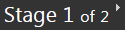

	- Click the arrow that points to the right to change the stage from 1 to 2.

From now on, this book is set to be a stage 2 book, like this:

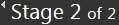

**Set up text styles and spacing**

An important part of making books for new readers is choosing the right font, size, line spacing, and word spacing. For each decodable stage or leveled reader, you may want to have different settings for these things. Here’s how to do it.

1. Near the bottom of the **Pages** pane, click the **Add Page** button
1. In the **Add Page** dialog box, below **Decodable Reader**, click the **Basic Text and Picture** page. It is the top-left one. Then click **ADD PAGE**.

A new page is inserted. The top shows a picture placeholder. It works just like the one on the Front Cover page. Below it is a text box.

1. Each text box has a small gray “gear” control: It is at the lower left corner of the box: . Click that gear control. It looks like this:

	

A **Format** dialog box opens with control you can use to set styles, font, font size and more.

For more information about this box, open the Help files that came with Bloom.

That's all you need to do to make a template. Back in the collections Tab, you should see something like this:

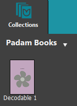

Now, repeat those steps for every decodable stage you need. When you are done, you should end up with something looking like this:

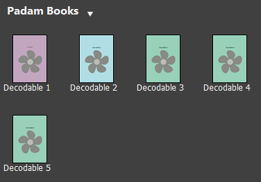

Now, we can do the same thing for each Leveled Reader level:

1. Click the  **Collections** tab.

	

1. In the Sources for New Book, click **Leveled Reader**.

	

1. In the right pane, click **Make a book using this source**.
1. The **Front Cover** page appears. Notice that the focus (place where you type) is in the top text box. This is the box where you type the title of the book. The yellow callout box tells you which language the box expects.

So, let’s give the template a title that will make sense to the author. For example, in English, we might name a template “Level 2” so that it is obvious to an author that he or she should select that one if what they want is to start a new book that will conform to level 2.

1. Let’s make sure the book is set Level 2. Here is how you do it:
	- In the **Leveled Reader Tool** pane, find the level control:

		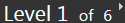

	- Click the arrow that points to the right to change from level 1 to 2.

From now on, this book is set to be a level 2 book, like this:

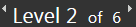

Finally, set the text formatting as you did before, for the decodable readers templates.

Now, in the **Collections** tab, you could have something like this:

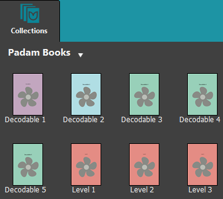

## Making a Reader Template Bloom Pack {#7c7159e4d2834ba996e3c989c8905dff}

You’ve now set up your stages and levels, and you’ve made a template to go with each one. Now you’re ready to give all this good work to a colleague or two who will use it to make lots of books.

First, let’s make sure the name of our collection describes what it is.

1. In the upper right, click on the Setting Icon:

	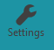

1. In the **Project Information** tab, edit the name in the **Bloom Collection Name**, box, and then click the **Restart** button.

	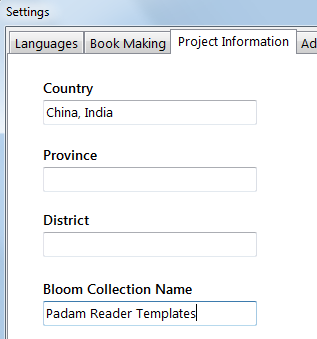

Bloom will restart to cope with that change. After the restart, you’ll see the new name at the top of the **Collections** tab:

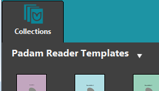

Now you are ready to make a Bloom Pack that will share your stages, letters, words and levels with others.

1. At the top of the left pane, look for the name of your book collection. Just to the right of that collection name, notice the white down arrow. It looks like this:

	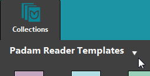

1. Click that white down arrow, and then click the **Make Reader Template BloomPack** command.
It looks like this:

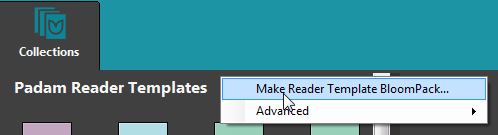

1. The Make Bloom Reader Template Bloom Pack dialog box opens.
1. Select the check box about confirming that you understand. Then, click the **Save Bloom Pack** button.

The Save As dialog box opens. At this point you can save this Bloom Pack file wherever you want: on a USB Flash drive that you share, to a shared networked folder, in Dropbox, etc.

1. Find the folder where you want to save it, and then click the **Save** button.

Now the Bloom Pack is saved. Another training document, “Using Bloom Reader Templates” is available to help the person who received this Bloom Pack. But just in case you want to know a bit now, that person simply has to copy that Bloom Pack to their computer and double click it. After that, the templates you have created will show up in their **Sources for New Books** area:

