When you open Bloom, Bloom puts the **Sources for New Books** in the lower left-hand corner of the screen. We will learn how to create a book by using the **Basic Book** template.

## Step 1: Create a new book {#8b295154c82d4bea9f34cd45ab930af3}

Creating a new book is a two-part process.

1. Select a template in the **Sources for New Books** pane by clicking its icon. Here, we use the **Basic Book** template, but you can explore the other templates Bloom provides.
2. Click the **`MAKE A BOOK USING THIS SOURCE`** button in the upper part of the right-hand side of the Bloom window.

	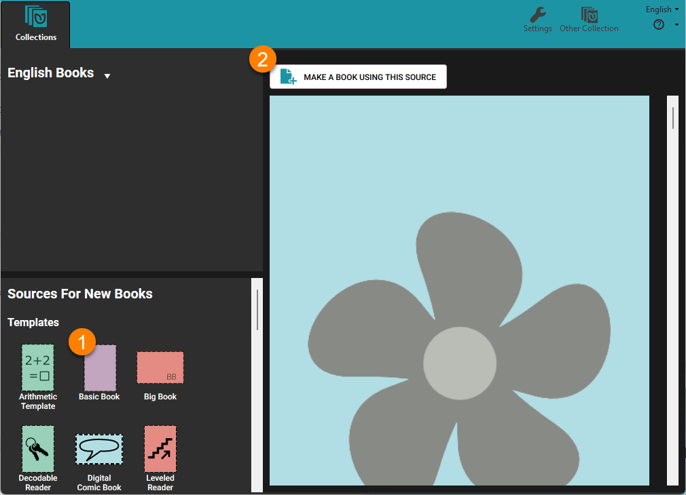

### The Edit tab {#421144f36dd94c6880857ff45ae3f576}

When you click **`MAKE A BOOK USING THIS SOURCE`**, Bloom adds a new book based on the template to your collection and opens it in a new tab, the **Edit** tab. (Bloom also adds a **Publish** tab.) When you open a new book for editing, Bloom takes you to the **Front Cover**. 

Let’s look at some of the parts of the Edit tab window and the front cover. 

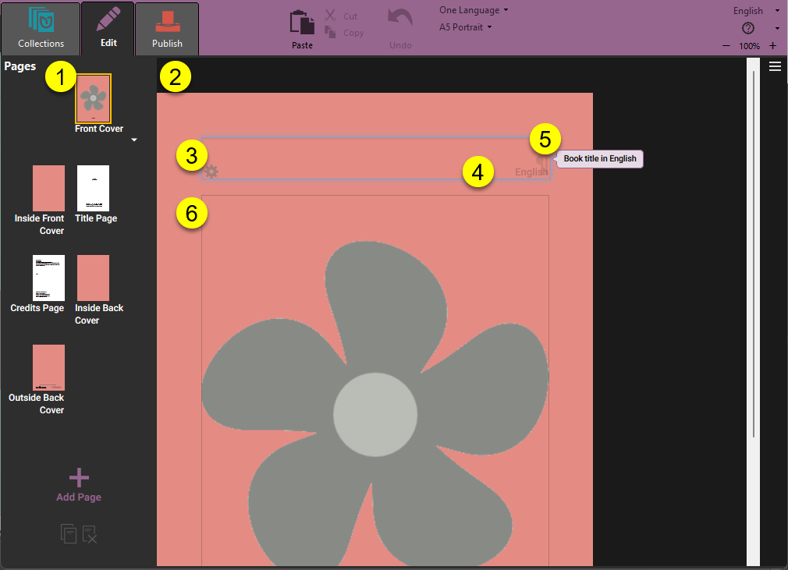

| **❶** | On the LEFT side of the window are small images (called **”thumbnails”**) of each page in your book.                                                                                             |
| ----- | ------------------------------------------------------------------------------------------------------------------------------------------------------------------------------------------------ |
| **❷** | On the RIGHT side is the **editing pane** where you can edit your book.                                                                                                                          |
| **❸** | Bloom puts a box around each place where you can put content. Here you see a box for the book title. When a text box is selected for editing, Bloom makes the box around it a light blue color.  |
| **❹** | Each text box has a light gray label in its lower right corner showing what language it contains.                                                                                                |
| **❺** | Bloom puts a small note to indicate that this is the title box.                                                                                                                                  |
| **❻** | The Basic Book template includes a place for you to put a picture on the cover of your book.                                                                                                     |

### Adding a page title {#d91111baa0f14027be1decb76554ef84}

When you first create a new book, you need to give it a title. 

- **Type the title of the book in the title box.**

	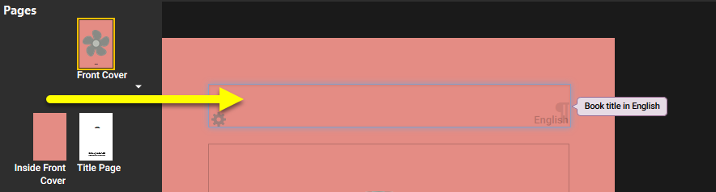

You can also add a picture to the front cover. We'll look at that next.

### Adding a cover picture {#2681cb0e96634b2eac32b50356e538b8}

In Bloom, spaces for pictures are shown with the **flower shape**. (If you do not add a picture, the final book will be blank in this space. The flower shape will not appear.)

To add a picture, hover the mouse over the flower.  Two buttons will appear (see below): 

| **❶** | The **upper right button** opens the image toolbox, from which you can select an image for this space.     |
| ----- | ---------------------------------------------------------------------------------------------------------- |
| **❷** | The **lower right button** lets you paste in an image which has been copied to your computer's clipboard.  |

- **Click the image toolbox button (****❶****) in the upper right-hand corner of the image icon.**

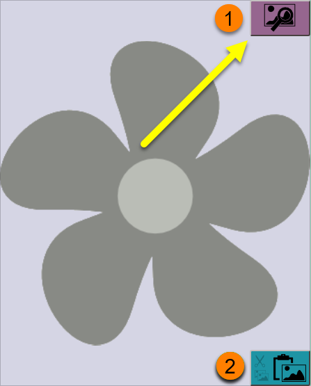

Next, Bloom will show the **Image Toolbox**. The Image Toolbox lets you choose from several sources for images, including Bloom Image Galleries, an attached scanner or digital camera, or a file on your computer. Here we will select an image from _The Art of Reading_ image gallery. (If you do not have _The Art of Reading_ or another Bloom image library installed, see [Installing Bloom](/installing-bloom#a5ed45478c4141838da36b429cd4a600) for directions.) 

1. **Click the** **`Image`** **`Galleries`** **button.**
2. **Type a search term into the search box****.** The search term needs to be in the language of the dropdown list to the right of the magnifying glass **❸**. (The language will default to the user interface language, but you can choose a different language for this search if you like.)
3. **Click the magnifying glass icon** 🔎 **to search the image collection.**
4. **Select an image from the results returned.**
5. **Click** **`OK`** **to insert the image into your book.**

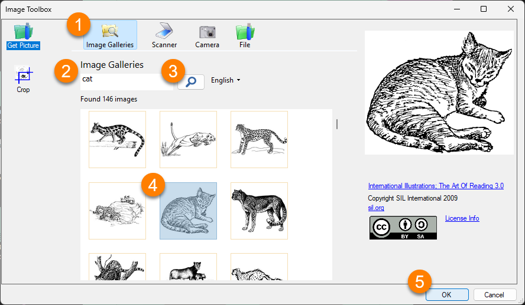

For more details about the Image Toolbox, see [Working with Images](/working-with-images). 

## Front matter pages {#86e2d91e11ef4fc0b662523c1859d38f}

Bloom knows about the basic requirements for any type of book, so it has already created some special pages for you, including a title page and a credits page. 

:::note

You can change how the front matter and back matter pages appear in the “Book Making” tab of the Collection Settings. 

:::

### The Title page {#d5816ffc724a42cd9551d97f32150c0c}

The **Title Page** should already have the title of your book. When you type the title of your book into the front cover, Bloom automatically copies the title to the title page. 

Whenever we make a book, it is important to acknowledge those who contributed to the content of the book.  You can acknowledge them on the title page. 

1. **Type the names of the book’s authors or illustrators into the second text box.**
2. **Use the third box to acknowledge any funders.**

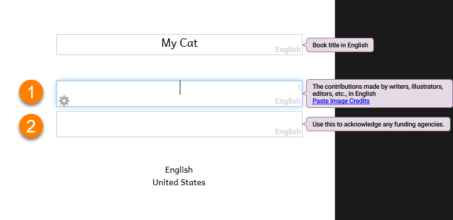

### The Credits page {#41dcdea0eacc4435bd8525afec354c6c}

The **Credits Page** lets you add three kinds of information: copyright and license information, additional acknowledgments, and ISBN number. 

1. If your book does not have a copyright statement, a **Needs Copyright** notice will appear.
2. **Click the** **`Click to Edit Copyright & License`** **link to add a copyright holder or change the license** (see below for more about copyright and licenses).
3. **Add additional acknowledgments in the text boxes:** for instance, to a translator, or to the source of the original book.
4. **Add an ISBN (International Standard Book Number)**, if your book has one.

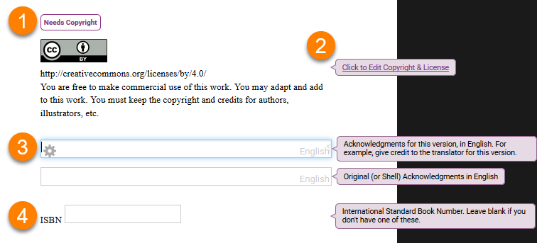

### Adding Copyright and Licensing information {#e967f6bf24924b7496a3b25e2ead3551}

Each Bloom book has copyright and licensing information built into it. 

By default, the Basic Book template uses a Creative Commons “attribution-only” license. This means that others can copy and share your work, and even make changes to it, but they need to acknowledge you as the original author. You can choose other licenses if you wish. 

After you click on the **Click to Edit Copyright & License** link, a small **Copyright and License** window will appear. 

1. **In the Copyright section, add the name of the Copyright Holder.** You can put your name (or the name of your organization) as the copyright holder,

2. **If you want to change the license, click the** **License** **tab.** If you want to use the default Creative Commons “attribution only” license, you can click **OK** to return to the Credits Page.

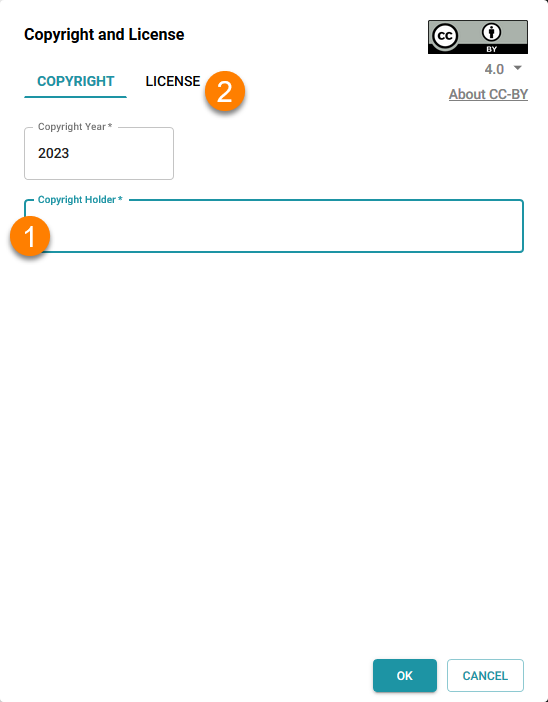

 Next, on the **License** pane: 

1. **Make any changes you want to the license settings.**

2. **Click** **OK** **to return to the Credits Page.**

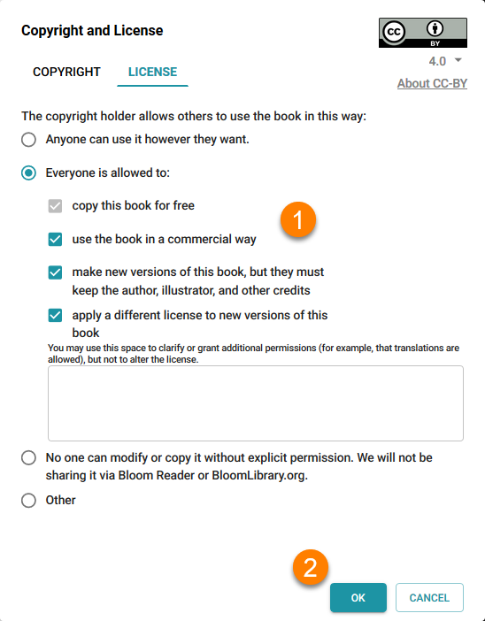

## Adding a page to your book {#55c6ab551f554fcea7a633c5207fb2ac}

After you have finished your book’s front matter, you can start adding pages. 

1. **Click the large** **`+ Add Page`** **in the pages pane to add a page to your book.**
2. **Select a page layout for your new page.**
3. **Click the** **`ADD PAGE`** **button.**

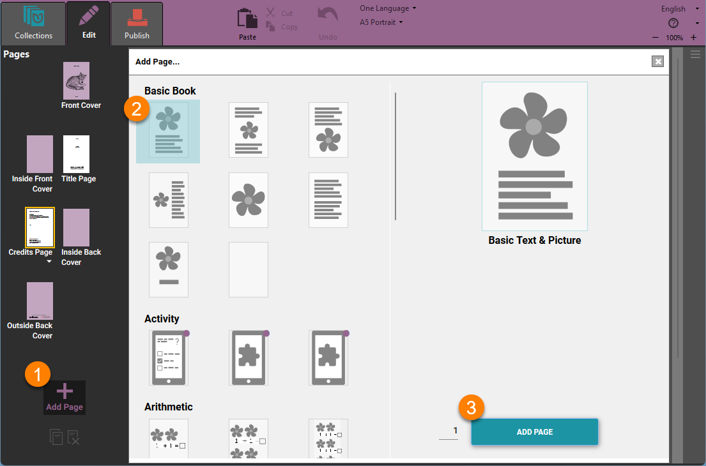

See [Working with Pages](/working-with-pages) for more directions on how to add and remove pages, change page layouts, and more. 

## Finishing your book {#8582862c7b3d424d8ab5c1f79d7e1366}

When you are finished, click the **Collections** tab. Bloom will return to the Collections view. Now you will see the new book that you have just created. 

When you want to work on your book another time, do the following

1. **Click the book’s image in the Collection pane.**
2. **Click** **`EDIT THIS BOOK`****.**

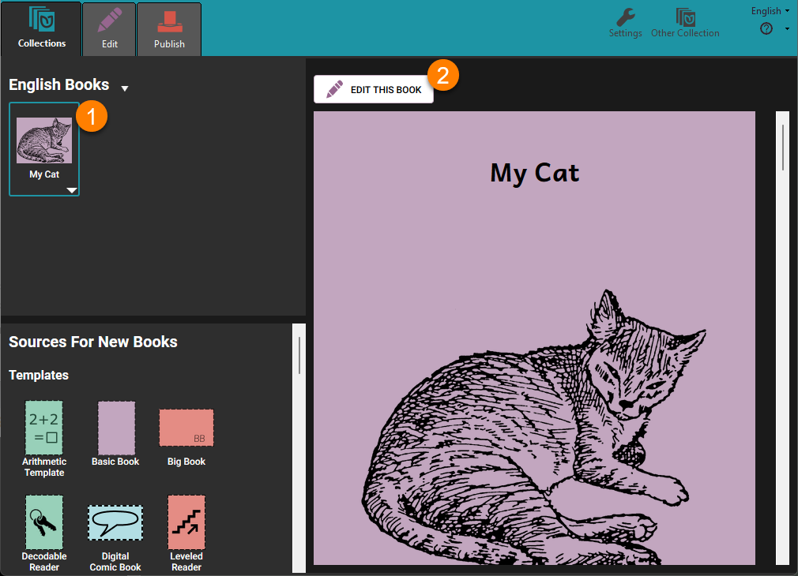

:::note

You can also open a book for editing by double-clicking the book’s image in the Collection pane.

:::

