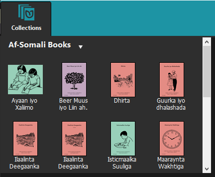
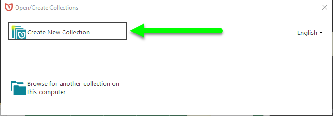
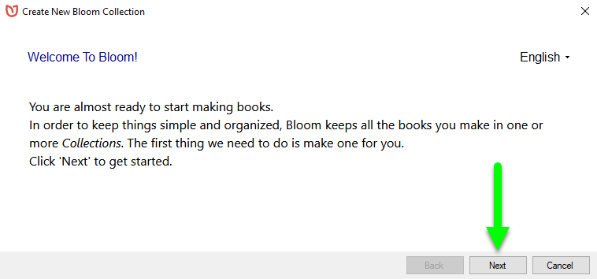
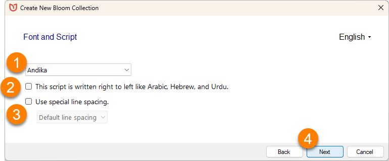
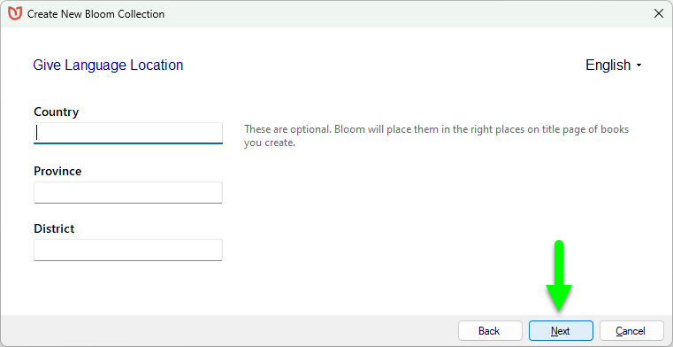
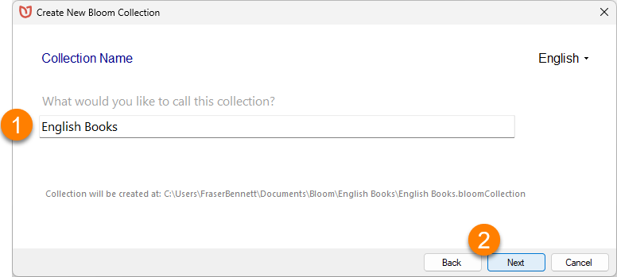
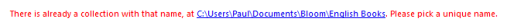
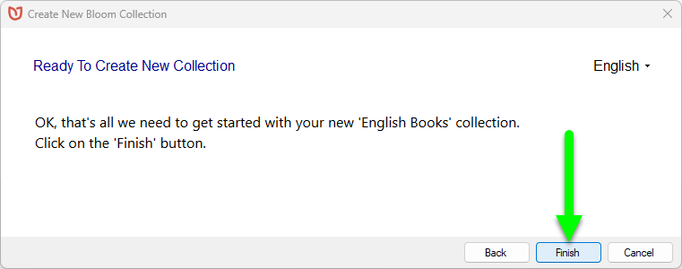
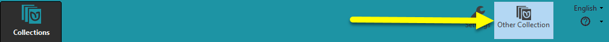

:::tip

There’s a 3-minute training video about creating a Bloom collection: 
**Bloom: Making a Set of Decodable and Leveled Reader Templates - Step 1: Create a New Collection** (available on [Vimeo](https://vimeo.com/showcase/3294468/video/121688803) and [YouTube](https://youtu.be/CQO8PmIYVqY))

:::

## What is a Bloom Collection?  {#90e1bad894004b8ba6f0fd8452b1e6ef}

In Bloom, every book is part of a **Collection**. A collection is a set of books that share certain characteristics. All the books in a collection have the same settings for their languages and book design. You may have a collection of English books, or French books, or books in some other language. 

In the Bloom Editor window, the current collection appears in the upper left-hand corner. 

:::note

You can have more than one collection of books on your computer. Bloom stores all the books in a collection together in a single folder on your computer. 

:::

Because every book must be part of a collection, before you can create a book you must have at least one collection.  

## How to create a new collection {#1d6b50d3274041feaf260bfd18d07d4f}

To create a collection, Bloom needs to gather some basic information about the books that will be part of the collection — especially, the name of the language the books are written in. Bloom will lead you through a series of screens to gather the information it needs. 

### How to begin your first collection {#c864fe0c9e214a6db969a63de11c6675}

When you start Bloom for the first time, Bloom will show you a window that lets you _Open/Create Collections._ 

- Click **`Create New Collection`**.

:::note

If this is your first time running Bloom, Bloom will also show you a welcome screen. 

If you see this welcome screen, click **`Next`**.

:::

Now Bloom is ready to gather the information it needs about your collection. 

:::note

**If you are using Bloom 5.4 or earlier,** Bloom will ask you to select a `collection type`.  In almost every situation, you will want to use a **Local Language collection**. 

:::

### Choose the main language for the collection {#51ae111e027546e7b7151d05d85ccec2}

Bloom will show you a long list of languages. 

1. **Scroll through the list, OR begin typing the language name in the search bar.** Bloom will show you a list of one or more languages that match what you typed.
2. Click on the **language's name** to select it.
3. **Change** how the language's name is **displayed** in your collection (optional).
4. Specify which script or dialect your collection uses by clicking on **`Script and Variant`** (optional).
5. If you can’t find your language in the list, click **`Can’t find your language?`** for more help.
6. Click **`Next`**.

### Select the font to use for the main language (optional) {#5bef2bd549244665987d586bdd788586}

You can tell Bloom which _Font and Script_ to use for the books in your collection. By default, Bloom uses the **Andika** font, which is a good font for new readers. You can change the font and script settings later, either for all the books in your collection or for an individual book.

:::note

Bloom versions prior to 5.5 use Andika New Basic as their default font. 

:::

1. **If** you want to use a different font, select the font you want to use from the drop-down list of fonts that are installed on your computer.
2. **If** the language’s script is written right to left (like Arabic), **tick the checkbox next to** **`This script is right to left like Arabic, Hebrew, and Urdu.`**
3. **If** the language’s script uses stacked diacritics, **tick the checkbox next to** **`Use Special line spacing`**. Then select the **`Default line spacing`** (or a taller spacing) from the drop-down list.
4. **Click** **`Next`**.

	

### Add language location information (optional) {#6997d5fc0d0b40488a0427e710294aff}

You may add details about the Language Location. This step is optional. You can add this information later in the Collection Settings. 

:::note

The language location will appear on the title page of books in this collection.

:::

- **Click** **`Next`**.

### Name the collection {#79d1ab39f9ef4b5fb6b41e5401e60b15}

1. Provide a **`Collection Name`** for your collection.

2. **Click** **`Next`****.**

:::note

The collection name is the name that Bloom will give the folder for your collection’s books, so it must be different than all your other project names. If you choose a collection name that already exists on your computer, Bloom will prompt you to choose a different name.  

:::

### Finish creating the collection {#822aba30c20e40829966ca01e2bf4546}

Now you are _Ready To Create Your New Collection_**.**

- **Click** **`Finish`**.

Bloom will create your new collection. 

## Now you are ready to make a book! {#c8dab090b53045d287c08826526bcd44}

After Bloom creates your new collection, Bloom will show you the Bloom Editor window. 

The Collection pane (in the upper left corner of the screen) is empty — ready for you to fill it with books! 

## How to begin a new collection from the Bloom window {#d99e8fe85cff4e22b4371f8dbfa77dae}

If you are already running Bloom, you use the **Other Collections** button to create a new collection. 

- **Click on the** **Other** **collections** **button in the Bloom toolbar.**

Next you will see a window that lets you **`Create a new collection`** or **`Browse for another collection on this computer.`** 

- **Click** **`Create New Collection`**.

If you are already running Bloom, you use the **Other Collections** button to create a new collection. 

- **Click on the** **Other collections** **button in the Bloom toolbar.**

Next you will see a window that lets you **`Create a new collection`** or **`Browse for another collection on this computer.`** 

- **Click** **`Create New Collection`**.
