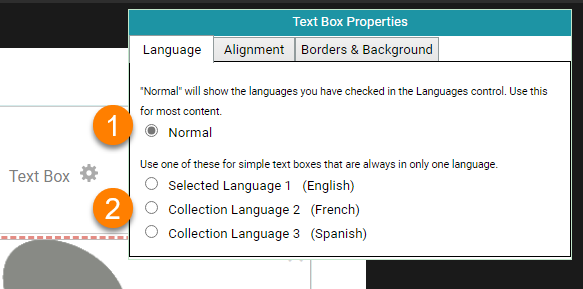
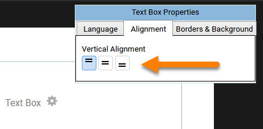
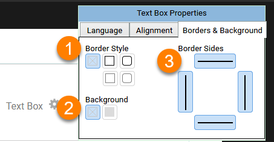

Bloom lets you control the formatting of the text boxes that contain text. 

1. **Click the** **`Change Layout`** **button at the top right-hand corner of a page.** Bloom will make any text in the text box gray, and show a gray gear icon in the center of the text box.
2. **Click the gray gear icon** to show the Text Box Properties dialog box.
3. Make whatever changes you like to the text box settings.
4. **Click the** **Change Layout** **button to return to editing the page.**

The Text Box Properties dialog box has three separate parts. We’ll look at each one in turn. 

## The Language tab {#807253a78d6f4355b217f2b20af6bdc5}

Every text box in Bloom is labeled as belonging to a certain language. When you are editing a book in Bloom Editor, Bloom indicates the language of each text box with a light grey “language tag” located in the bottom right of each text box. 

When you are making books in Bloom, it is _very_ important that these language tags accurately correspond to the actual language written contained within each text box.

:::caution

**Make sure the text you type into a text box belongs to the language of the text box!** 
If you are simply printing your book, having inaccurate language tagging will not negatively affect you or anyone else. But if you want to share your book through the Bloom Library, accurate language tagging is crucial so that others will be able to find your book in the correct language category. 

:::

You can change the language (or languages) used in your book in the Collection settings. If you want a text box to always be in a different language from other text boxes, you can do that with the **Language** tab.  

| ❶ | Choose **Normal** to let this field be controlled by the language settings in the Collection settings.  (Note: This is distinct from the “Normal” text style: this setting in the Language tab will say “Normal” even if you have the text box set to a different style.)  |
| - | -------------------------------------------------------------------------------------------------------------------------------------------------------------------------------------------------------------------------------------------------------------------------- |
| ❷ | If you want this text box to always display a certain language, choose Language 1, Language 2, or Language 3. (These are the same languages that are listed in the Collection settings.)                                                                                   |

For more details on language settings and making bilingual and trilingual books, see **[Problem Internal Link]**. 

## The Alignment tab {#39af07a9fdfb450d9052eb7789bd2f74}

If you want to align text vertically within the text box, click the **Alignment tab** and choose one of the vertical alignments: top, centered, or bottom. 

:::✅

The “Picture on Left” page layout uses vertical centering by default. 

:::

## The Borders & Background tab {#b7b2dd05956540c880ef5e5ffbd9f9d1}

The **Borders & Background** tab allows you to put a black or grey border around your text box, which will show up on the printed page. Here we see a grey border with rounded corners around the text box

| ❶ | **Border Style** lets you select whether the text box will have no border, or a black border, or a or gray border. The border can have square corners or rounded corners.  |
| - | -------------------------------------------------------------------------------------------------------------------------------------------------------------------------- |
| ❷ | **Background** lets you select whether the text box will have no background color, or a gray background.                                                                   |
| ❸ | **Border Sides** lets you choose which sides (if any) of your text box will have a border.                                                                                 |

