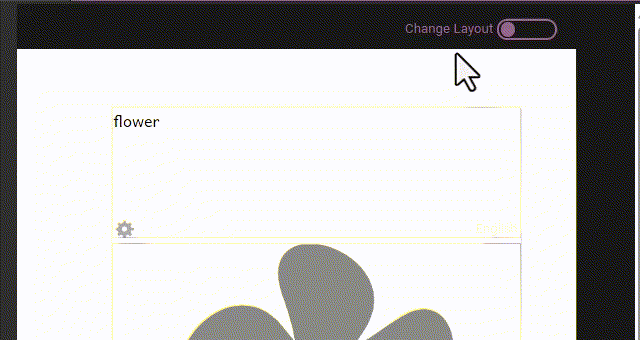
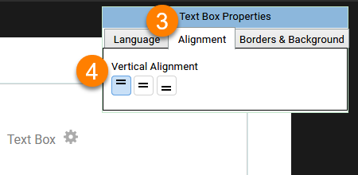

Bloom lets you control the formatting for text boxes.

1. Click the `Change Layout` button at the **top right-hand corner** of a page.
	1. Bloom will make any text in the text box gray, and show a **gray gear icon** ⚙ in the center of the text box.
2. Click the **gray gear icon** ⚙ to show the _Text Box Properties_ dialog box.
3. Make whatever changes you like to the text box settings.
4. Click the `Change Layout` button to return to editing the page.

The _Text Box Properties_ dialog box has three separate tabs:

- 
- 
- 

We’ll look at each one below. 

## Text Box Language Settings {#6bc31bd14abe4b5ebbae22534bdb24e2}

Every text box in Bloom is labeled as belonging to a certain language. When you are editing a book in Bloom Editor, Bloom indicates the language of each text box with a light grey “language tag” located in the bottom right of each text box.

When you are making books in Bloom, it is _very_ important that these language tags accurately correspond to the actual language written within each text box.

:::caution

**Make sure the text you type into a text box belongs to the language of the text box!** 
If you are simply printing your book, having inaccurate language tagging will not negatively affect you or anyone else. But if you want to share your book through the [Bloom Library](https://bloomlibrary.org/) 📕, accurate language tagging is crucial so that others will be able to find your book in the correct language category.

:::

You can change the language (or languages) used for the whole book in .

## The Language tab {#807253a78d6f4355b217f2b20af6bdc5}

If you want a text box to **always** be in a specific language, you can do that with the **Language** tab.

1. Click the `Change Layout` button at the **top right-hand corner** of a page.
2. Click the **gray gear icon** ⚙ in the center of the text box that you want to edit.

	

3. Choose **Normal** to let this field be controlled by the language settings in the Collection settings.
	1. (Note: This is distinct from the “Normal” [text style](/formatting-text-styles#feb4fb1700e64099b661c721f9195918): this setting in the Language tab will say “Normal” even if you have the text box set to a different style.)
4. If you want this text box to always display a certain language, choose Language 1, Language 2, or Language 3. (These are the same languages that are listed in the [Collection settings](/8ebe7814-fc9f-4c6f-8890-809347af6dde#cb9073a21d7b4b04be0aaba5884a00e7).)

	

## The Alignment tab {#39af07a9fdfb450d9052eb7789bd2f74}

You can set text to **align vertically** within the text box.

1. Click the `Change Layout` button at the **top right-hand corner** of a page.
2. Click the **gray gear icon** ⚙ in the center of the text box that you want to edit.
3. Click the **Alignment tab**.
4. Choose one of the vertical alignments: `top`, `centered`, or `bottom`.

:::tip

The “Picture on Left” page layout uses **vertical centering** by default.

:::

## The Borders & Background tab {#b7b2dd05956540c880ef5e5ffbd9f9d1}

The **Borders & Background** tab allows you to put a black or grey border around your text box, which will show up on the printed page. Here we see a grey border with rounded corners around the text box.

1. Click the `Change Layout` button at the **top right-hand corner** of a page.
2. Click the **gray gear icon** ⚙ in the center of the text box that you want to edit.
3. Click the **Borders & Background** tab.
4. **Border Style:** select whether the text box will have **no border**, or a **black border**, or a or **gray border**.
	1. The border can also have **square corners** or **rounded corners**.
5. **Background:** select whether the text box will have **no background color**, or a **gray background**.
6. **Border Sides:** choose which **sides** (if any) of your text box will have a border.

	

