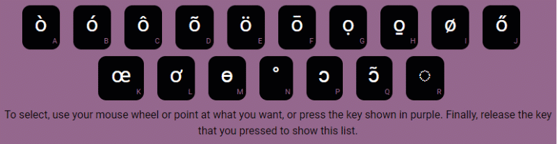
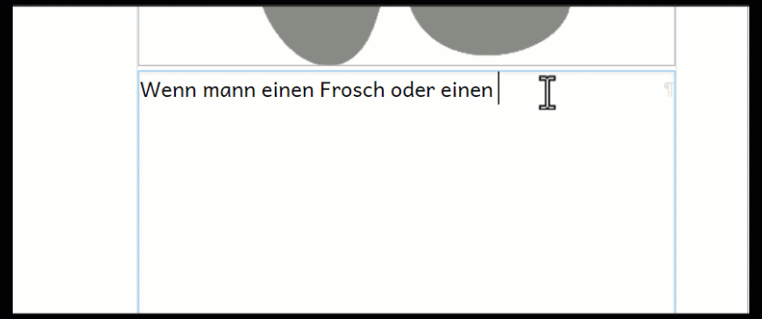
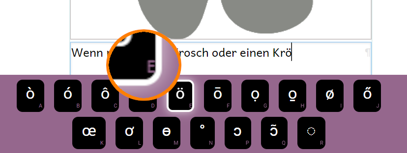

Your language's alphabet or script may include **special characters**, such as **ā**, **β**, and **ĉ**. Normally, you will already have a way to type such letters on your computer. But if you do not, Bloom provides a convenient way to enter the characters that you need. 

:::tip

If your language uses a non-Roman script or regularly uses special characters based on the Roman script, you need a way to type it conveniently. Your operating system may provide a keyboard for your language, or you can use special keyboarding software such as SIL's **Keyman** ([https://keyman.com](https://keyman.com/)).  

:::

## How to insert a special character {#2d90f198a0724cb7b82dd7ffe60ffd4b}

1. **Press and hold** the key that has the **base letter** for the special character (for example: “o”).
	1. **K****eep holding** the key **down.**
2. Bloom will display special characters that are variations of the base letter:

	

3. You can then select the character you need using your **mouse** or the **keyboard**.

### Using the mouse {#5a4facf9ccca4002850da24e7dbcac11}

- Click on the character that you want to use:

	

### Using the keyboard {#02d08bf9c9b24411a6dd3e7c53a172ed}

When you press and hold the key, each Special Character for that base letter is assigned a key, which you can press to insert that character. The keys are shown at the bottom right corner in each of the special character boxes.

- Press the **keyboard letter** that appears in the **Special Character box.**

:::note

For special characters that you use frequently, you can memorize the key that goes with that character. For example, the keys to press for the special character **ö** would b:
1. Press and hold down the **O** key.

2. Press the **E** key.

:::

