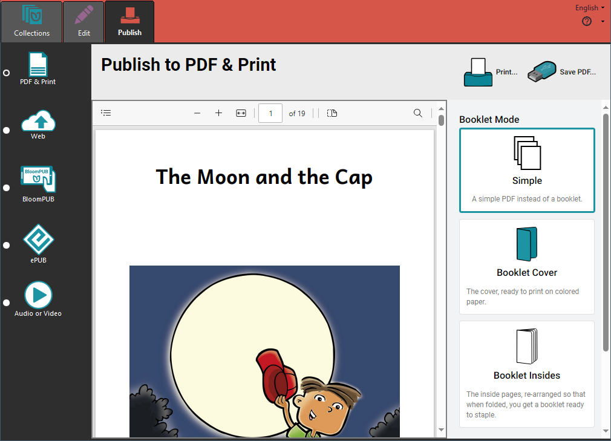

Bloom lets you print your book in several ways. 

Printing a book in Bloom is a two-step process. First, you use Bloom to create a **PDF** version of your book. A PDF file is a computer file that looks like a printed document, with text and graphics. Then you can print and share your book with others.

## Choose a page size and orientation {#b434d49e12b94563ac526dc97b40fb6d}

To get your book ready to print, first open the book you wish to publish as a PDF.

Then, from the toolbar, select a page size and orientation. Choose a paper size that your printer supports. (In this example, we have chosen **A5Portrait**.)

:::note

**Portrait** orientation is taller than it is wide. **Landscape** orientation is wider than it is tall.

:::

## The Publish tab {#ba243c4f82814779a43df5ed5840620f}

Now click on the **Publish tab**. This will show you the Publish tool and the various options for publishing. Bloom gives you many options for publishing your book:

- PDF & Print

- Web (upload to Bloom Library)

- BloomPUB

- ePUB

- Audio or Video

We will look at the **PDF & Print** option. 

## Creating a simple PDF {#abcd05d5bf7a40cb80c9e13feaf3877a}

The **Simple** option will create a PDF that looks like the pages of your book. If you print the Simple PDF, each page of your book will be printed on a separate sheet of paper.

1. **Click the** **`Publish`** **tab** (you may have done this already)
2. **Click the** **`PDF & Print`** **button in the left-hand toolbar.**
3. **Bloom Enterprise users** can choose to create a PDF with full-bleed images and CMYK four-color separation.
4. **Click the** **`Simple`** **button in the right-hand toolbar.**

When Bloom has finished making the PDF, it will show it to you.

## Making a booklet {#413953d2bca94e89b08c2d3bfd7732ff}

If you want to print your book in booklet form, you create a PDF for the **Booklet Cover** and **Booklet Insides** separately. The booklet cover is separate because it is often printed on heavier paper, or on colored paper.

### Create a PDF of the booklet cover {#4f0c1bd07b5842bb884fe86c22e0b0d5}

1. **Click the** **`Publish`** **tab** (you may have done this already)
2. **Click the** **`PDF & Print`** **button in the left-hand toolbar.**
3. **Click the** **`Booklet Cover`** **button in the right-hand toolbar.** Bloom will make a PDF of just the front and back cover.
4. Bloom will show you the PDF of the booklet cover, ready to print double-sided.
5. **Click the** **`Print…`** **button in the upper-right-hand portion of the Bloom window.**

### Create a PDF of the booklet insides {#90196101e03743f7b1cf3d3f5b52123e}

1. **Click the** **`Publish`** **tab** (you may have done this already)
2. **Click the** **`PDF & Print`** **button in the left-hand toolbar** (you may have done this already also)
3. **Click the** **`Booklet Insides`** **button in the right-hand toolbar.** Bloom will make a PDF of just the inside pages of your book.

	:::✅
	
	Bloom will reorder the pages so that when you it double-sided and fold it, you will have a booklet. 
	
	:::
	
	

4. Bloom will show you the PDF of the booklet cover, ready to print double-sided.
5. **Click the** **`Print…`** **button in the upper-right-hand portion of the Bloom window.**

## Printing {#9ffb5c176a1a4c42a0da205ab84ab915}

1. After you click **`Print…`**, Bloom will display a banner at the bottom of the screen giving you advice about the printer settings you should use.
2. Bloom will also display a  printing dialog box.
3. **Select the printer you want to use from the printer drop down menu, and make adjustments as needed to your printer settings.**
4. **Click** **`Print`** **to send your book to your printer.**

:::✅

If you are printing a booklet, your book should come out of the printer ready to be folded and stapled or sewn. 

:::

## Saving and sharing your book as a PDF file {#7f0a0560655f46789a976488bd04a379}

If you want to save your PDF after you have created it, click on **Save PDF** on the tool bar. This is true whether the PDF is for a **Simple** book, **Booklet Cover** or **Booklet Insides**.

Bloom will ask you where you want to save your PDF file. Browse to a location on your computer where you will save your PDF. Click **Save** to complete the process.

If you want to share your PDF with someone, browse to the location on your computer where the book is stored. Then you can copy it. You can share the PDF file using email, an online service, or a USB flash drive. 

