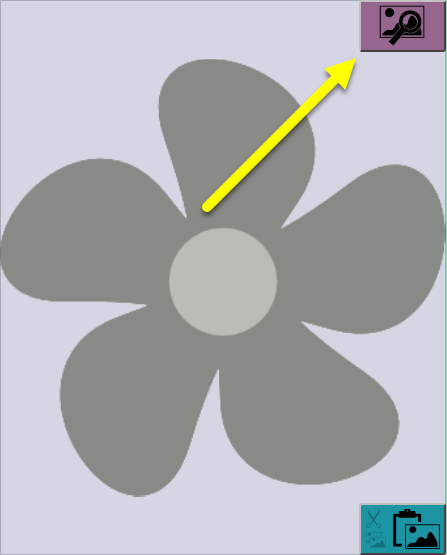
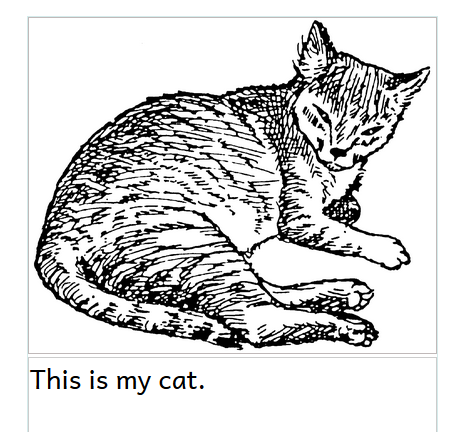
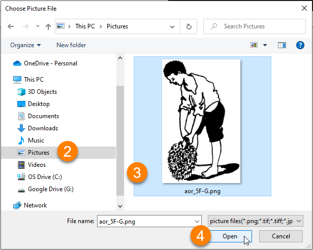
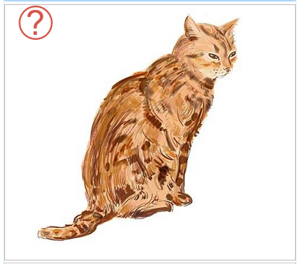
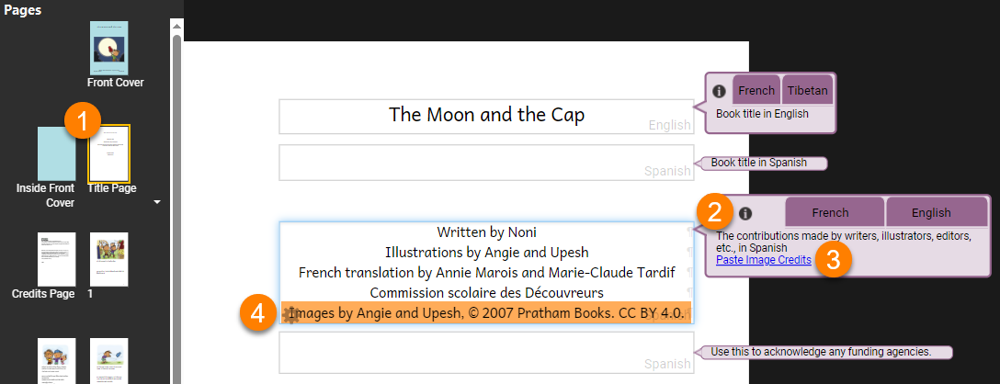

Images are often important to include when writing books, especially materials for readers in the early grades. Bloom gives you multiple ways to add images to your books.

## Adding an image {#edab65404ee44b7e9b410614f10c9450}

Bloom has a unique design to show where you can add an image. Whenever you see a **placeholder** with an image of a flower, you can insert an image. 

:::note

The placeholder image is never printed in the published form of a book. If you do not replace the placeholder flower with another image, the published book will have a blank space there. 

:::

### The Image Toolbox {#4b49a0c6adbc4d338522f7fd1fa1bb20}

Bloom allows you to add images using several methods. Most of them use the **Image Toolbox**.

To access the Image Toolbox:

- Hover your mouse over the an image box.

- Click the **Change Image** button that appears.

:::note

You can invoke the Image Toolbox by clicking the Change Image button even if you have already replaced the placeholder with an image. 

:::

### Using the Image Toolbox {#848d5a8d84334d7a9fa320482f84b876}

The Image Toolbox gives you several methods for inserting images. 

| **❶** | **Image Galleries** are searchable collections of images in a special format that Bloom understands. You can install the free _Art of Reading_ collection from SIL International, or you may have another image collection available to you.  |
| ----- | --------------------------------------------------------------------------------------------------------------------------------------------------------------------------------------------------------------------------------------------- |
| **❷** | A **scanner** directly attached to your computer.                                                                                                                                                                                             |
| **❸** | A **digital camera** directly attached to your computer.                                                                                                                                                                                      |
| **❹** | A **file** in your computer’s file system.                                                                                                                                                                                                    |

We will focus on the **Image Galleries** and **File** methods below. 

### Adding an image from an Image Gallery {#de4d254b555a4c378a635319b1973cc1}

In this section, we will demonstrate how to add an image from the free **Art of Reading** image gallery from SIL International. (If you do not have the Art of Reading installed, you can find instructions on how to install it in [Installing Bloom on Windows](https://www.notion.so/009fad3932c449249d310a7f3ccf410f).) 

1. In the _Image Toolbox_, click on the **`Image Galleries`** tab.
2. Type a **keyword** into the search box.

	:::note
	
	The _Art of Reading_ images are indexed in _English, Arabic, Bislama, Chinese, French, Hindi, Indonesian, Portuguese, Russian, Spanish, Swahili,_ and _Thai_.
	
	Search terms can be in any of the languages listed above.
	
	:::
	
	

3. To change the language you are using to search, click the **drop-down arrow next to the name of the search language**. For instance, if your search term is _“cat”_, the search term language should be _“English”_.
4. Click the **search icon** **🔎** (or press the **Enter** key). Bloom will show you all the images that have been tagged with that keyword.
5. **Select an image** from the results returned.
6. Click **`OK`** to insert the image into your book.

Bloom automatically changes the size of the image so that it fills up the box where the image has been placed.

### Adding an image from a file {#a119c4a3de514c99a6d347ef2db5a2fc}

You can use the Image Toolbox to browse to any location on your computer where an image is stored and insert it. Here are the steps to do this:

1. Click **`File`** in the _Image Toolbox_. Bloom will open a standard file browsing window.

2. Go to the **folder** where the picture is stored. (In this example, the image is in the Pictures folder.)

3. Click on the **image** to select it.

4. Click **`Open`**. Bloom will show the image in the Image Toolbox.

5. Click **`OK`** to add the image to your book.

## The Image Control Buttons {#a567f57468934a7f82b850a60eca3310}

When you place your cursor over an image, three buttons appear in the corners of the **image container** (the box on the page that holds the image). 

| **❶** | **Upper left corner:** **`Edit Image Credits, Copyright, & License`**. Clicking this will open the image copyright and license dialog box (see [Including copyright and license information for images](/working-with-images#2247254aae9d456b9867c70031438bcc) below).  |
| ----- | ------------------------------------------------------------------------------------------------------------------------------------------------------------------------------------------------------------------------------------------------------------------------------------ |
| **❷** | **Upper right corner:** **`Change Image`**. Clicking this will open the Image Toolbox (as seen in [Using the Image Toolbox](/working-with-images#4b49a0c6adbc4d338522f7fd1fa1bb20) above).                                                                              |

The last three buttons are combined in one block in the lower right corner: 

| **❸** | **`Cut Image`**: Clicking this will remove the image from the image container and place it in your computer’s clipboard.           |
| ----- | ---------------------------------------------------------------------------------------------------------------------------------- |
| **❹** | **`Copy Image`**: Clicking this will leave the image in its place, and also put a copy of the image on your computer’s clipboard,  |
| ❺     | **`Paste Image`**: Paste an image on your computer’s clipboard into the image container.                                           |

## The Image Information Panel {#75d9722d1f454776b0669b142d26221e}

After you insert an image into a page, Bloom can show you a panel of information about the picture and the image container it fills. To see the image information panel, hover your mouse over the image. 

| **❶** | **Information about the image:** its filename, disk size, and dimensions.                                                                                                                                                                                                                                                                                                       |
| ----- | ------------------------------------------------------------------------------------------------------------------------------------------------------------------------------------------------------------------------------------------------------------------------------------------------------------------------------------------------------------------------------- |
| **❷** | **Information about the image container:** The image container is the box on the page that is filled by the image. In this example, the image container is 408 dots (pixels) wide and 197 dots (pixels) high. (Note that the image container size is specific to the paper size: if you increase the paper size, Bloom will make the image container larger to fill the page.)  |
| **❸** | **Information about the image in the image container:** Bloom reminds you that for print publications, the image should print at 300-600 dots per inch (DPI). Bloom also tells you the resolution at which this image will be printed, and the optimal pixel size for the image.                                                                                                |

In the example above, the image is in a file called “High Desert Dawn.jpg”, which is 1.07 megabytes (mb) in size. The image is 4,032 dots (pixels) wide and 1,941 dots (pixels) in height. In this example, the image will print at 949 DPI — more than enough. (In fact, the image could be reduced to a pixel size of 1275 x 616, which would reduce the disk space occupied by the book without sacrificing quality.) 

## Resizing an image on a page {#636cb3ce40044815a206c15e5ba30996}

Bloom automatically resizes an image to fill the box where you place it. You can change the size of an image by changing the size of the image box that holds it. 

1. Place your mouse cursor at the edge of the image box. A red line will appear.

2. Click and drag the red line. Bloom will automatically adjust the size of the image box and the other elements (usually a text box) on the page.

:::note

Bloom helps you choose a consistent size for the image box by making it easy to pause at certain points, such as **⅓**, ½, and full width. 

:::

## Cropping an Image in the Image Toolbox {#0277ff05b63f44d2880efa042753e2c7}

Sometimes an image has extra elements that you do not want to include in your book. Any time that you cut down an image to show less of it, you _crop_ the image. You can use the Bloom Image Toolbox to crop your image. 

:::note

Bloom does not provide any other tools for editing images. If you need to edit your images, use an image editing program and then add the image to Bloom. 

:::

1. Click the **`Crop`** button on the left side of your _Image Toolbox_. Bloom will highlight the image, with four grey _crop bars_ along the borders.

2. **Click and drag** the **four crop bars** toward the center of the image to change how much of the image will show in your book.

3. Click `OK` to add the image to your book.

## Including copyright and license information for images {#2247254aae9d456b9867c70031438bcc}

Bloom lets you record copyright and licensing information for each image in your book. 

:::info

It is very important that each image in your book have accurate copyright and licensing information! This is <u>especially</u> important if you want to share your book with others or publish it on Bloom Library. 

For more information on copyright and licensing, see [Permission to Publish](https://www.notion.so/984651c9bcd9465ca181ccdf16cac34a). 

:::

If an image does not have copyright and licensing information, Bloom will show a red question mark in the image's upper left-hand corner. 

To add copyright and license information to an image, do the following: 

1. Hover your mouse over the **red question mark ❓**. Then click on the **green button** that appears. Bloom will show you the _Copyright and License_ dialog box.

	

	:::note
	
	The copyright dialog box for images includes a field for the illustrator or photographer’s name, in addition to the copyright holder’s name. 
	
	:::
	
	

2. Type the name of the **illustrator or photographer** into the `Illustrator/Photographer` field (optional).
3. Type the name of the **copyright holder** into the `Copyright Holder` field.
4. Click on the **`LICENSE`** tab and fill in the license information. (This is optional: Bloom adds a Creative Commons CC-BY license by default.)
5. Click **`OK`** to add the information to your image.

Bloom will ask you if you want to apply the same copyright and license information to all the images in your book. Click **`Yes`** if you want to do this. Click **`No`** if not all the pictures have the same copyright and license information.

### Adding image credits to your book's Title Page {#f21c5a3809954b64b7cd34c7da5d880a}

You can easily add a summary of the copyright and license information for all the images in your book to the Title Page.

1. Go to the **Title Page** for the book.
2. Click on the information ℹ tab in the _Contributions bubble_ (on the right-hand side).
3. Click on the **`Paste Image Credits`** link.
4. Bloom will gather the image credit information you have provided for all the images in the book and put it in this box in summary form.

