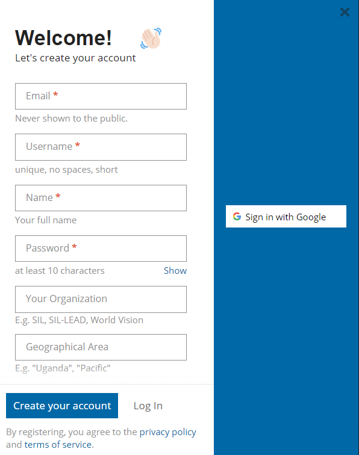
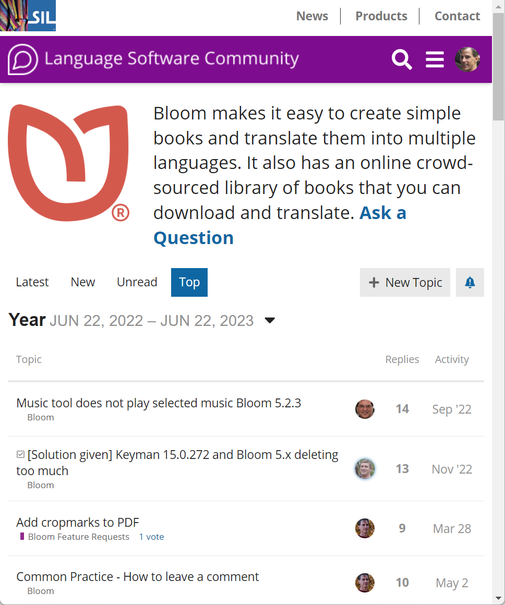

The Bloom Community Forum is the place to get announcements, ask for help, share ideas, and vote on new features.

# Step 1: Sign Up to the Web Forum {#64aeca2190ba4906b40e4fb455d12ce0}

[**Click here to sign up**](https://community.software.sil.org/signup)

# Step 2: Go to the Bloom Section {#c21552b29bd54db2a4dbfae08c1094d3}

[**Click here for the Bloom section**](https://community.software.sil.org/c/bloom)

# Step 3: Turn on email notifications for Bloom Topics {#ed958ead95e640f5872bdaa8875d9978}

Finally, in order to get emails of announcements and discussions, 

1) Click on the bell icon

2) Select “Watching”

[Why share on Bloom Library?](/why-share-on-blorg)

