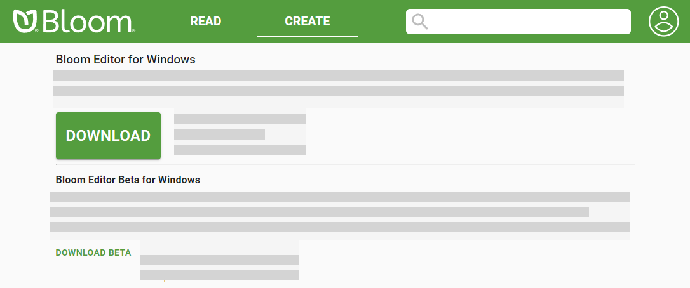
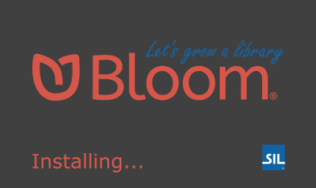
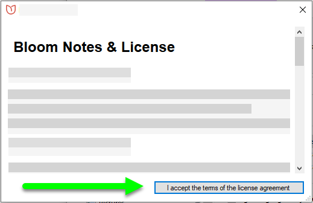
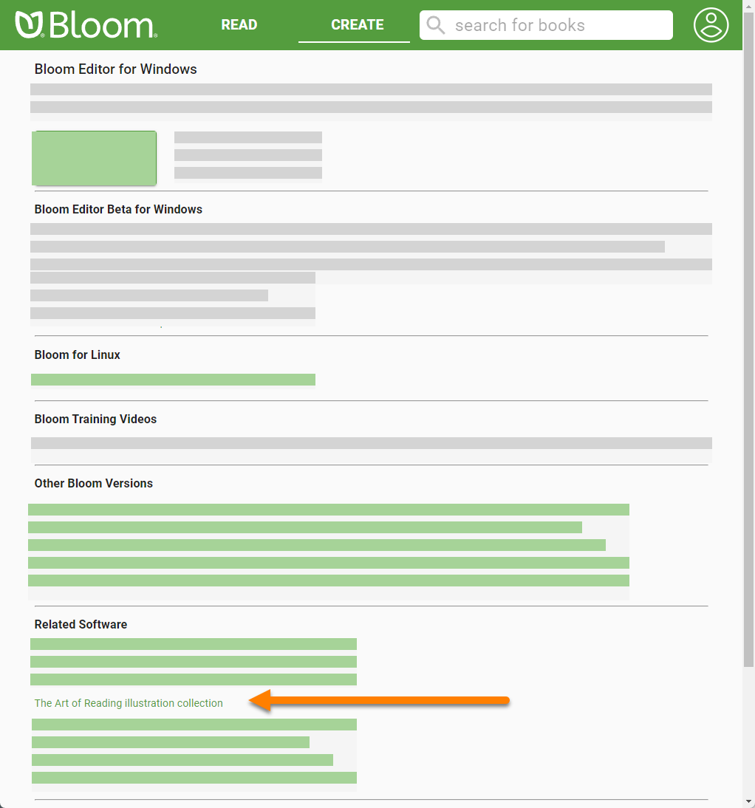
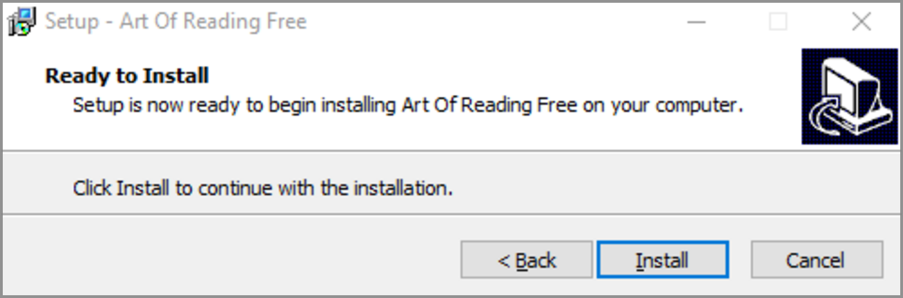

**Bloom Editor** is a program that runs on your computer. Before you can use Bloom, you need to install it on your computer. There are some additional programs that you should install, too, to use the Bloom image gallery. 

# System requirements {#2a975ec7819348eab9d4421a624ac4ae}

## Hardware {#5e94abda80254d1fa5a83a7539d3b365}

Bloom is designed to run on fairly modest hardware. Your computer should have at least the following to run Bloom:

- 1.5 Ghz processor
- 4 GB memory (RAM)
- 2 GB available hard disk space

## Operating system {#3fcf15146bf34b8c82ff2a445247ddce}

Bloom is primarily a program for the Microsoft Windows operating system. To run Bloom, you need **Windows 8.1**, **Windows 10**, or **Windows 11**.

:::🐧

Bloom can also run on computers that use Ubuntu Linux. Bloom comes pre-installed in [Wasta-Linux](https://www.wastalinux.org/), SIL’s Linux distro. 
If you are using Ubuntu Jammy (22.04)+, you can download the latest version of Bloom as a Flatpak here: [https://flathub.org/apps/details/org.sil.Bloom](https://flathub.org/apps/details/org.sil.Bloom), 

For Ubuntu Bionic (18.04) and Focal (20.04), Bloom is distributed as apt packages from SIL’s package repository. See [https://bloomlibrary.org/page/create/linux](https://bloomlibrary.org/page/create/linux) for installation instructions.

:::

:::🪟

You can use older versions of Bloom with Windows XP and Windows Vista, but this is <u>not</u> recommended. If you must use these unsupported operating systems, you can download the required versions of Bloom from the [Bloom Library downloads](https://bloomlibrary.org/page/create/downloads) page. 

:::

## Fonts and keyboards {#14b4c74f84664b658f7168630913c7d7}

Bloom assumes that you have a way to type your language on your computer. That will often involve using a certain font. SIL offers a free, high-quality fonts for many scripts on its website at [software.sil.org/fonts](https://software.sil.org/fonts).

You may also need a special **keyboard layout** to let you type the characters in your language. **Keyman** is a free program from SIL that has many keyboard layouts. You can get Keyman from [keyman.com](https://keyman.com/).

If you need help to find a font or keyboard for your language, try looking on SIL’s [ScriptSource](https://scriptsource.org) site. 

# Downloading Bloom {#cb910b03fa4a483189be6b98d5a1bed8}

You can download Bloom  installation program from the Bloom Library at [bloomlibrary.org/downloads](https://bloomlibrary.org/downloads). Click the **Download** button at the top of the page to download the latest release version for Microsoft Windows. 

# Installing Bloom {#2951da6997b54ca79ac8cd00b97907db}

Double-click the installer program to install Bloom on your computer. While the installer is working, it will display this window. 

After the installer has finished, it will show you a license agreement. Click **I agree to the terms of the license agreement.**

When you launch Bloom the first time, Bloom will ask you to create a **collection**. You may do so at this point, or you can create your initial collection later.

For more details on how to create a collection, see **Creating a new collection**.

## Installing _The Art of Reading_ {#a5ed45478c4141838da36b429cd4a600}

_The Art of Reading_ is an collection of black and white line drawings from SIL International that you may use without cost.

To download _The Art of Reading,_ click on **The Art of Reading illustration collection** link under "Related Software" on the Bloom installers page. That link will take you to the Art of Reading web page. Click on the link there that says, **Download Art of Reading version 3.3 installer**. The installer will download to your computer.

Next, double-click _The Art of Reading_ installer to install the image library. The installer program will take you through a series of screens where you will accept the license agreement, find out more information about the collection, and, finally, click the "Install" button.

There is no icon or desktop shortcut for _the Art of Reading._ It will be available the next time that you run Bloom.

:::🐧

If you are using Bloom for Linux, see [bloomlibrary.org/page/create/art-of-reading](https://bloomlibrary.org/page/create/art-of-reading) for instructions on installing _The Art of Reading_ from the SIL package repository. 

:::

# Troubleshooting {#9bb9718916d34c5fa12c8257ede140fb}

If Bloom does not install properly, try temporarily disabling your computer's anti-virus software. Then try to install Bloom again. It will probably install correctly this time. 

:::caution

Be sure to re-enable the anti-virus software after you have installed Bloom!

:::

If this does not work, ask an IT expert to help you. You may find other helpful ideas in [this community site post](https://community.software.sil.org/t/how-to-fix-installation-problems/17).

