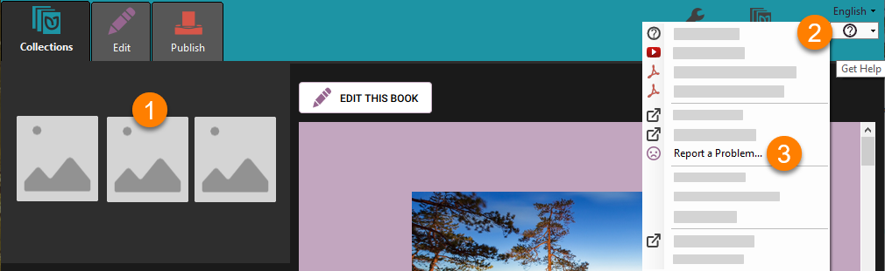
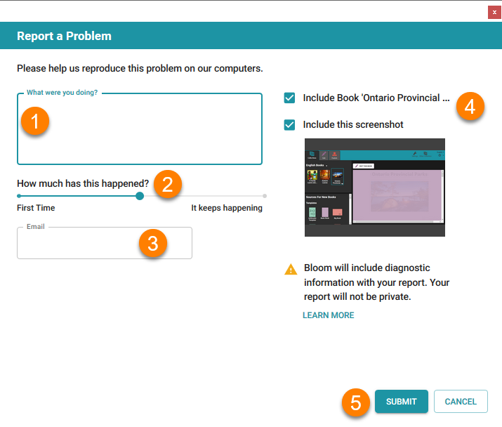
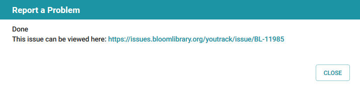
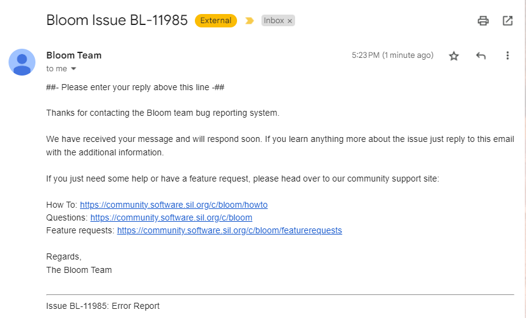

If you come across a software problem when using Bloom, our team wants to know about the problem so we can find a solution for you. 

There are four steps to this process:

1. [Start your error report](/report-problem#742dc066529441c99fd107cc4b5288de)
2. [Report the Problem](/report-problem#bf297e526e6440b69c0788cd0bdf86e8)
3. [Check for an email receipt](/report-problem#d984aa3889d542c98e757b2cef74ba81)
4. [Follow-up with Correspondence](/report-problem#44c3b90994bc469b8cf07c2d2e1fcb14)

# Start your error report {#742dc066529441c99fd107cc4b5288de}

To start the process, you must:

1. **Select the book** which shows the problem. You might be editing the book, or publishing the book.
2. Click the **`?`** in the top-right corner.
3. Click **`Report a Problem`**.

# Report the Problem {#bf297e526e6440b69c0788cd0bdf86e8}

Following this, the **Report a Problem** dialogue will appear.

1. **Describe the problem** in as much detail as you can. For example, which page(s) of your book exhibit(s) the problem?
2. Tell us if the problem happened **only once**, or if it **keeps happening**.
3. Ensure your **email** is **entered** and is **correct.** (Hint: if you registered in Bloom, your email will appear automatically.)
4. Ensure these **boxes are ticked.**
5. Click **`Submit`**.

Depending on the speed of your internet, and the size of your book, it may take some time to send your book to Bloom’s error-reporting system.

Eventually, you will see a message like this:

You can close the message.

# Check for an email receipt {#d984aa3889d542c98e757b2cef74ba81}

If you open your email program, you should see a message confirming that your error report was received by the Bloom team. The message will look something like this:

If you do _not_ receive an email, there are two possible causes:

- You made a mistake in your email address
- The email was flagged as SPAM.

# Follow-up with Bloom team {#44c3b90994bc469b8cf07c2d2e1fcb14}

Through this email thread, the Bloom team will send responses to you about the status of their investigations. Sometimes, they will ask additional questions. 

Please note that it is your responsibility to respond to requests from the Bloom team when asked. If the Bloom team does not receive a response from you when asked, the issue will be eventually be closed.

