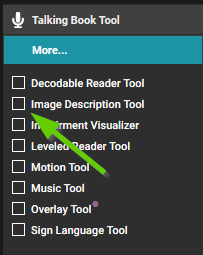
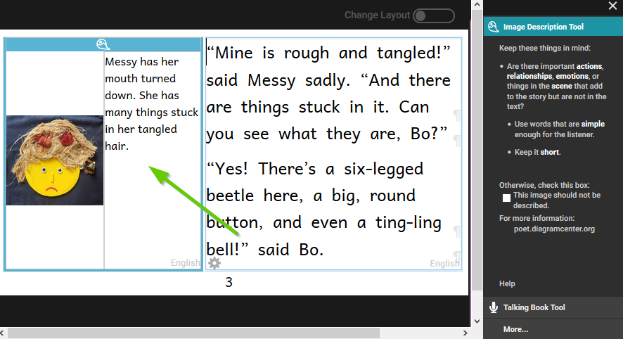
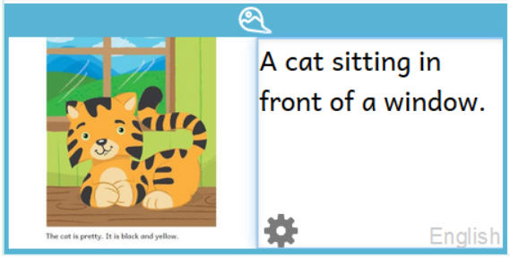
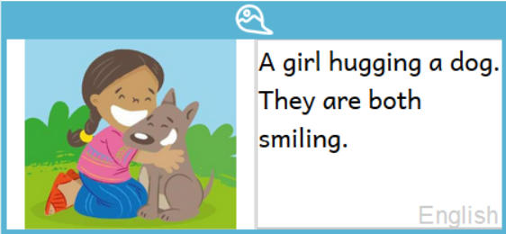
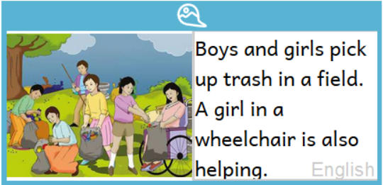
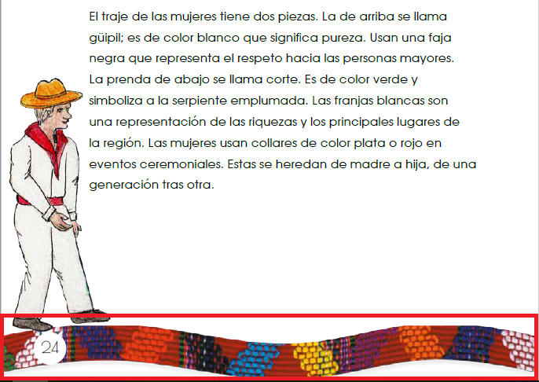
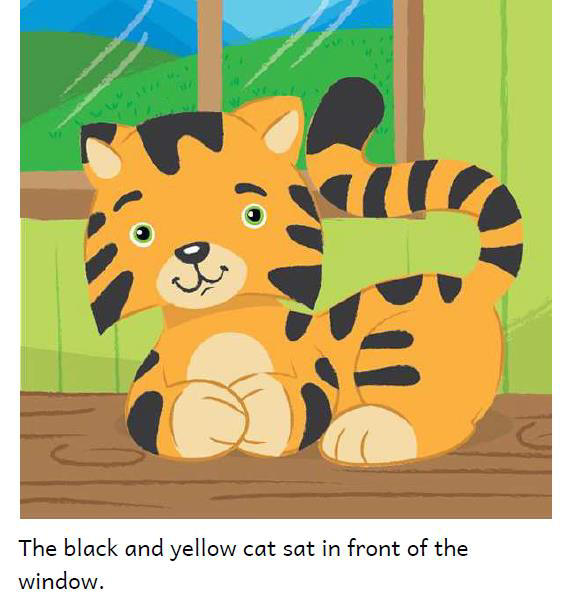
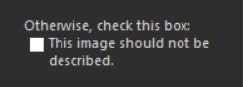

The Image Description Tools lets you add text descriptions of images. You can also add an audio recording of an image description. These image descriptions can help users of your book who have impaired eyesight to enjoy your book. 

## Activating the Image Description Tool {#276261e5b9864ca7a19bb356dad0d3cb}

In order to access the Image Description Tool, click on the menu icon at the top right of the screen. 

The toolbar will open. If the Image Description Tool is not listed at the top, click on the _“More…” button_ at the bottom of the toolbar. 

Then activate the **Image Description Tool** by clicking in the check box.

## Create Image Descriptions {#06836ffe32e943a485c675e3d3a8d73b}

Now that the Image Description Tool is open, a space will be created next to the image for adding a text description. You may now type in the text which describes the image. Repeat this process for each image in the book. 

:::tip

Some images do not add any new information. If that is the case, you can check the box that says, This image should not be described.

:::

Once you are satisfied with the image description, you can close the Image Description Tool by clicking on the X above the Image Description Tool window. 

See [Writing Good Image Descriptons](/image-description-tool#2814bb19df128009bb03d419ee2730e2) below for general guidance on how to write good image descriptions. You can find more advice for writing good image descriptions at [poet.diagramcenter.org](http://poet.diagramcenter.org/). 

:::note

If you are using the Overlay Tool to make comic books, Bloom allows you to have a background image. You can describe that image just like any other. However, the Overlay Tool also lets you drag images on top of the background, and Bloom does not currently allow you to add image descriptions to these draggable images. Instead, you will need to describe whatever the user needs to know about the scene based on your description of the background image.

:::

## Writing Good Image Descriptions {#2814bb19df128009bb03d419ee2730e2}

### Keep it short and simple {#2814bb19df1280e99413f5ed5ef1ca49}

In general, it is best to keep image descriptions short and simple. Use only enough words to let the visually impaired reader what the image conveys that the text does not. In this example, the text says that the cat is black and yellow, so the image description does not need to include that, and we can keep it short:

For the image below, we could tell how many tarps there are, exactly what colors they are, how many
apples are showing at the top of the bag, etc., but unless those details are important to the story, we can use a shorter, simpler description:

### Be descriptive {#2814bb19df1280c695bacc093abb2afb}

As simply as possible, describe what is in the image and any action taking place. Focus on the details that are relevant to the story.

In this example, the story says that the girl loved her dog and they were playing together. The fact that she is hugging the dog and they are smiling helps illustrate her love for her dog.

In this example, it is important to say that there are both boys and girls and that one girl is in a wheelchair because the author wanted to illustrate inclusiveness:

If a color is important to the story, include that detail. If the people in the picture are named in the  story, use their names. Include those details that are important to the story.

### It isn't always necessary {#2814bb19df1280969043e93ba4f0589d}

We should normally describe all images, but there are some circumstances in which that is not necessary. If the image is purely decorative, it does not need to be described. Also, if the description would simply repeat what is in the text, it does not need to be described. 

Sometimes, an image may serve just to decorate the page or separate one thing from another. In the example below, the image in the red box is purely decorative. Such images do not need to be described. 

In this example, our description might say, “A black and yellow cat sitting in front of a window”, but the text already says that, so the image does not need to be described.  

If the image does not need to be described, check the box that says, “This image should not be described”. 

## Recording Audio of Text and Image Descriptions {#988d166c68974ac681dfeb765bc52d1b}

To make a book accessible, you need to record all of the text as well as all of the image descriptions. 

The process for recording audio of image description text is the same as for recording the audio of regular text. 

1. Make sure the Image Description Tool is active.
2. Switch the active tool from the Image Description Tool to the Talking Book Tool.
3. Click on the text you want to record, or use the Next and Back button to change from one text box to another.
4. Record your audio.

:::note

See [Prepare to Record Audio](/prepare-to-record) for step-by-step instructions on how to record audio. 

:::

