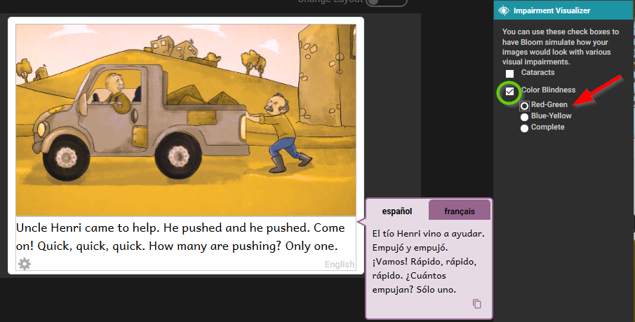

# The Impairment Visualizer {#eed6e6e9e83d46978419bdfcfc7ed4f4}

The Impairment Visualizer is another tool for creating accessible books. This tool allows you to select several filters that will show you what the image might look like to someone with several different kinds of visual impairment.

## Activating the Impairment Visualizer {#2750a2f8e71e431ba169eb61f10c1edb}

Activate this tool by clicking on More... in the Tool Panel and selecting Impairment Visualizer. 

Using this tool, you can evaluate whether an image should be modified so that it is easier to interpret for people with these sorts of visual impairments.

Bloom does not have a tool for editing images. If an image needs to be edited, you will have to use another program to do that.

## Using the Image Visualizer {#8d66fa5d68c447f1b4fe2d974782f927}

The first choice shows what the image might look like to someone with cataracts.

For color blindness, there are three possibilities. The first shows what the image might look like to someone with red-green color blindness.

The second option shows what the image might look like to someone with blue-yellow color blindness.

The third option shows what the image might look like to someone with complete color blindness.

