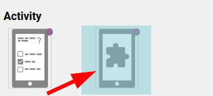
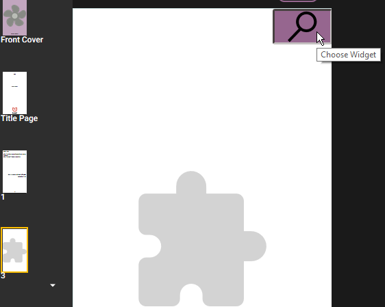
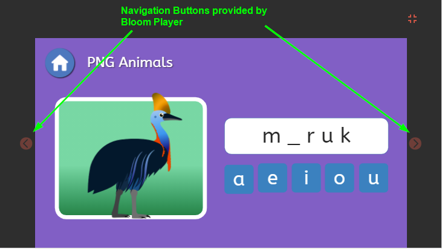
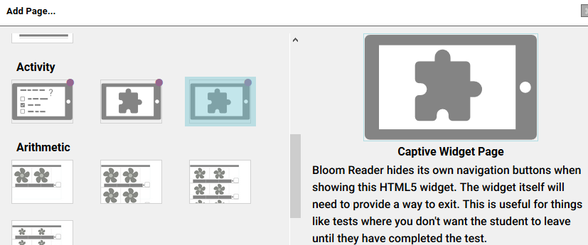

Bloom pages can embed little custom HTML5 activities called “widgets”. When published as a BloomPUB, these widgets will work on the web, Bloom Reader, and RAB Apps. You can see examples of widgets in [these interactive books](https://bloomlibrary.org/activities/books-with-widgets) in the Bloom Library.


Many of these widgets already exist on the web, because they work with Apple's iBooks and other software. You can also make your own using programs like [Active Presenter](https://atomisystems.com/activepresenter/). Most widgets don’t have any custom programming, but if software like Active Presenter is not sufficient for what you need, you can hire a web developer to do something even more advanced.


# Format {#7bc52563c94c439f816f6827ffc737f2}


Bloom can import any of the following widget formats

- a zipped set of files ending in ".wdgt". which contains a file named "index.html", or, if the .wdgt file is not zipped, you can import the index.html file.
- the main .html file from a saved Active Presenter output.

# Adding to Bloom {#cb88f96b162543898f468ed2a9082469}


To add a widget, click “Add Page” and then select one of the template pages. These have an image of a puzzle piece:





Then click on the button in the corner of the widget:





In the file chooser dialog, you can either choose a .wdgt file, an .htm file, or an .html file. A “.wdgt” file is just a zip file containing all the files of the widget. If you instead choose an HTML file, Bloom will gather up and import all of the files in that same folder.


# Captive Widgets {#9521203ecfde4223b62f3ee3ce2f881f}


Normally, when Bloom Player shows a widget, it also shows page navigation buttons:





If you want to hide these navigation buttons, follow these steps:


### 1: Use the special page template {#ea1bb4f65c4e4fef9d403e028de3a079}


In Bloom (version 5.1 or later)  when you choose “Add Page”, you should see a “Captive Widget” page:





Bloom Player will not give the user any way to navigate away from this page except by leaving the book entirely. It will be up to your widget to tell Bloom Player when you want the user to leave this page and go forward or backward in the book.


### 2: Send navigation messages {#2f6c61a6febd4a128e9225ba30fd2a33}


To tell Bloom Player to navigate, you will need to add some JavaScript to a button:


<div class='notion-row'>
<div class='notion-column' style={{width: 'calc((100% - (min(32px, 4vw) * 0)) * 1)'}}>


```javascript
window.parent.postMessage('{"messageType":"control", "controlAction":"navigate-to-previous-page"}',"*");
```


</div><div className='notion-spacer'></div>
</div>


or


<div class='notion-row'>
<div class='notion-column' style={{width: 'calc((100% - (min(32px, 4vw) * 0)) * 1)'}}>


```javascript
window.parent.postMessage('{"messageType":"control", "controlAction":"navigate-to-next-page"}',"*");
```


</div><div className='notion-spacer'></div>
</div>

