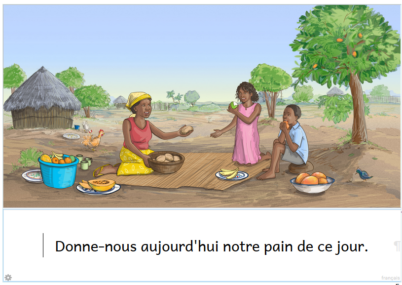
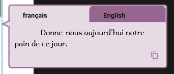
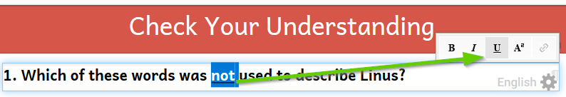
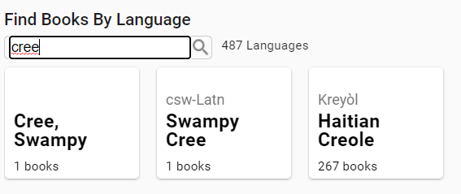
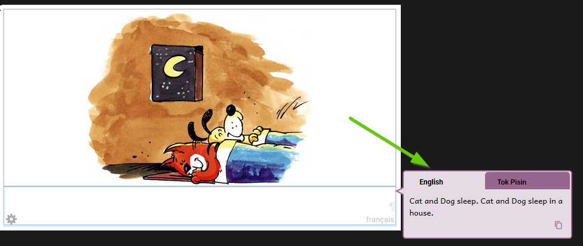
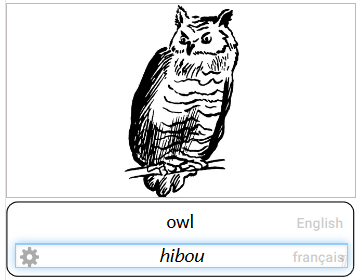
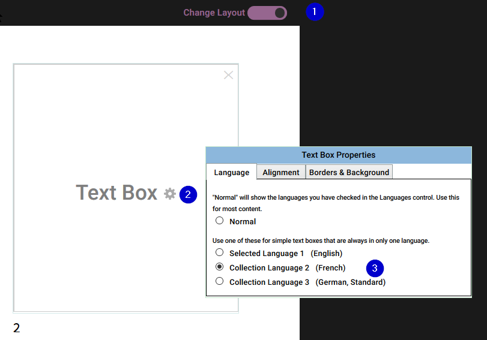

# Effective use of Styles {#765ef785a8b64719864f32b738878f17}

There are a number of simple “best practices” to follow to ensure your Bloom publications will display _optimally_ on a variety of devices with Bloom Reader (or ePUB), or on Bloom Library.

When a user does not follow these best practices, the resulting book will be less flexible and less adaptable to changes in font settings and various publishing options. 

Another way of saying this is that books which don’t follow best practices will be more “fragile” and more prone to “break” if you make a change in font settings or publishing format.

There are two bad habits that violate best practices:

- Using spaces to center or indent text.
- Formatting entire text boxes using _character_ formatting instead of using the text box style.

## Using Spaces to Center or Indent Text {#78392b559be3468ca66edc6b5b128560}

Often users need to center text or indent the first line of a paragraph. Bloom provides a way to do this, but new users sometimes miss this and attempt to center or indent text using spaces. 

The trouble with this approach is that doing any of the following will cause the text to no longer be centered:

- Changing the text in any way (adding a word, deleting a word, etc.)
- Changing the font size
- Change the font to a different font

For example, increasing the font size results in the text shifting to the right making it no longer fit on one line:

Likewise, changing the paper size will break the perfect centeredness of the text.

Also, if you upload your book to Bloom Library and then later someone downloads the book in order to translate it into their language, the translation bubble will retain those spaces:

This could be confusing for people.

:::tip

Conclusion: Do not use spaces to center text or to indent text.  Instead, use a centered text box style, or an indented paragraph style.

:::

## Formatting the entire text box using _character_ formatting instead of using a style {#db922f79470c42baa2dc8fa8d06e427b}

Bloom allows you to select certain words in a text box and make them bold, italic etc.. This is useful for highlighting particular words, e.g.: 

But if want an entire text box to be (say) Bold, you should set that formatting using the text box style, e.g.:

:::tip

Key principle: use character formatting to highlight particular words or phrases in a text box, and use text box Styles to format an entire text box.

:::

If you need a new Style for a text box, Bloom provides a simple way to create one:

## Accurate Language Tagging {#2adf286cde6349c18b2445cef0e96a9e}

:::tip

Key principle: the actual text typed in any text box needs to accurately correspond with the language tag associated with it.

:::

When you are editing a book in Bloom Editor, Bloom indicates the language which should go in each text box using a light grey “language tag” located in the bottom right of each text box:

When you are making books in Bloom, it is _very_ important that these language tags _accurately_ correspond to the actual language written contained within each text box. 

If you are simply printing your book, then having inaccurate language tagging will not negatively affect yourself or anyone else. 

However, if you want your book to participate in Bloom’s “ecosystem”, i.e. the Bloom Platform, then accurate language tagging is absolutely crucial so that books on Bloom Library can be found in the correct language category:

In addition, if someone downloads the book to translate it into another language, the language displayed in the “translation bubble” is also accurate:

Typically, this won’t be a problem since whatever language you specified as your main language will also be the same one used for any text box your add to your book.

Where the need does arise to pay attention to accurate language tagging is you are making a bilingual or trilingual book. Now, typically, when you specify you want to show two or three languages in your book, Bloom will show the 2 or 3 languages _stacked_ one upon each other like this example:

But you may wish to deviate from the above “stacked” orientation for your bilingual (or trilingual) book. For example, you might want a layout that has one language on the left, and another on the right:

To achieve this specialized layout like the above, you will (1) slide the Change Layout slider across, (2) click on the gear icon of the text box, and (3) choose the desired language:

 

## Image Credits {#3cb0b242b33c4573b78eeefdbf5092e6}

Please ensure that you have accurately filled out the copyright and licensing information for all images in your book.  

For ideas on options for illustrations, please refer to [this important article](https://bloomlibrary.org/page/create/page/Create-Resources-Illustrations).

