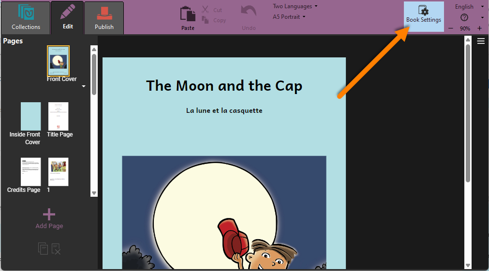

You can adjust the appearance of individual books through the `Book Settings`:

:::note

The Book Settings option is available in Bloom 6.0 and higher. 

:::

## Cover Settings {#ae57b21abaf249b1a8ac57c000a1799d}

The Cover section of the Book Settings lets you specify the following items: 

### Front Cover {#1ba4bb19df128041aac2e256d7cf9b2b}

- `Fill the front cover with a single image` Ticking this box will turn on print bleed indicators on paper layouts and causes the image to fill the entire front cover. This option requires an Enterprise Subscription and is available on Bloom 6.2 or higher. Full Bleed is available for the following paper sizes: A5, A4, A3, US Comic, and 6x9.
For more information, see [Full Page Cover Images](/full-page-cover-images).
- `Show Title in (Local Language)` displays or hides the title of the book in the “Local Language” specified in the Collection Settings.
- `Show Title in (Language 2)` displays or hides the title of the book in the “Language 2” (e.g., a national language) specified in the Collection Settings.
- `Show Language Name` displays (or hides) the name of the book’s language on the front cover. If more than one language is set to be displayed in the book, the names of all displayed languages will be shown: for instance, if the multilingual book control is set to show two languages, the names of both languages will appear on the cover.
- `Show Topic` displays (or hides) the topic field on the cover.

### All Cover Pages (Bloom 6.1+) {#1ba4bb19df12800d9221dd6c914b92fb}

- `Background Color`allows you to choose the background color for all cover pages.

## Content Pages Settings {#f99540ece37c4388b33c9dd0473d7962}

The Content Pages section of the Book Settings lets you specify the following items: 

### Page Theme {#efac5dd9212547d38568d507578464f2}

A Page Theme is a bundle of margins, borders, and other page settings. See the [Page Themes Catalog](/page-themes-catalog) for details about the page themes that are available. Most users will use the `Default` theme. 

:::tip

If you are publishing books electronically as BloomPUBs, you may want to use one of the Ebook themes. 

:::

### Show Page Numbers {#1ba4bb19df1280698481d607e90aa6ca}

Check this box to display page numbers. 

### Languages to Show in Normal Text Boxes {#5876f208589c4125bc20ef081c452cc7}

 This controls the same multilingual text settings as the `One Language/Two Languages` setting in the Edit toolbar. 

### Advanced Layout**:** Text Padding  {#7232695e5e584d5db92b54435af482a3}

This setting controls the amount of padding (extra space) around text boxes, so that text boxes are visually separate from each other and images. The `Default` setting (which is controlled by the Page Theme) should be sufficient for most users, but you can also set the text padding to 0 mm, 2 mm, 4 mm, or 1 em (which varies according to font size).

## BloomPUB Settings {#248b710e279744b581c15f002da84da6}

### Resolution {#c2dd9c88a76243719f72d959ddefa818}

You can set the maximum image size for all images in BloomPUB and ePUB digital publications. Choosing a lower resolution helps reduce book size, which makes it easier to share books over poor internet connections. This will also use less space on mobile phones.

:::note

Here are the image sizes you can choose from:
| Size    | Image Resolution (width x height) in pixels |
| ------- | ------------------------------------------- |
| Small   | 600 x 600                                   |
| HD      | 1280 x 720                                  |
| Full HD | 1920 x 1080                                 |
| 4K      | 3840 x 2160                                 |

:::

## Fonts (Bloom 6.1+) {#1ba4bb19df1280d091dffc876b97aa7c}

This section lists all the fonts used in your book and will alert you to any font licensing problems. 

