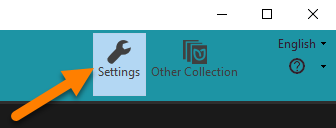
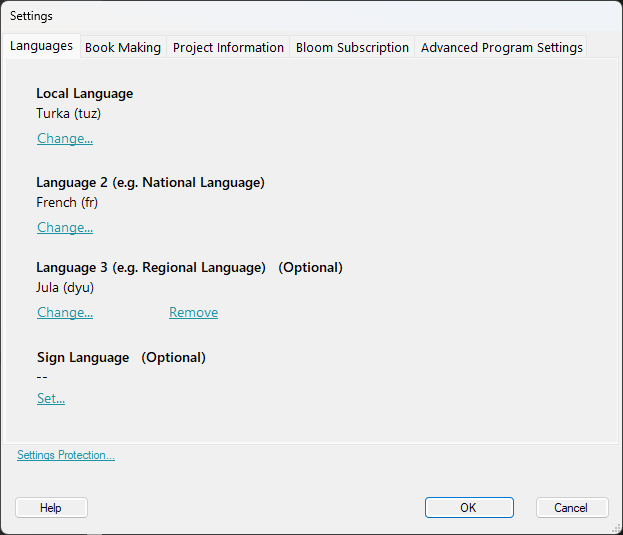
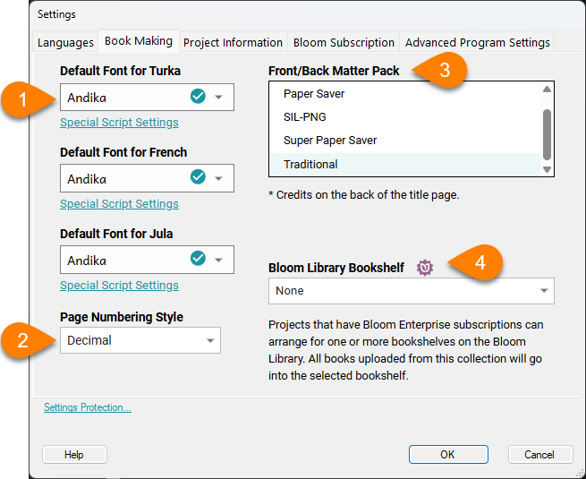
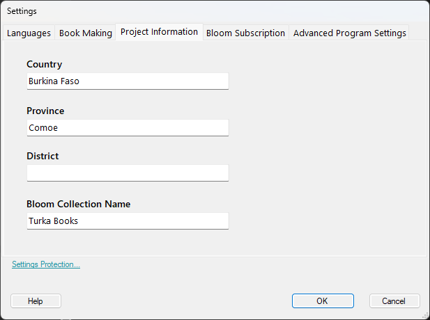
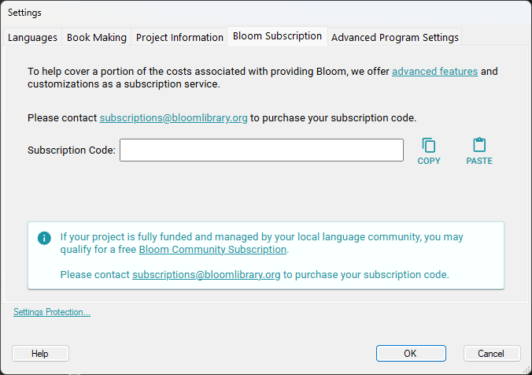
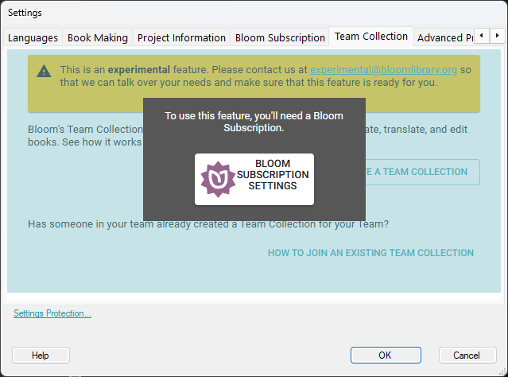
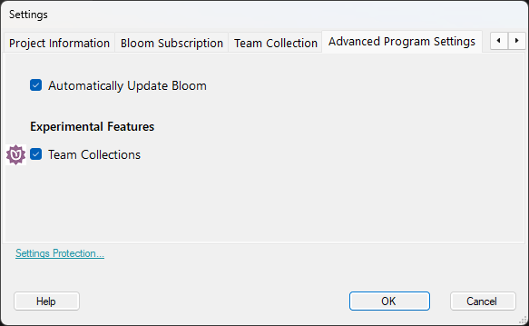

:::note

This page is a draft version.

:::

To open/change the settings for your current collection:

1. Click on the `Collections` tab.
2. Click on `Settings` in the **upper-right corner** of the Bloom window.

	

There are five different tabs in the **Collection Settings** window:

- [**Languages**](/collection-settings#666299e09b6c4f36bd368dcbd8a20a10): Set the language(s) for the books in this collection.
- [**Book Making**](/collection-settings#ce3b078271804fad95b986b382a8d7eb):
- [**Project Information**](/collection-settings#06fe40e899ee450686c2cf937cd56380)**:**
- [**Bloom Subscription**](/collection-settings#d375f428f63d4ccc9721bb4c81db0f76)**:**
- [**Advanced Program Settings**](/collection-settings#be4f20d8ed584ed2bceb94d29da72ed7)**:**

## Languages Tab {#666299e09b6c4f36bd368dcbd8a20a10}

In the Languages tab, you can choose the languages for the books in this collection. 

:::note

The Collection settings tab defines the languages that are available for display in the books in the collection. The languages that are actually displayed in each book are controlled by the Book Settings in the toolbar of the Edit tab. 

:::

## Book Making Tab {#ce3b078271804fad95b986b382a8d7eb}

Choosing the default fonts and numbering style for the languages in your book, plus front/back matter layouts and Bloom Library bookshelf (for Enterprise customers). 

(1) Default Fonts:
You can choose default fonts for your local language, Language 2, and Language 3 can be set here. 

(2) Page Numbering Style:
You can choose the page numbering style here. The default style is `Decimal`, using western Arabic numerals Other available styles include Arabic-Indic, Bengali, CJK-Decimal, and many others. 

(3) Front/Back Matter Pack:
You can select the front/back matter arrangement here. The Basic Book template includes the following layouts: 

	- Traditional: Credits on the back of the title page
	- Device: This is automatically applied when publishing to Bloom Reader (Android). It moves front matter pages (other than the cover) to the back.
	- Paper Saver: Designed to save paper, this puts the credits on the inside of the front cover.
	- Super Paper Saver: Designed to save paper, this puts the title page on the inside of the front cover, and the credits on the inside of the back cover.
	- SIL-PNG: Has SIL Papua New Guinea customizations, including hiding some fields and changing instructions in others.

(4) Bloom Library Bookshelf (Bloom Enterprise customers only): 
Projects that have Bloom Enterprise subscriptions can arrange for one or more bookshelves on the Bloom Library. All books uploaded from this collection will go into the selected bookshelf.

## Project Information Tab {#06fe40e899ee450686c2cf937cd56380}

The Project Information tab lets you set the country, province, and district description.

:::note

You can also **change the name** of the whole **collection** here (but remember that each collection on your computer must have a unique name).
See [Rename a Collection](/rename-collection) for more info.

:::

## Bloom Subscription Tab {#d375f428f63d4ccc9721bb4c81db0f76}

[Bloom Subscription](/about-bloom-subscriptions) offers features and services essential for publishers, governments, and international organizations. This paid subscription meets their unique needs while supporting the development and user support of Bloom for the community at large. 

In addition, Bloom Enterprise features are available to projects that are funded by local communities. 

If you have a Bloom Enterprise subscription, click the `Enterprise Subscription` tab and enter your Bloom Enterprise code there. 

If your project is funded by the local community, please contact [subscriptions@bloomlibrary.org](mailto:subscriptions@bloomlibrary.org) to request a community subscription code.

## Team Collection {#c9f1df86137140738adb9c016f45158a}

[Team Collections](/team-collections-intro) are a way for a group of authors, illustrators, and editors to work together on a collection of books. Team collections use a “shadow collection” stored on a shared file service to manage and synchronize a collection of books. Team Collections are a Bloom Enterprise feature. 

Use this tab to convert a regular Bloom collection into a team collection. For detailed instructions, see [Get Started With Team Collections](/team-collections-getting-started). 

:::note

Team collections are an experimental feature. Be sure the `Team Collections` box is checked in the `Advanced Program Settings` tab. 

:::

## Advanced Program Settings Tab {#be4f20d8ed584ed2bceb94d29da72ed7}

The Advanced Program Settings has a variety of additional features. As of Bloom 6.0 the following advanced program settings are available: 

- `Automatically Update Bloom`: check this have Bloom automatically download and install software updates.

	:::note
	
	If `Automatically Update Bloom` is not checked, you can manually download updates using the `Check for New Version` command in the help (?) menu. 
	
	:::
	
	

- `Show Experimental Book Sources`: Some sources are marked as experimental: these are available to you, but they are known to have problems. Unchecking this box will hide them.
- `Team Collections`: This box must be checked for a collection to be made into a team collection. Team Collections are a [Bloom Enterprise feature](/advanced-bloom-features#55c8baa318884dcf874c76f7e0dd9859).
- `Spreadsheet Import/Export`:  This [Bloom Enterprise feature](/advanced-bloom-features#04fd63f5a0fa443bb635115674b580a2) allows text and images from a Bloom book to be exported to a spreadsheet, and re-imported into a Bloom book. This can be useful for making translations or for troubleshooting language encodings. For more details see [Spreadsheet Import and Export](/spreadsheet-import-export).

## Settings Protection {#422fb5b9640a47af9841db4a7b5758c6}

At the bottom section of the Collection Settings window link to the `Settings Protection` dialog box. If you are supporting inexperienced users of Bloom, you may wish to hide the Settings dialog box to prevent them from making inappropriate changes to the collection settings. 

- `Hide the button that opens settings`: Checking this box hides the button in the Collections toolbar that shows the Settings button. Hold down the `Ctrl` and `Shift` keys at the same time to show the button.
- `Require the factory password to get into settings`: If this box is checked, you must enter the factory-set `b7loom` password to access the Settings dialog box.

