# Book Name vs. Book Title {#8f09204cebf34d4b82e810c85f456a40}

In Bloom, there is a difference between a book’s **title** and a book’s **name:** a book’s name refers to the Windows file and folder name corresponding to the book you create.

:::note

The file and folder name affects the sort order of your book collection. It also affects the file name of your published documents (PDF, ePUB, BloomPUB).

:::

By default, the **name** of a Bloom book matches its **title.** This means that if you change the **title** of a book, the book’s **name** will also be automatically updated to match the new title.

This default naming convention serves the majority of Bloom users, so most users will not need to worry about renaming their books.

# Why Rename a Book? {#2244bb19df1280b4880fe08d3d4592d5}

However, there are at least three situations where you may wish to **override** Bloom’s default naming convention:

- Your book collection is extensive, making it challenging to find a specific book.
- Your book titles are quite long, and you would like to have a shorter, more manageable name for your published digital file.
- You have multiple versions of the same book, which share the exact same title but differ in layout or format. For example, you may have an A5 print version of a given book as well as a digital audio version. To easily differentiate between these two versions, consider appending the version information to the book name:

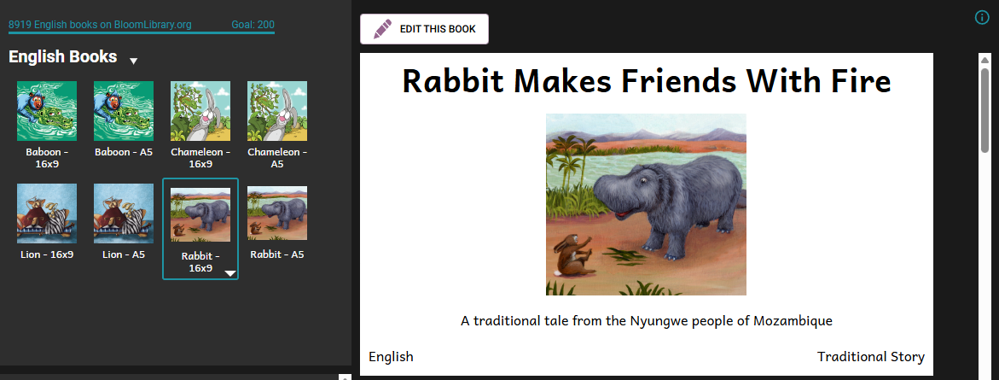

In the above example, the user has a collection of four different books. But each book has two different versions: an A5 version and a 16x9 version. Using shortened names of the books, such as “Rabbit”, “Lion”, and “Baboon”, and appending “- A5” or “- 16x9” to those shortened names, the user can easily identify the two different versions of each book.

For any or all of the above reasons, you may wish to override book names to help keep your Bloom book collection tidy and more manageable. 

# Rename a Book {#2244bb19df12808e9ad1cd7eb9f4c3ba}

## Override the default book name {#2144bb19df12803992f5dabc35fbc37f}

If you wish to override the default book name, follow these steps:

1. Go to the **Collections** tab.
2. Click on the **thumbnail** of the book that you want to rename.
3. Click the **down arrow** next to the thumbnail (or Right-click on the thumbnail).

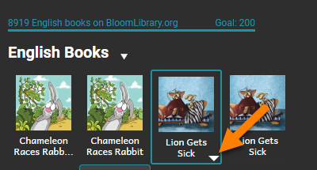

4. Click on Rename Book.

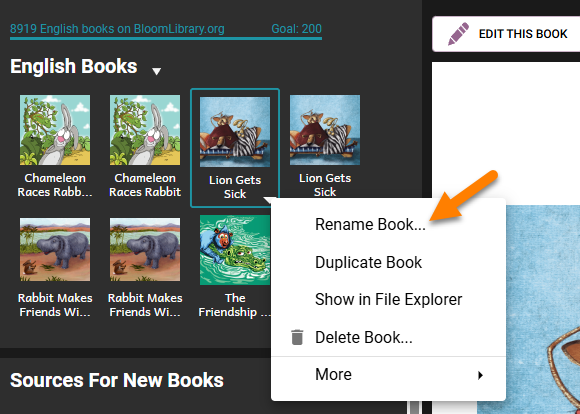

5. Type in the name of the book and press Enter.

After renaming your book, you will see that your book’s name (A) is different from its title (B):

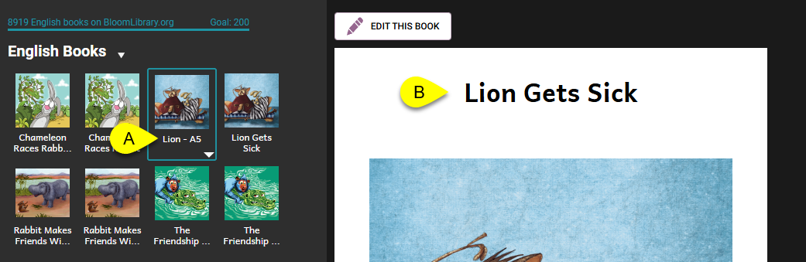

The Windows file name of your book will now match the name you assigned it:

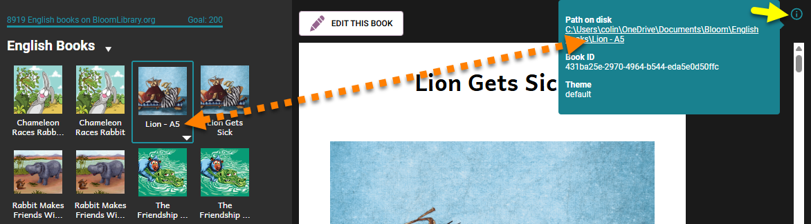

This file name will be used when saving your published book to disk.

## Revert a renamed book back to its title {#2244bb19df12801daf78fb6ddb3ea689}

If you wish to remove the override file name, so that the book name reverts back to matching the book’s title, then follow these steps:

1. Click on the book's **thumbnail**.
2. Click the **down arrow** next to the thumbnail:

	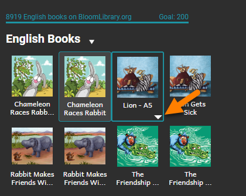

3. Click **Rename Book**.

	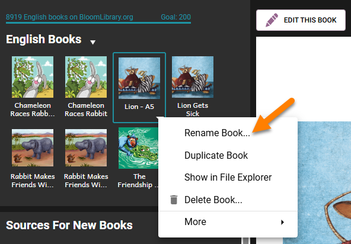

	1. The thumbnail name will be selected:

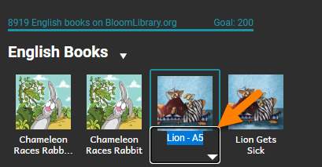

1. Click Delete.
2. **Press** Enter.

The book name will now match the book title.

## Rename Your Book Title {#6109595844e04d66a576c31e89fa2319}

Lastly, as discussed above, most users change the book name simply by changing the book’s title. This happens automatically. 

You might update a book title to correct the spelling, translate it into another language, or give the book a clearer name before sharing it online.

1. Go to the **Collections** tab.
2. Click on the **thumbnail** of the book that you want to rename.
3. Click the `EDIT THIS BOOK` button.

	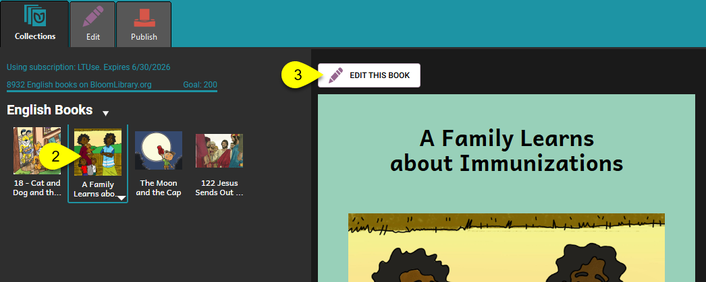

4. Click the **title area** on the book’s cover:

	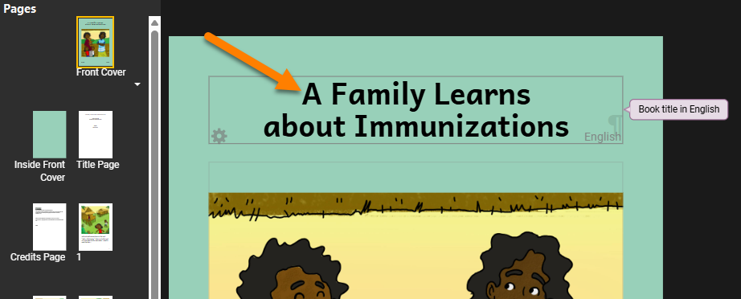

5. **Type** the new title (keep it short and clear).
6. **Click outside** the title box to finish.
7. Bloom saves the new title automatically:

	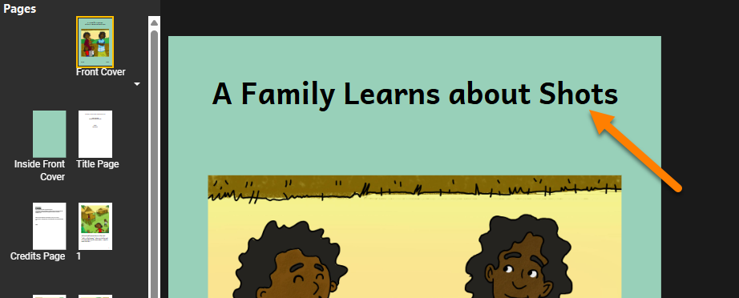

## Tips for Good Titles {#c063e0dd53804b528251ab0bea4c04c2}

- **Match** the story: choose a title that references the main idea or character.
- **Check** spelling and capitalization.
- **Translate** the title into the language of your audience as needed.

## Troubleshoot Common Issues {#44252d68e588488694f2ee474416b082}

| Problem                                 | Fix                                                                          |
| --------------------------------------- | ---------------------------------------------------------------------------- |
| Title did not change in collection view | Refresh the collection (press **F5**) or reopen Bloom.                       |
| Cannot edit title                       | Make sure you are in the **Edit** tab and clicked directly on the title box. |

## Related Topics {#4c0d2ea7545f4796a5c80b605e67f56d}

- Create a New Book
- Delete a Book
- Organize Your Collections
- Edit Book Information
- Publish Your Book

## Rename a Collection {#2204bb19df12805591bed3a43fa4de91}

If you need to rename a collection, please see [Rename a Collection](/rename-collection).

