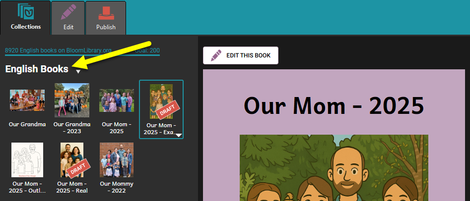
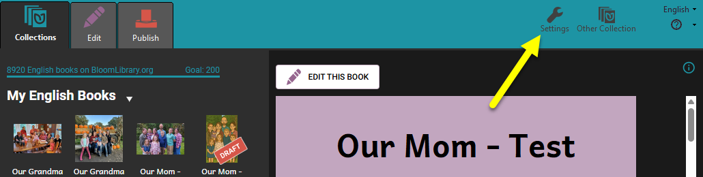
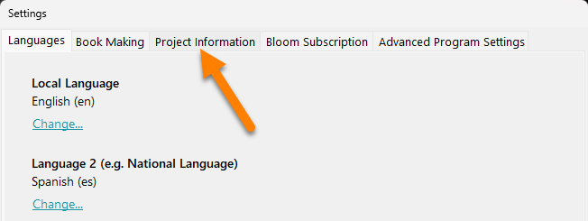
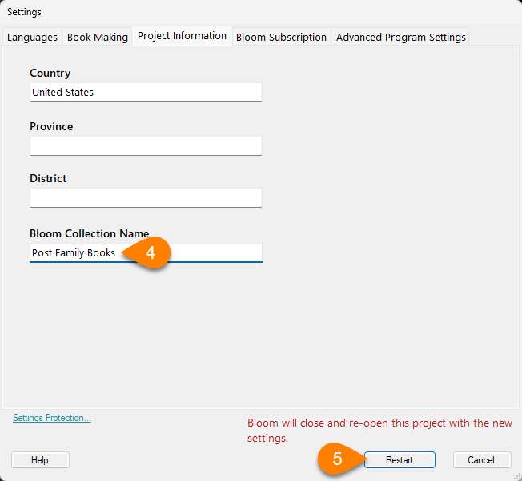
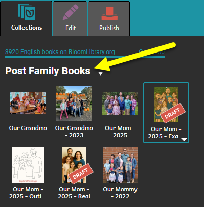

:::note

You may want to change the name of a book collection to more accurately describe the type of books in the collection.

:::

Follow these steps to **rename your Collection**:

1. Go to the **Collections** tab.
2. Click on **Settings**:

	

3. Click the **Project Information** tab:

	

4. Edit the name in the **Bloom Collection Name** box:

	

5. Click **Restart**.

Bloom will close and then reopen the collection with the new name:

