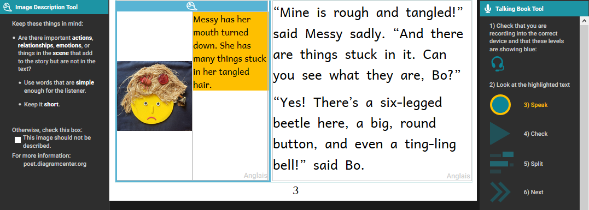

# Create Accessible Books {#621e053371724459ae5e6167ae01164c}

## Creating Accessible Books in Bloom {#84b69f618d77465ea850d78a72029ed9}

Accessible books are electronic books that have features to make their content more readily accessible or available to people with visual disabilities. Such features include audio recording of the text, descriptions of images, and text size that can be changed by the person reading the book. Bloom can help you create books with these features and that meet technical accessibility standards.

## What to expect in this module {#51a903555d1e44298c64f5c6f2707c22}

In this training module, you will learn how to:

1. Create image descriptions,
2. Record audio of the text in the book and in image descriptions,
3. Evaluate whether images need adjustment for visual impairment, and
4. Choose images that are going to be easier to perceive

## Choosing Good Images {#9b5d6c7250b34a98a3105c3012a98a24}

Choosing images that are appropriate for readers with low vision is a complex subject, but we can consider some general principles.

- In general, simple images are preferable.
- Graphics should be relatively large to make them easier to see.
- It is helpful for objects and key features to have a black outline.
- Black and white line drawings (such as come with the Art of Reading) serve well, but even then some have more details than others.
- If color is used, they should be colors that contrast well with one another.
- In line drawings, the lines should be thick and solid black. Use black and white images rather than grayscale.
- Photographs often have many details that can be hard to distinguish. Only use them if they are simple and not too detailed.

Now we will compare some images to provide some examples of these principles.

## Considerations for choosing images: Amount of detail {#8b79affb113e43ee9b3123c73ea02fe4}

Here are some examples of images with more detail compared with images with less detail. All of these images are from the Art of Reading. It will be better to use the images with less detail. 

For example, the Images with less detail on the left, rather than the images with more detail on the right:

Here are some additional examples of images with less detail on the left and more detail on the right:

## Considerations for choosing images: Thick black lines {#ef61fc29124f44c2bc3f84dddb40ab4e}

These images from the Art of Reading illustrate images that have thick, solid black lines compared to images with thinner, less distinct lines. It will be better to use images with thick, solid lines. 

The images on the left have thicker, solid lines, and the images on the right have thinner, less distinct lines. 

Here are some additional examples of images with thicker, solid lines on the left and thinner, less distinct lines on the right. 

## Considerations for choosing images: Color and photos {#87c950eedcd64a37bfb462892c174d1e}

We all like photos and color illustrations, but they are visually more complex. Below you can compare line drawings to a photo or a color illustration or a simpler color illustration to a more complex one. It will generally be better to use simpler images. 

The images on the left are simpler, while the ones on the right are more complex.

Additional examples of simpler images on the left and more complex images on the right:

## Summary {#2688584619fc44a9ac09298acadc4048}

In this training module, you learned how to:

1. Gain access to accessible book tools in Bloom,
2. Create image descriptions,
3. Record audio of the text in the book and in image descriptions,
4. Evaluate whether images need adjustment for visual impairment, and
5. Choose images that are going to be easier to perceive.
