# Leveled Readers {#33c4bb19df1280fa95ced76c549f2ebf}

In this section, you will learn how to use a leveled reader template that has already been prepared for your language.

### **Starting a book based on a leveled reader** {#33c4bb19df128030b893f9aa7eb4d5e3}

Once you have a reader template available to you, here are some steps you can follow:

1. Run Bloom. It should open again to your Local Language Collection.
2. In the Collections Tab, look down at the “Sources for New Books” area. Scroll through there and locate the group of templates that came in from the Reader Template Bloom Pack. The exact names will vary, but if your language was named “Bislama”, you might see something like this:

	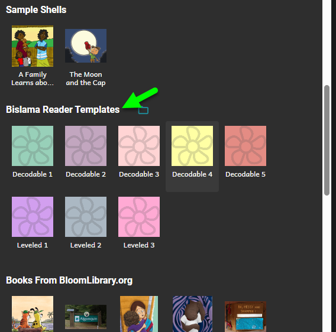

3. You should see several templates there, named by what kind of template they are. If it is not clear which one you should use, ask the person who set up the templates to show you which one you should start with.

	Note that in this section, we’re only describing what you will do and see with **leveled** readers templates. If you want to start with a **decodable** reader template instead, skip to the next major section, where we talk about that.

4. Select the template you want.
5. Click **Making a book using this source.**

	As usual, Bloom creates a new book and takes you to it in the Edit Tab. It already contains the cover, the Title Page, etc. If you like, go ahead and set the title of your book, and choose a cover image. Or just skip that and come back to it later. Your template may already come with pages and images. Or it might be empty except for the front-matter and back-matter. It just depends on what was in this template when your colleague made the Reader Template Bloom Pack.

6. Get to a page where you can start entering text. That means either select an existing page, or add a new one by clicking on one of the page templates on the right.

### **Using the Leveled Reader Tool** {#33c4bb19df1280329237eb8e4440eef9}

Now let’s look at your _Leveled Reader Dashboard_:

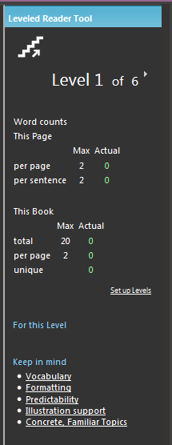

Notice that there are numbers that keep you informed about the number of words you are using, and compares them to the maximum you should be using for this level. The dashboard shows you the number of words on this page, in the sentences on this page, and in the book. Finally, notice the row labeled “unique”. _Unique_ here means we only count a word the first time it is used. Notice that we have used 5 words here, but only 3 are _unique:_

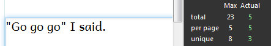

Notice that the numbers in the “Actual” column in screenshot above are all 0. This is because there are no words yet on the page. Do you see the color is green? That means that this number fits within the limits for this level. If you go beyond those limits, the number will turn orange, as will the sentence with too many words:

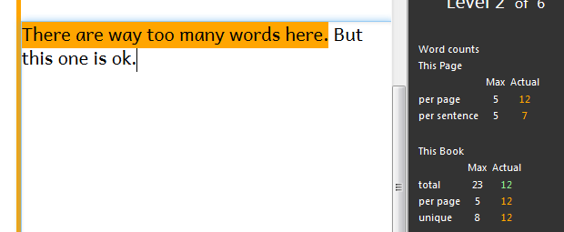

### **Beyond Word Counts** {#33c4bb19df12809f962de2f8d20f928b}

Bloom will help you remember not to use  too many words. That’s the good news. The bad news is there’s **so much more** to making a leveled reader than just limiting your words, and computers are not smart enough to help you with all those other things. So learning to make a good leveled reader will normally require training and workshop activities. What we _have_ done in Bloom is to give you a few reminders, in the dashboard, of things you should keep in mind as you work on a book:

At any time, you can click on one of these links to read a short summary of the topic, to refresh your memory.

# Using a Decodable Reader Template {#33c4bb19df12803fbf28ca764b45de45}

In this section, you will learn how to use a decodable reader template that has already been prepared for your language. You should have already unpacked the Reader Template Bloom Pack as described earlier in this document.

1. In the Collections Tab, look down at the “Sources for New Books” area. Scroll through there and locate the group of templates that came in from your Bloom Pack.
2. You should see several templates there, named by what kind of template they are. If it is not clear, ask the person who set up the templates to show you which one you should start with.
3. Select the template you want.
4. Click **Making a book using this source.**

	As usual, Bloom creates a new book and takes you to it in the Edit Tab. It already contains the cover, the Title Page, etc. If you like, go ahead and set the title of your book, and choose a cover image. Or just skip that and dive into the decodable goodness. Your template may already come with pages and images. Or it might be empty except for the front-matter and back-matter. It just depends on what was in this template when your colleague made the Reader Template Bloom Pack.

5. Get to a page where you can start entering text. That means either select an existing page, or add a new one by clicking on one of the page templates on the right.

	Now let’s look at what we’ll call your _Decodable Reader Dashboard_:

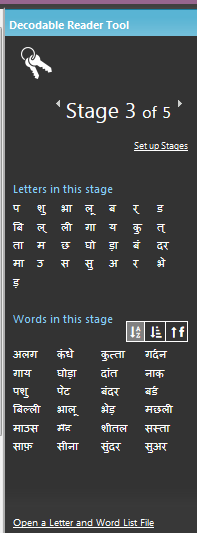

At the very top, you will see the stage number that this template has selected for you. There is a control to change the stage, but normally you should not touch that. Instead, if you decide you have opened the wrong template, go back to the Collection Tab and chose the correct template.

You will also see a “Setup Stages” link. Unless you are responsible for setting up stages, don’t click that either. It’s for literacy specialists, not authors.

With that out of the way, let’s look at the parts that will be helpful to you. First, there is a list of the letters that you want to use in this stage. You might be wondering, What if I accidently use a word with a letter I’m not supposed to use? We’re glad you asked. Let’s experiment:

In the text area of the page, type some words. Type some that use only the letters listed, and some that use other letters. You’ll see something like this:

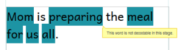

Words that are not allowed in this stage are highlighted in blue.

Thinking of words that only use a small number of letters can be hard, so the next section, labeled “Words in this stage” lists words from your language that use only those letters. It also lists any _sight words_ that are part of this stage. Sight words are words that may use letters that haven’t been taught yet, but students will be learning to recognize these words anyways.

There’s just one more thing to try out with decodable readers. Just above the list of words, notice that there are 3 little buttons:

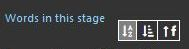

Click one of these buttons to sort the words in one of these three ways: alphabetically, by word length, or by frequency. _Frequency_ means how common the word is. Now, Bloom doesn’t actually know the frequency of the word in the language, so this is just based on how often the word occurred in the Sample Texts Bloom was given by the literacy specialist.

Finally, when doing a decodable reader, you may want to also check the book against _leveled reader_ criteria for Level 1 or Level 2. To do that, follow these steps:

1. Click on the rectangle labeled “More…” in the lower right hand corner:

	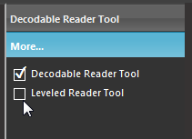

2. It opens to show you the tools that are available. Click on the Leveled Reader Tool.
3. The Leveled Reader tool will open.
4. Go through your book, making sure that you don’t see any of the orange warning blocks that would mean you are using too many words.

# A Note on Entering Special Characters {#33c4bb19df12803aaef8c5747c259fcf}

Does your alphabet (writing system) have special characters, for example, ë, ĉ, Ç, ɨ, and ñ? Ideally, you will want to have a proper keyboarding system for your language. But in case you find yourself using Bloom without a way to type your language, Bloom does include a last-resort way to enter the letters you need.

Type a letter, like ‘o’, and HOLD DOWN the key. The Special Character box will pop up.

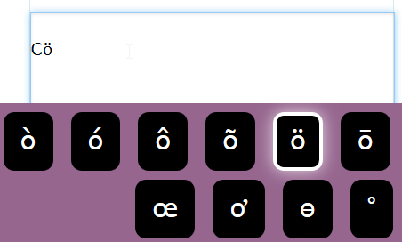

Now, still holding down the letter, use the arrow keys or the mouse to select the one you want. Then let go of the letter key.

Note that this feature is limited to languages that using latin/roman scripts. If you’re using another script, you really need to have someone help you install a proper keyboarding solution for your script.

# A Note on Changing Font Sizes {#33c4bb19df1280958f35de327d522e60}

Ideally, the templates you use will already have carefully chosen fonts, font sizes, line spacing, and word spacing. If however your book requires an even larger font, you can change that yourself. For example, perhaps you are making a level 1 book that only has a single word, so you’d like to make that word _really big_. Here’s how to do it.

1. Place the cursor inside of a text box. You will see a grey “cog” icon in the lower left:

	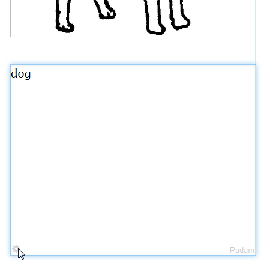

2. When you click on that icon, you’ll see a box full of options:

	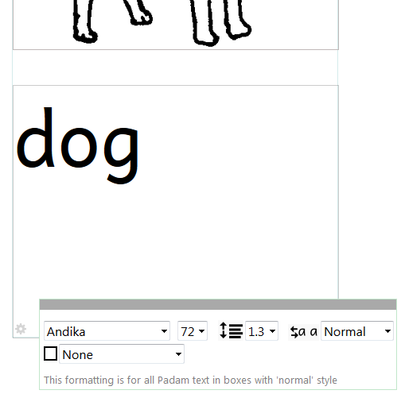

3. Now add another page, and notice that this page already is using the larger font.
When you change the formatting of a text box in Bloom, you are setting it for all similar boxes in the book. This helps you be consistent and saves you time:

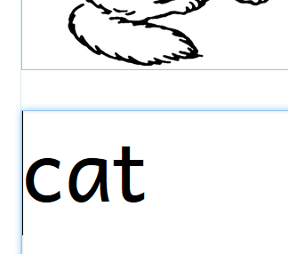

