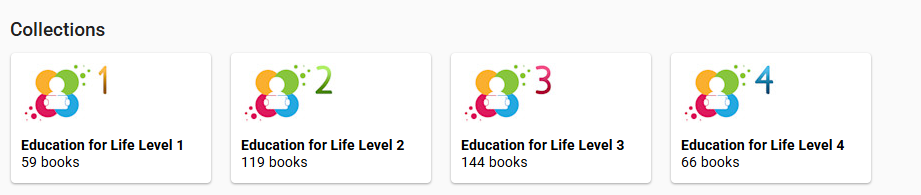

# Intended Audience {#32e4bb19df128005b3f6c7310b199335}

This documentation is intended for trained **Literacy Specialists** who wish to create [Decodable](/glossary#f89e2ff182c3471a9cbabefaad5fe4f6) and [Leveled](/glossary#32f4bb19df12800e89a9f4f3597c40d9) **Reader Templates**. 

:::caution

Setting up Reader Templates requires a deep understanding of the language, its orthography, and its grammar.

:::

# The Goal {#32e4bb19df12803089ecdb541305ac73}

After the Literacy Specialist has configured and created these Decodable and Leveled Reader Templates for a given language, they will bundle them into a special file called a “[Reader Template Bloom Pack](/glossary#32f4bb19df12802891c5f7a73c2ed890)” and give it to **local authors** to install on their computers. Local authors will then use these templates to create and publish stories that carefully target a specific reading level.

After local authors make their collection of decodable and leveled books, they can be published in print or digital formats to support the literacy goals of a language community. 

Bloom users with a [Bloom Enterprise subscription ](/which-subscription)can organize their books into grade-level collections in Bloom Library. For example, Education for Life has this series of books:  

# What the literacy specialist should already know {#32e4bb19df1280a4bd81f4006b34f5aa}

This material assumes you already have a good working knowledge of the Bloom program. 

If necessary, you may wish to review the following:

- [How to Install Bloom](/installing-bloom-on-windows)
- **[Problem Internal Link]**
- **[Problem Internal Link]**
- **[Problem Internal Link]**

:::note

This article will not teach you principles related to selecting the order in which you will introduce letters and sight words to new readers. Instead, we assume you have a plan and just need to learn how to implement it in Bloom.

:::

# What you will learn {#32e4bb19df1280f3b9f2e5798933fde8}

You will learn how to create a collection of [Reader Templates](/glossary#32f4bb19df1280fdb4a3d77da7c693fd) at various levels/stages and for various purposes (decodable or leveled).

It may not at first be obvious, but if you think about it, you will realize that the parameters of decodable books, in particular, must be set up to match the orthography and vocabulary of an individual language. So the collection of templates you create will be for a single language.

Finally, you will learn how to create a “Reader Template Bloom Pack” file that you can give to authors of this language, so that the templates you have created will be available to them.

Before we begin, please review the following key terms in our glossary.

# Definitions {#32e4bb19df1280baabaec82ef0dba5d5}

- [Decodable Reader](/glossary#f89e2ff182c3471a9cbabefaad5fe4f6)
- [Leveled Reader](/glossary#32f4bb19df12800e89a9f4f3597c40d9)
- [Reader Template Bloom Pack](/glossary#32f4bb19df1280fdb4a3d77da7c693fd)

# Create a new Local Language Collection to hold your templates {#40161bf9f04f4da2ac0cb8acd1ebdc08}

A Local Language Collection combines two things. First, it is a folder on your disk that contains other folders, each of which has all the parts of a single book or template book. As you use Bloom, you add books to your collection. We are focusing here on local language collections because the rules for decodable reader stages and leveled reader levels are specific to a single local language. 

Second, a Local Language Collection in Bloom has a set of Decodable Reader Stages, and a set of Leveled Reader Levels. Because the rules belong to a collection, and not just to an individual book or template book, you don’t have to repeat what the rules are each time you make a reader. Whenever you make a reader in the collection, you will be able to say “this book should fit Decodable Stage 1, or 2, or 3”, etc. Bloom will look up what the letters, words, and other rules are for that stage or level, and the book you are working on. 

If you already have a local language collection, it’s best to [create a new one](/create-a-new-collection) for these templates. The reason is that all the books in this new Local Language Collection will serve as templates to distribute to your local language authors. And so, the _only_ books that you want to appear in this collection are decodable and leveled reader templates. 

:::note

Hint: you might wish to name this collection “Reader Templates for ____”.

:::

## Additional Reading (SIL) {#33b4bb19df1280bb9483f4350ed73066}

- [Resources for Literacy and Education](https://www.sil.org/literacy-and-education/resources-literacy-and-education).
- [Resources for Developing Curriculum and Teaching Materials](https://www.sil.org/literacy-education/resources-developing-curriculum-and-teaching-materials).
- [Education Technology](https://www.sil.org/literacy-education/education-technology).

## Additional Reader (general) {#33b4bb19df1280cc8afff98e461f6421}

- [10 tips for using decodable texts](https://www.thereadingleague.org/media/maria-murrays-10-tips-for-using-decodable-texts/).
- [A Teacher’s Guide to Decodable Readers](https://readingeggs.com/articles/a-teachers-guide-to-decodable-readers/).
