### Making Your Templates {#32e4bb19df12801a9012dc1801987e92}

Now that you have set up the system for decodable and leveled readers for this collection, you can do one of two things. If you are working all by yourself, you can just start making books using those levels and stages. The remainder of this document, however, will assume that what you want to do is make a series of book templates that will serve as launching points for authors. You will see how to create each of these templates, and then how to package them up into a Reader Template Bloom Pack that you can give to authors.

While setting up your levels and stages in the previous section, you will have already made one or more template books. The purpose of those templates was to give you access to the reader tools so you could set things up for this collection. In the following, we are going to give you step by step instructions you can use to make many more of basically empty books, each one tied to a single decodable stage or leveled reader level, and each one with the “normal” style set to have an appropriate font size, line spacing, etc. So what happens to the ones you already made? Feel free to use those as a starting point, for example, for the first level and stage. You are also free to delete them (right click on their icon and choose **Delete Book**). Remember, all the set up you have done belongs to the Bloom Collection, so it will be there for any future reader books you make. It won’t go away just because you delete one or even all of the books in your collection.

### Create a template of the appropriate type {#32e4bb19df1280119689ce24ba313868}

First you need to decide if you are making a decodable reader or a leveled one. Then, in the **Collections** tab, you would click the appropriate source template.

Let’s make a Decodable Reader template.

1. Click the **Collections** tab.
2. Click **Decodable Reader**.

	

3. In the right pane, you see a button that looks like this: .

	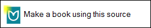

4. Click the **Make a book using this source** button.

	The Front Cover page appears. Notice that the focus (place where you type) is in the top text box. This is the box where you type the title of the book. The callout box tells you which language the box expects.

	So, let’s give the template a title that will make sense to the author. For example, in English, we might name a template “Decodable 2” so that it is obvious to an author that he or she should select that one if what they want is to start a new decodable book that will conform to stage 2.

5. Let’s make sure the book is set Stage 2. Here is how you do it:
	- In the **Decodable Reader Tool** pane, find the stage control:

		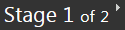

	- Click the arrow that points to the right to change the stage from 1 to 2.

From now on, this book is set to be a stage 2 book, like this:

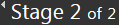

**Set up text styles and spacing**

An important part of making books for new readers is choosing the right font, size, line spacing, and word spacing. For each decodable stage or leveled reader, you may want to have different settings for these things. Here’s how to do it.

1. Near the bottom of the **Pages** pane, click the **Add Page** button
2. In the **Add Page** dialog box, below **Decodable Reader**, click the **Basic Text and Picture** page. It is the top-left one. Then click **ADD PAGE**.

	A new page is inserted. The top shows a picture placeholder. It works just like the one on the Front Cover page. Below it is a text box.

3. Each text box has a small gray “gear” control: It is at the lower left corner of the box: . Click that gear control. It looks like this:

	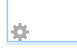

A **Format** dialog box opens with control you can use to set styles, font, font size and more.

For more information about this box, open the Help files that came with Bloom.

That's all you need to do to make a template. Back in the collections Tab, you should see something like this:

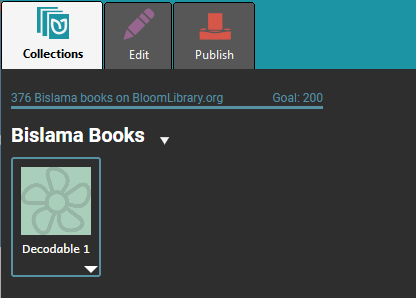

Now, repeat those steps for every decodable stage you need. When you are done, you should end up with something looking like this:

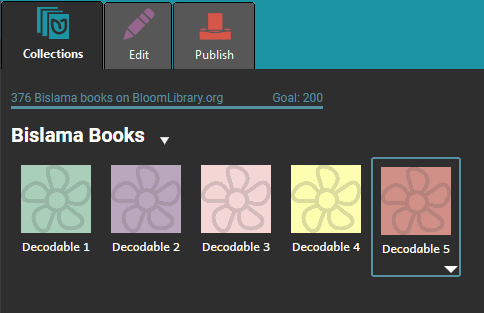

Now, we can do the same thing for each Leveled Reader level:

1. Click the  **Collections** tab.

	

2. In the Sources for New Book, click **Leveled Reader**.

	

3. In the right pane, click **Make a book using this source**.
4. The **Front Cover** page appears. Notice that the focus (place where you type) is in the top text box. This is the box where you type the title of the book. The yellow callout box tells you which language the box expects.
So, let’s give the template a title that will make sense to the author. For example, in English, we might name a template “Level 2” so that it is obvious to an author that he or she should select that one if what they want is to start a new book that will conform to level 2.
5. Let’s make sure the book is set Level 2. Here is how you do it:
	- In the **Leveled Reader Tool** pane, find the level control:

		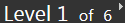

	- Click the arrow that points to the right to change from level 1 to 2.
	From now on, this book is set to be a level 2 book, like this:

		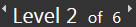

6. Finally, set the text formatting as you did before, for the decodable readers templates.
Now, in the **Collections** tab, you could have something like this:

	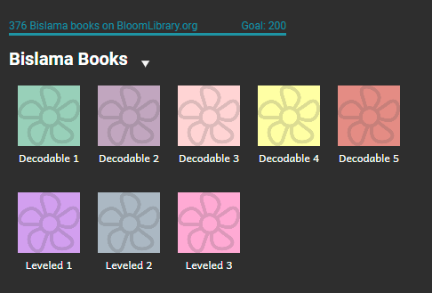

## Making a Reader Template Bloom Pack {#32e4bb19df1280adbbb8e443f4ce8e97}

You’ve now set up your stages and levels, and you’ve made a template to go with each one. Now you’re ready to give all this good work to a colleague or two who will use it to make lots of books.

First, let’s make sure the name of our collection describes what it is.

1. In the upper right, click on the Setting Icon:

	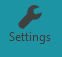

2. In the **Project Information** tab, edit the name in the **Bloom Collection Name**, box, and then click the **Restart** button.

	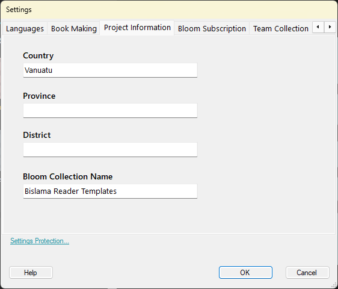

	Bloom will restart to cope with that change. After the restart, you’ll see the new name at the top of the **Collections** tab:

	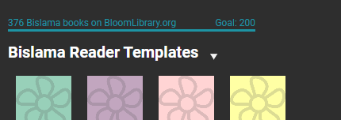

Now you are ready to make a Bloom Pack that will share your stages, letters, words and levels with others.

1. At the top of the left pane, look for the name of your book collection. Just to the right of that collection name, notice the white down arrow. It looks like this:

	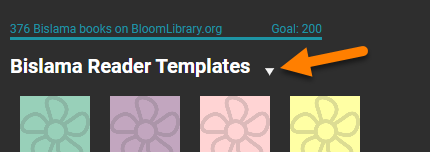

2. Click that white down arrow, and then click the **Make Reader Template Bloom Pack** command.
It looks like this:

	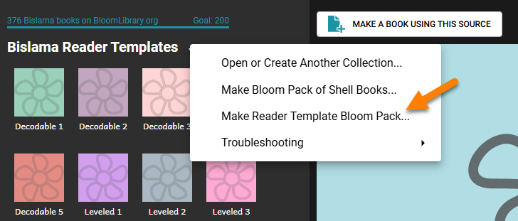

3. The Make Bloom Reader Template Bloom Pack dialog box opens.
4. Select the check box about confirming that you understand. Then, click the **Save Bloom Pack** button.

	The Save As dialog box opens. At this point you can save this Bloom Pack file wherever you want: on a USB Flash drive that you share, to a shared networked folder, in Dropbox, etc.

5. Find the folder where you want to save it, and then click the **Save** button.

	Now the Bloom Pack is saved. Another training document, “Using Bloom Reader Templates” is available to help the person who received this Bloom Pack. But just in case you want to know a bit now, that person simply has to copy that Bloom Pack to their computer and double click it. After that, the templates you have created will show up in their **Sources for New Books** area:

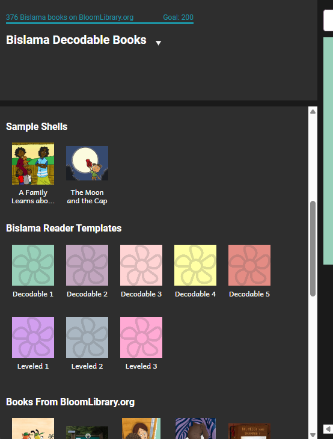

