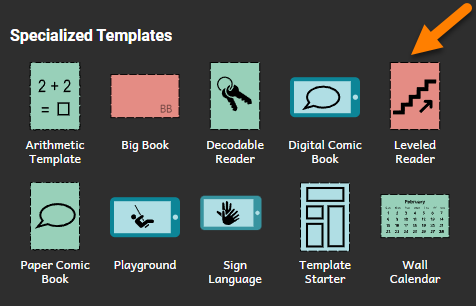
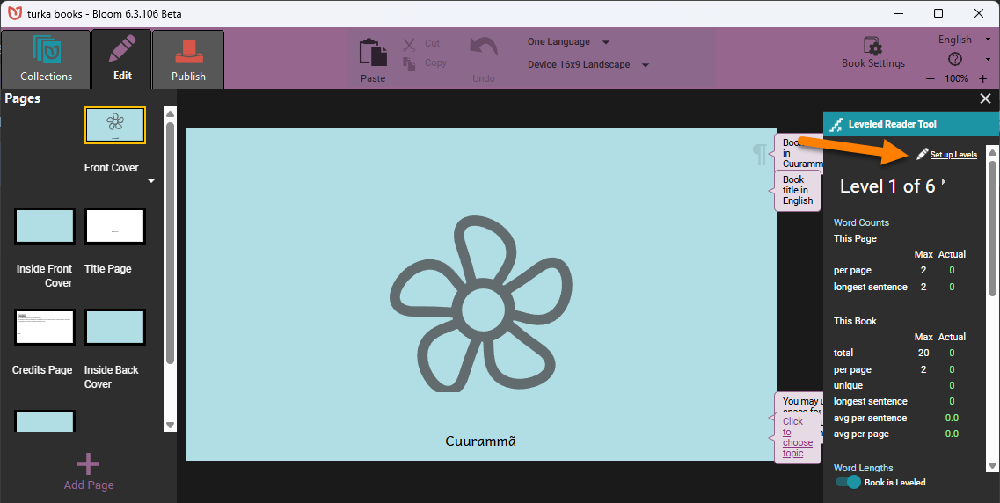
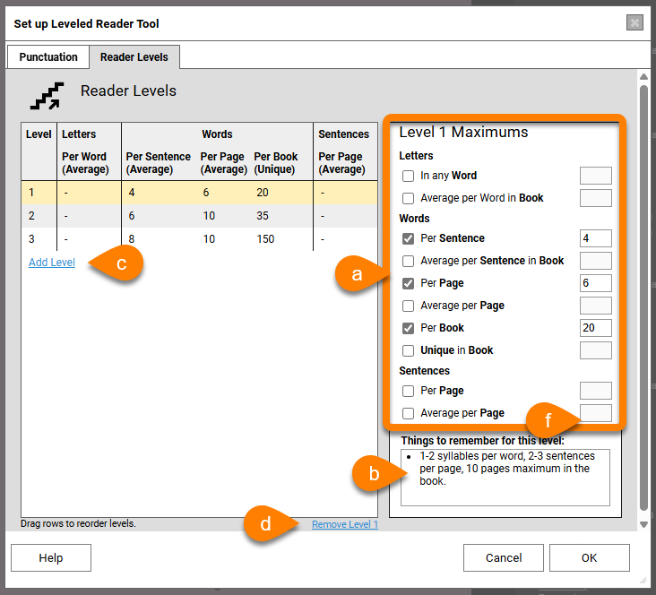
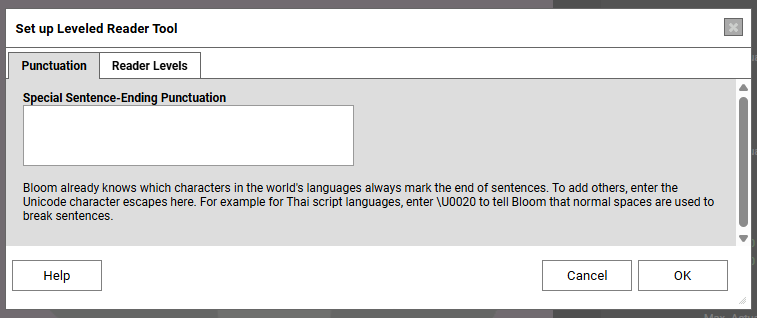
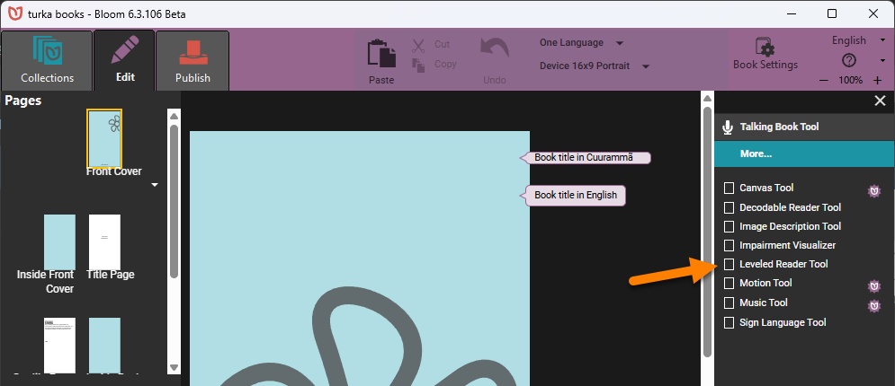
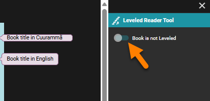
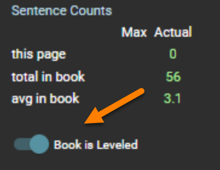

## Leveled Reader Levels {#140de27b23eb4d7884b0fd877bfb7d2c}

Each level defines specific targets for word length, sentence length, and number of unique words. These targets can be set for each sentence, each page, and the entire book. Levels also determine appropriate formatting. Levels may also include suggestions for appropriate vocabulary, illustration support, and topics for the given level.

As you enter text into the book, Bloom helps you keep in mind the level for which you are writing and points out when you exceed the limits set for the level. Bloom does this by highlighting text whenever you exceed the set limits.

Setting up the Leveled Reader Tool is not too much different from setting up decodable stages. In fact, it is easier. There are 6 levels already set for you. You can use them as-is or modify them.

:::caution

While setting up the Leveled Reader Tool is not too difficult, determining the best criteria for it is usually done by someone with specialized skills in literacy education.

:::

# Make a Leveled Reader template {#32e4bb19df128010b883f2840bda2c2c}

In the Collections tab, look for Sources for New Books in the bottom left of the screen.  There you will see **Specialized Templates**:

1. Click the **Leveled Reader** template.
2. Click the **Make a book using this source** button.

You should now see the Leveled Reader Tool. It is on the right side of the Bloom window. 

Bloom comes with a set of basic levels. You can edit these to suit your needs or make additional levels. 

1. **Click the** **`Set up Levels`** **button** (located at the top of the Leveled Reader tool) to display the Set up Leveled Reader Tool dialog box.
2. For each level:
	1. Edit the Maximums: letters in a word, words in a sentence, words per page, etc. If you do not want to define a given maximum length, you can leave it blank.
	2. Add any additional notes in the “Things to remember for this level” field.
	3. Click the `Add Level` link to add a level to the list of levels.
	4. If you need to remove a level, click the `Remove Level` link at the lower right-hand corner of the levels list.

		

3. Bloom knows about most punctuation marks that are used to end a sentence. If your language uses other punctuation marks to end a sentence, you can tell Bloom about them by listing them in the `Punctation` tab. (This step is optional.)

	:::tip
	
	If you need to list more than one punctuation character, add them to the box without any dividers or punctuation between them.
	
	:::
	
	

	

4. When you are finished, click `OK`.

## Changing any book into a Leveled Reader {#32e4bb19df128017b2a3f04fc4f7929f}

Any book can be changed into a Leveled Reader. Follow these steps: 

1. **Open the tool bar and tick the box for the Leveled Reader tool**

	

2. The slider “**Book is not leveled**” will be set to the left side, indicating this is _not_ a leveled book. To make the book a leveled reader, slide the slider to the right.

	

3. The Leveled Reader tool will open, and the slider will indicate this is a leveled book.

