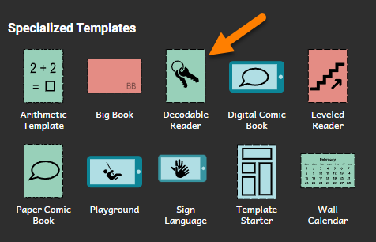
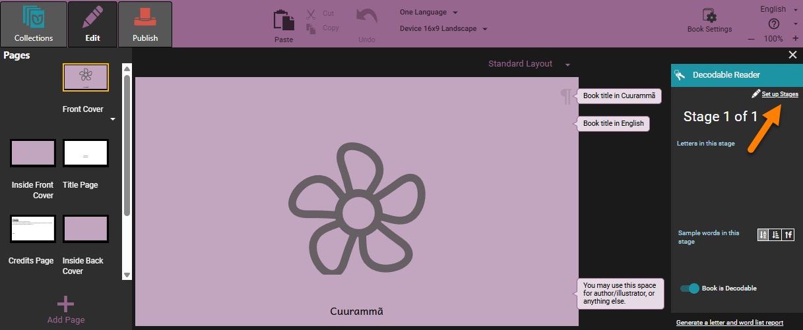
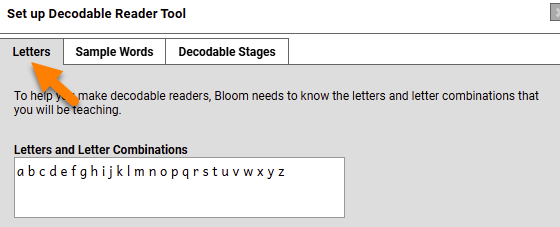
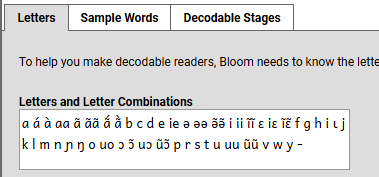
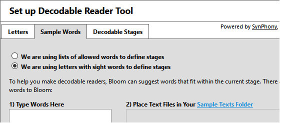
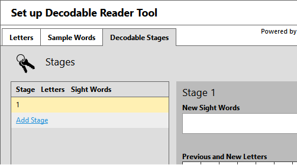

# Decodable Stages {#b8a7ff8e058543e18632627c9c8ab974}

A language may have few **decodable stages** (5-10) or many decodable stages (30 or more). 

Each stage introduces one or more **letters or letter combinations**, and may introduce some **sight words** as well. **Sight words** are words that have been selected for students to learn, even though they may use letters that haven't been taught yet.

Generally, the number of stages is determined by how children are taught to read in that language without having acquired literacy skills in another language. However, in a “transfer literacy” program where students already know one language (for example, a language of greater communication), and the goal is to learn the unique features of a local language, then stage 1 or 2 might include all the letters the student has previously acquired for the language of greater communication, and additional stages will add letters new to the student in the local language.

# Make a Decodable Reader template {#32e4bb19df12809b9805de00e989ddfe}

In the Collections tab, look for Sources for New Books in the bottom left of the screen.  There you will see **Specialized Templates**:

1. Click the **Decodable Reader** template.
2. Click the **Make a book using this source** button.

You should now see the Decodable Reader Tool. It is on the right side of the Bloom window. 

Click the **Set up Stages** link.

# Setup Stages {#32e4bb19df12808ea3c1d6a49afba33a}

## Letters {#32e4bb19df12803f8698ffbb688fe732}

The first task is to tell Bloom about the letters, and letter combinations in your alphabet (orthography). You do this in the Letters tab:

1. Click the **Letters** tab.
2. Click the Letters and Letter Combinations box.
3. If the letters _and_ letter combinations that appear in that box are not the same as the letters in your alphabet, you need to delete them.
	1. Select those letters with your mouse and then press the Delete key.
	2. In the box, type the following things that are part of your language:
	○ All of the letters and letter combinations.
	○ All letter combinations you plan to teach.
	○ Any other word-forming characters, like dashes, apostrophes, hyphens.

:::tip

It is important to add both Letters **and** Letter Combinations. 

Letter Combinations could include any of the following: digraphs, and any important (phonemic) distinctions in vowel length, nasality, consonant clusters, and special diacritics like tone marking.

:::

For example, a language with vowel length and tone marking may have the following:

## Sample Words {#32e4bb19df12800fbbe1e3147fce1478}

The second task is to tell Bloom the words you want it to suggest. You do this in the **Sample Words** tab.

1. Click the **Sample Words** tab. It looks like this:

	

	The default selection is **We are using letters with sight words to define stages**. For this exercise, do not change this selection.

	The first box is called **Type Words Here**. It is a box where you can type words you want Bloom to suggest. 

	The second box is labelled "Place Text Files in Your Sample Text Folder”. You cannot type in this box. It shows file names. These are files of word lists or longer paragraphs of text. If these files are saved correctly in the Sample Text folder for the book, Bloom can read them and make suggestions. You see the suggestions in the **Decodable Reader Tool**. 

	Bloom will suggest words from both of these places. 

	Let’s first type words in the **Type Words Here** box.

2. Click in the **Type Words Here** box. Type a word. Press your spacebar key to enter a space. Then type another word. You can do this for as many words as you want.

	Next, let’s put a text file in the Sample Text folder. You can have many files in the folder but let’s do only one right now. Notice that in the label **Place Text Files in Your Sample Text Folder**, you see two different colors.

3. Click in the **Sample Text Folder** link.

This opens your computer’s explorer window to the Sample Texts folder for this collection.

You need to have a file available with a word list or a sample text saved as a UTF-8 Unicode *.txt file. Microsoft Notepad works well for this. Microsoft Word also works.

While the details about UTF-8 are beyond the scope of this training module, here are the basic steps you need to do:

- If you have files in Microsoft Word, use **Save As…**.
Click the down arrow in the **save as type** box to see the options.
Choose **Plain Text (.txt)**.
Then, the **File conversion** dialog box opens. Choose **file encoding**, and then click **UTF-8**.
- Save the file in the **Sample Text** folder. If the folder is open, you can drag-and-drop the file from another folder.

You should be able to see names of the files in the **Place Text Files in Your Sample Text Folder** box. Now, Bloom can find your file and suggest words.

At this point, you might be asking yourself, “Do I really need to do all this for every template?” No, you only do it once for all your work in a language. All of this setup is part of the Local Language Collection, so it is usable by any book you make in your collection.

## Decodable Stages {#32e4bb19df1280ed886ef9b8c37220c9}

The third task is to set up the stages. You do this in the **Decodable Stages** tab.

1. Click the **Decodable Stages** tab. It looks like this:

	

	Stage 1 is the first stage. You can add more stages. But first, add letters to Stage 1.

2. In the **Previous and New Letters** area, you see a grid of letters. These are the letters you added in the **Letters** tab. Click the letters you want to introduce in this stage. If you do not see a letter you need, click the **Letters** tab again and add the letter there.

	Notice that the letters you clicked get a colored background. Also, notice that those letters appear in the left pane.

	If you saved a file in the **Sample Files** folder, words that use the letters in Stage 1 appear in the **matching words** pane. It is on the right side of the tab.

	Now, you can tell Bloom about any sight words you want to use in this level.

3. Click the **New Sight Words** box. Then type the words, separated by a space.
4. Now it is time to add another stage. To do this, click the **Add Stage** link.
5. In the **Previous and New Letters** area, you see a grid of letters. Click the letters you want to introduce in Stage 2.

	Notice that you cannot click the letter you already introduced.

6. In the **New Sight Words** box, type the sight words to introduce in Stage 2.
7. Do the steps above to add Stage 3, Stage 4 and Stage 5.
8. Click **OK**.

Your local language collection now knows about the decodable stages you want. It knows the letters and sight words you want to introduce. Bloom can now suggest words.

At any time, you can go back in and work on your stages. Remember, these same stages will be available in any decodable reader you make in this collection. They don’t really “belong” to the book you have open.

