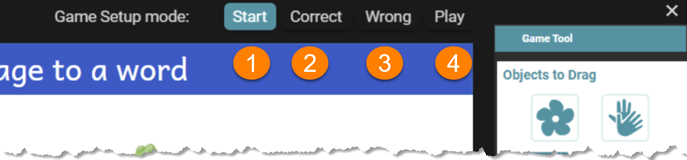
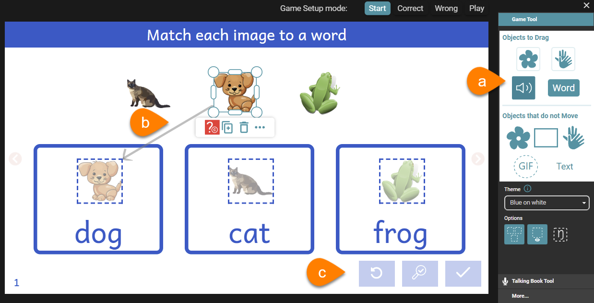
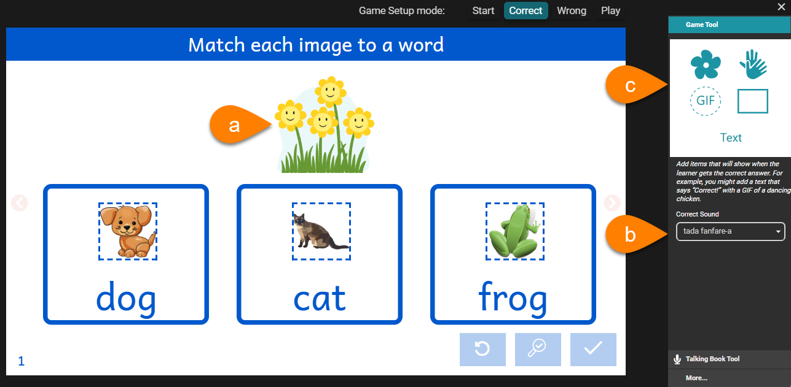
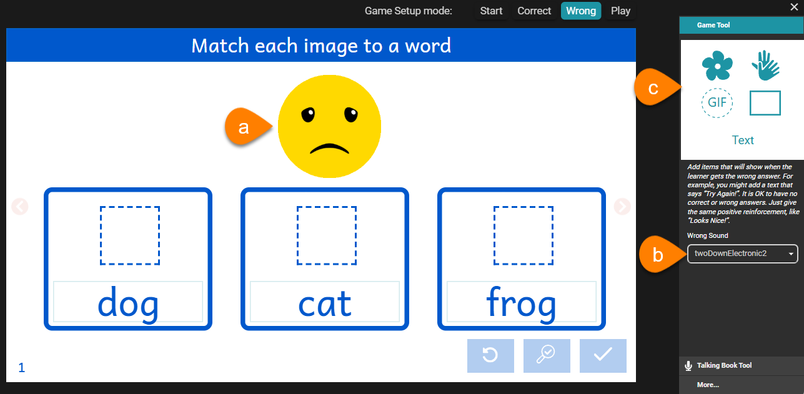
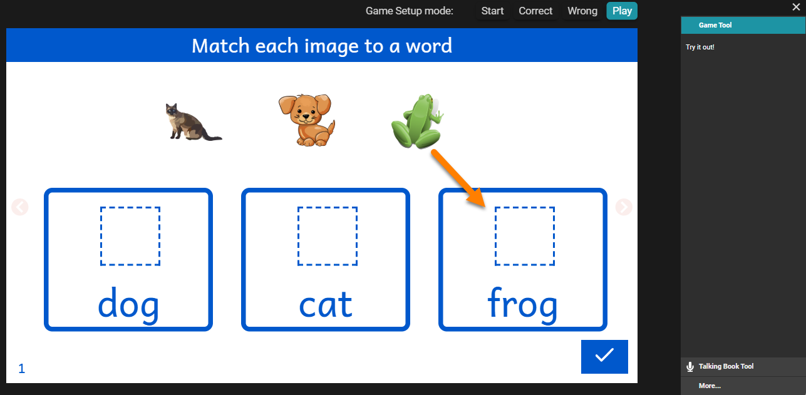

When editing a Drag-and-Drop game, there are four (4) unique setup modes:

1. [Start](/game-setup-modes#28e4bb19df1280948a30c4c4f985fd17)
2. [Correct](/game-setup-modes#28e4bb19df12801c95f8f29fe4491433)
3. [Wrong](/game-setup-modes#28e4bb19df128010958ad517426d3630)
4. [Play](/game-setup-modes#28e4bb19df12803d8b7ec1ad2c1a1078)

## Start {#28e4bb19df1280948a30c4c4f985fd17}

**Start** mode is the place to begin when adding a new Drag-and-Drop game page. This mode allows you to fill in or define the content of the game, whether the game page was made from one of Bloom’s pre-configured Game templates (such as Drag Sound to Word), or you are designing a custom game from scratch using the Custom Game template. 

In the Start mode: 

1. The [Game Tool](/game-tool) presents four tools: Objects to Drag, Objects that do not Move, Theme, and Options. All of these four components are active.
2. Game Objects can be selected, moved, resized, deleted, duplicated, and otherwise manipulated.
3. The game’s Play Controls are disabled.

## Correct {#28e4bb19df12801c95f8f29fe4491433}

In **Correct mode**, any tiles which can be dragged are hidden, allowing space for you to define what will happen when the reader answers or plays the game **correctly**.

By default, a **flower GIF** will appear (a) accompanied with a fanfare sound (b).  The default GIF can be changed, moved, resized etc. The default sound can be changed; simply click to select from the list.

Additional tiles can be added to the game canvas using Game Tool (c). These tiles will only appear when the reader answers correctly.

## Wrong {#28e4bb19df128010958ad517426d3630}

In **Wrong** mode, any tiles which can be dragged are hidden, allowing space for you to define what will happen when the reader answers or plays the game **incorrectly**.

By default, an **unhappy face GIF** will appear (a) accompanied with a particular sound (b).  The default GIF can be changed, moved, resized etc. The default sound can be changed; simply click to select from the list.

Additional tiles can be added to the game canvas using Game Tool (c). These tiles will only appear when the reader answers incorrectly.

## Play {#28e4bb19df12803d8b7ec1ad2c1a1078}

In **Play** mode, the game presents itself as a “live” game which can be tested. You can drag tiles to their target areas, e.g.

After completing the game, click the checkmark to verify your answers.

