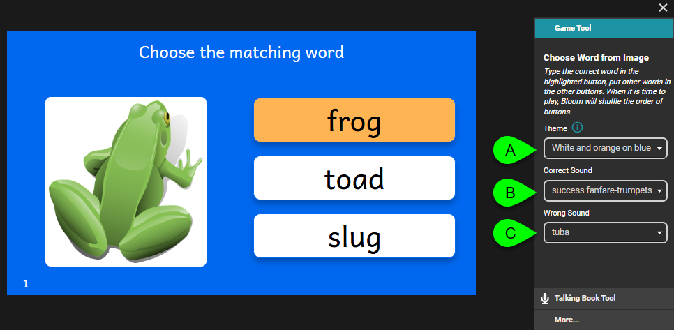
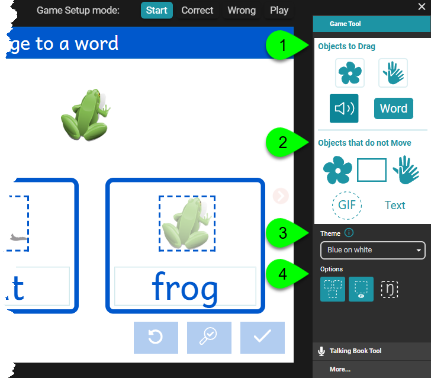

The **Game Tool** is automatically opened when you add or navigate to certain game pages. Depending on the type of game page you are editing, the Game Tool presents different options.

There are two types of game pages: static and dynamic.

## Static Game Pages {#28c4bb19df1280d49881f1e346c50abe}

**Static** game pages are pre-configured, static game pages containing **no** user-designed elements. For static game pages, such as Quiz or Simple Choice game pages, the Game Tool presents three simple configuration options: Theme, Correct Sound, and Wrong Sound.

1. To choose a different **color theme**, click on **A** and choose a theme from the list.
2. To choose a different sound to resound when a **correct answer** is selected, click on **B** and choose a theme from the list.
3. To choose a different sound to resound when an incorrect or **wrong answer** is selected, click on **C** and choose a theme from the list.

## Dynamic Game Pages {#28c4bb19df12800eab05cbd536e441bb}

For Dynamic Game Pages, users are given access to a toolbox of game elements which they can use to customize any of the pre-configured drag-and-drop game templates, or they can design their own game from scratch. There are four main parts to the Game Tool:

1. **Objects to Drag**: Bloom offers four different object types (also called “tiles”): Image tile, Sign Language video tile, Sound tile, and Word tile. All of these tiles can be moved by the end-user when the game is being played.
2. **Objects that do not Move**:  Bloom offers five different object types/tiles: Image tile, Rectangle tile, Sign Language video tile, GIF tile, and Text tile. These tiles are static and cannot be moved by the end-user when the game is being played.
3. **Theme**: select from the pull-down list to choose a different color theme.
4. **Options**: various options.

