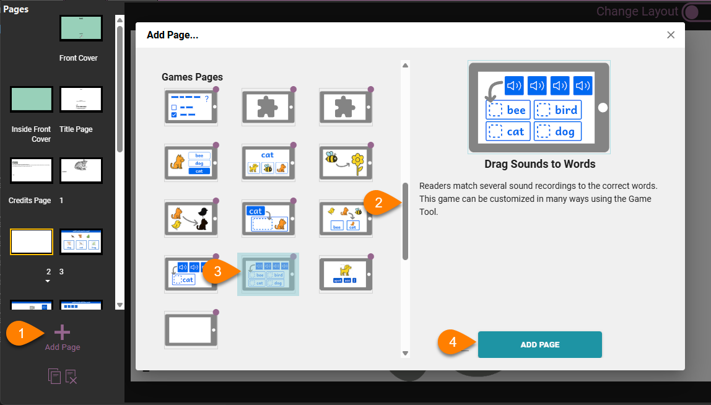
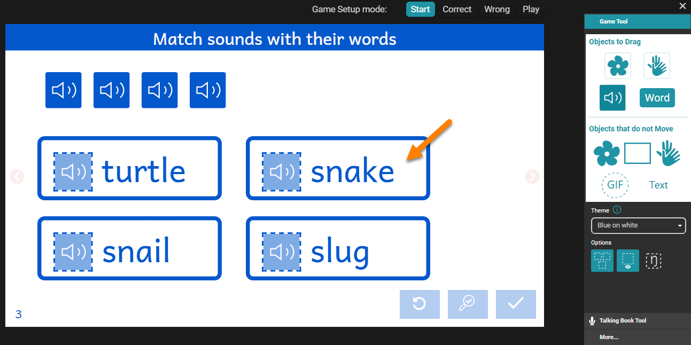
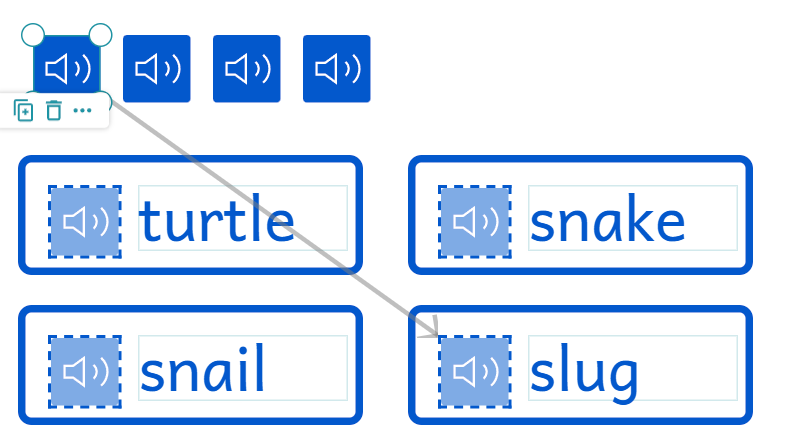
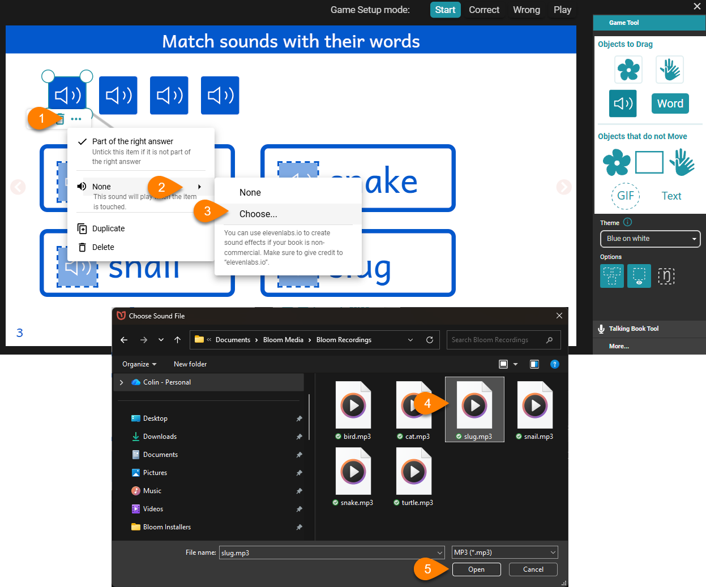

In this tutorial, we will build a new “Drag Sounds to Words” game in English.

:::tip

This tutorial requires you to have a stock of audio recordings of the words you choose for your tutorial. The recordings must be in .mp3 format.

:::

## Step 1: Add a new “Drag Sounds to Words” page {#28e4bb19df128081ae16ff487fef901b}

1. Click the purple +Add Page button.
2. Scroll down to the section entitled **Games Pages**.
3. Choose the thumbnail “Drag Sounds to Words”.
4. Click the green ADD PAGE button.

## Step 2: Type in four words {#28e4bb19df1280dfb392f12fda3ef798}

## Step 3: Identify which sound tile is linked to which target word {#28e4bb19df12801a8d35df2d7cee3429}

The four sound tiles (“speaker” icons) are each associated with one written word. For example, the first sound tile is associated with the second word on the bottom:

 

## Step 4: Import pre-recorded mp3 files for the words {#28e4bb19df128015978bd41b60aa2bf1}

1. On the sound tile, click the “**…**” to access the advanced menu.
2. Hover over the word **None**.
3. Click **Choose**.
4. Navigate to your media folder containing your mp3 recordings and select the file.
5. Click **Open**.

Repeat the above for all of the sound tiles.

## Step 5: (optional) Customize {#28e4bb19df12806489b9c2973e35fddb}

Your game can be customized in a variety of ways, appropriate to your situation and user needs.

For example, you might choose a different **Correct Answer sound**, or a different **Wrong Answer sound**, because the default sounds would be inappropriate for your cultural situation or for the intended age of your target audience.

## Step 6: test your game in Play mode {#28e4bb19df12800e8e43e2e2544509d1}

Select **Play mode** to test your game. 

1. Click on the speaker tiles one by one and verify the accuracy and qualify of your recordings.
2. Drag the speaker tiles to the target areas and deliberately make a mistake. Click on the check mark to test a “Wrong” answer scenario.
3. Click the Replay button.
4. Drag the speaker tiles a second time, this time to the correct target areas. Click on the check mark to test a “Correct” answer scenario.
