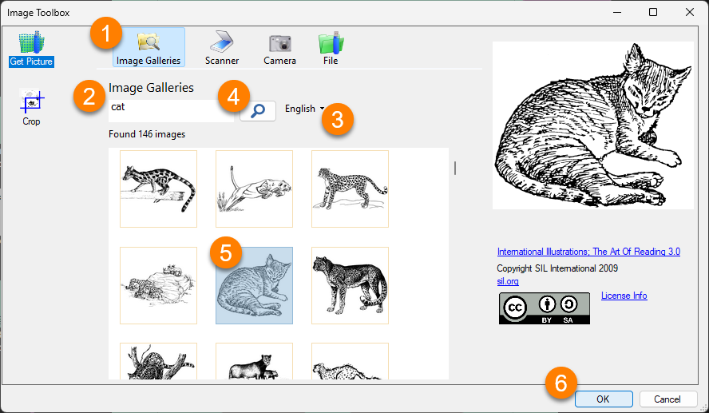

Bloom gives you multiple ways to add images to your books.

Bloom has a unique design to show where you can add an image. Whenever you see a **placeholder** with an image of a flower, you can insert an image. 

:::note

The placeholder image is never printed in the published form of a book. If you do not replace the placeholder flower with another image, the published book will have a blank space there. 

:::

# Using the Image Toolbox {#848d5a8d84334d7a9fa320482f84b876}

Bloom allows you to add images using several methods. Most of them use the **Image Toolbox**.

To access the Image Toolbox:

1. Hover your mouse over the an image box.
2. Click the **Change Image** button that appears.

	

:::note

You can open the Image Toolbox by clicking the **Change Image** button even if you have already replaced the placeholder with an image. 

:::

The Image Toolbox gives you several methods for inserting images:

1. **Image Galleries** are searchable collections of images in a special format that Bloom understands. You can [install the free Art of Reading collection](/install-art-of-reading) from SIL International, or you may have another image collection available to you.
2. A **scanner** directly attached to your computer.
3. A **digital camera** directly attached to your computer.
4. A **file** in your computer’s file system.

We will focus on the **Image Galleries** and **File** methods below. 

## Add an Image From an Image Gallery {#de4d254b555a4c378a635319b1973cc1}

In this section, we will show how to add an image from the free **Art of Reading** image gallery from SIL International. (If you do not have the Art of Reading installed, you can find instructions on how to install it in [Install Art of Reading](/install-art-of-reading).)

1. In the _Image Toolbox_, click on the **`Image Galleries`** tab.
2. Type a **keyword** into the search box.

	:::note
	
	The **Art of Reading** images are searchable in **English, Arabic, Bislama, Chinese, French, Hindi, Indonesian, Portuguese, Russian, Spanish, Swahili, and Thai**.
	
	Search terms can be in any of the languages listed above.
	
	:::
	
	

3. To change the language you are using to search, click the **drop-down arrow next to the name of the search language**. For instance, if your search term is **“cat”**, the search term language should be **“English”**.
4. Click the **search icon** **🔎** (or press the **Enter** key). Bloom will show you all the images that have been tagged with that keyword.
5. **Select an image** from the results returned.
6. Click **`OK`** to insert the image into your book.

Bloom automatically changes the size of the image so that it fills up the box where the image has been placed.

## Add an Image From a File {#a119c4a3de514c99a6d347ef2db5a2fc}

You can use the Image Toolbox to browse to any location on your computer where an image is stored and insert it. Here are the steps to do this:

1. Click **`File`** in the `Image Toolbox`. Bloom will open a standard file browsing window.

	

2. Go to the **folder** where the picture is stored (for example: the Pictures folder).
3. Click on an **image** to select it.
4. Click **`Open`**. Bloom will show the image in the `Image Toolbox`.

	

5. Click **`OK`** to add the image to your book.

	

:::note

If you need to crop an image, see [Crop an Image](/crop-image).

:::

