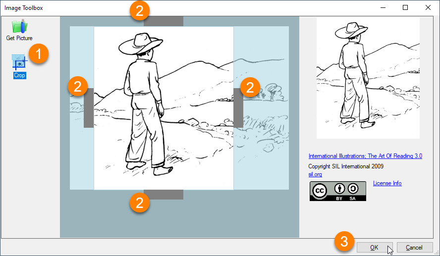

Sometimes an image has extra elements that you do not want to include in your book. Any time that you cut down an image to show less of it, you **crop** the image. You can use the Bloom Image Toolbox to crop your image.

:::note

Bloom does not provide any other tools for editing images. If you need to edit your images, use an image editing program and then add the image to Bloom. 

:::

1. Click the **`Crop`** button on the left side of your **Image Toolbox**. Bloom will highlight the image, with four grey **crop bars** along the borders.
2. **Click and drag** the **four crop bars** toward the center of the image to change how much of the image will show in your book.
3. Click `OK` to add the image to your book.

	

