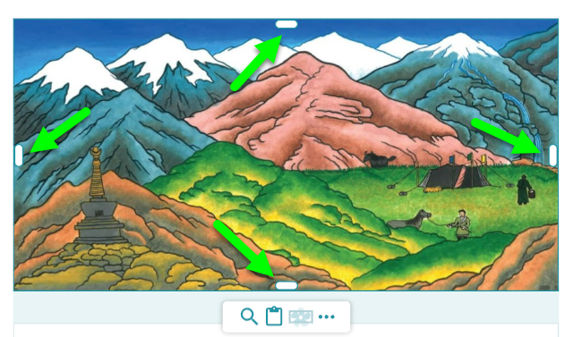
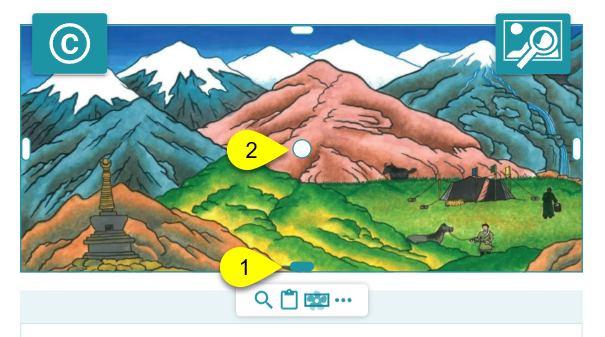

To crop an image, you begin by selecting the image by clicking on it. 

## Crop Image {#2a14bb19df128057b154d7b9bcecbd15}

After selecting the image, you will see white crop handles on all four sides of the image: top, bottom, right, and left:

Click the Crop handle you want and **drag it toward the middle** of the image. 

After cropping on one side, the Crop handle will turn blue (1), and a Move handle (2) will appear: 

## Remove Crop {#2a14bb19df12805195f7e4a312f41108}

To remove a crop, click the blue Crop handle and drag it back outward toward the edge of the image until it turns white.

## Move Image {#2a14bb19df1280eab152d9ad0f2db729}

Click the Move handle and drag up or down to change which portion of the image is shown.

## Reset Image {#2a14bb19df1280368f4aff45bade51fc}

If you wish to undo all cropping and return to the original image, select the image, then:

1. Click the **`…`** button.
2. Click **`Reset Image`**.

