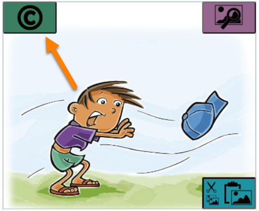
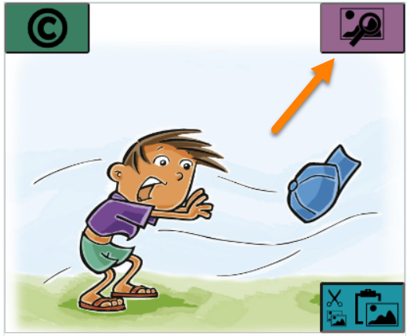
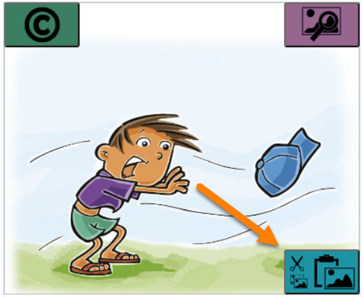
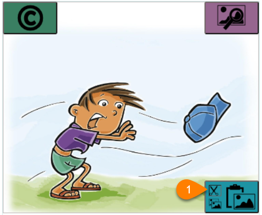
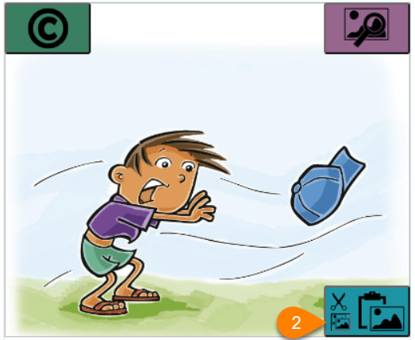
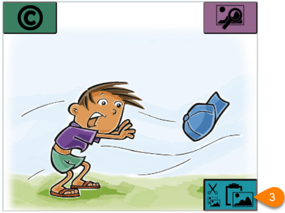
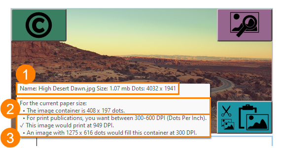
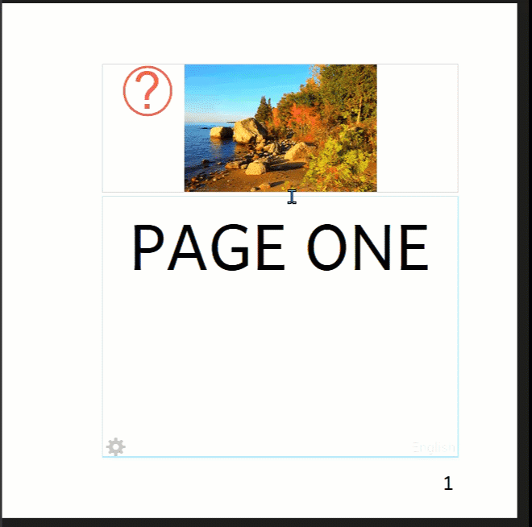

When you place your cursor over an image, three buttons appear in the corners of the **image container** (the box on the page that holds the image).

# Credits, Copyright & License {#9d6aea0701c143b4b00eb587da0f324e}

In the upper-left is the `Edit Image Credits, Copyright, & License` button. Clicking this button will open the image copyright and license dialog box (see [Image Copyright and License Information](/image-copyright-license)):

# Change an Image {#449f7fd569d64a57947f71a510ff1f31}

In the upper-right is the `Change Image` button. Clicking this button will open the Image Toolbox (see [Add an Image](/add-image)):

# Cut and Paste an Image {#58625cb2f6d54fe3a51c956c18a91d2c}

The last three buttons are combined in one block in the lower right corner:

1. The `Cut Image` button will remove the image from the image container and place it in your computer’s clipboard:

	

2. The `Copy Image` button will leave the image in its place, and also put a copy of the image on your computer’s clipboard:

	

3. `Paste Image`: The Paste button will paste an image on your computer’s clipboard into the image container:

	

# The Image Information Panel {#75d9722d1f454776b0669b142d26221e}

After you insert an image into a page, Bloom can show you a panel of information about the picture and the image container it fills.

To see the image information panel, hover your mouse over the image:

Here are the parts of this information panel:

1. **Information about the image:** its filename, disk size, and dimensions.

	:::note
	
	In the example above, the image is in a file called “High Desert Dawn.jpg”, which is 1.07 megabytes (mb) in size. The image is 4,032 dots (pixels) wide and 1,941 dots (pixels) in height.
	
	:::
	
	

2. **Information about the image container:** The image container is the box on the page that is filled by the image. In this example, the image container is 408 dots (pixels) wide and 197 dots (pixels) high. (Note that the image container size is specific to the paper size: if you increase the paper size, Bloom will make the image container larger to fill the page.)
3. **Information about the image in the image container:** Bloom reminds you that for print publications, the image should print at 300-600 dots per inch (DPI). Bloom also tells you the resolution at which this image will be printed, and the optimal pixel size for the image.

	:::note
	
	In this example, the image will print at 949 DPI — more than enough. (In fact, the image could be reduced to a pixel size of 1275 x 616, which would reduce the disk space occupied by the book without sacrificing quality.) 
	
	:::
	
	

# Resize an Image on a Page {#636cb3ce40044815a206c15e5ba30996}

Bloom automatically resizes an image to fill the box where you place it. You can change the size of an image by changing the size of the image box that holds it. 

1. Place your mouse cursor at the edge of the image box. A red line will appear.

2. Click and drag the red line. Bloom will automatically adjust the size of the image box and the other elements (usually a text box) on the page.

:::note

Bloom helps you choose a consistent size for the image box by making it easy to pause at certain points, such as **⅓**, ½, and full width. 

:::

