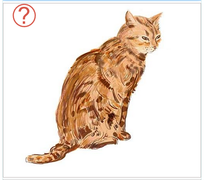
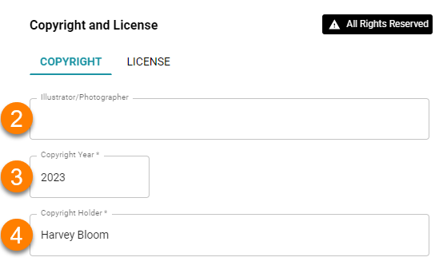
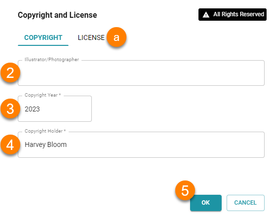
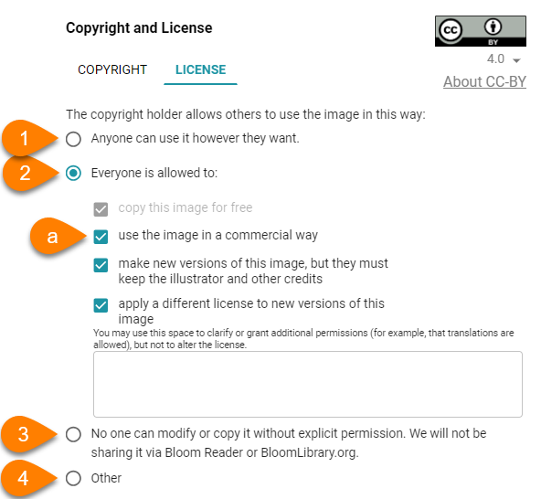
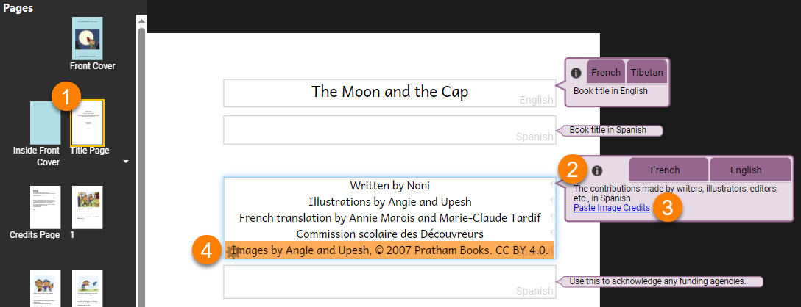

Bloom lets you record copyright and licensing information for **each** image in your book.

:::info

It is very important that each image in your book have accurate copyright and licensing information! This is **especially** important if you want to share your book with others or publish it on Bloom Library. 

For more information on copyright and licensing, see [Permission to Publish: Copyrights, licensing, and attribution in Bloom Library](/permission-to-publish). 

:::

If an image does not have copyright and licensing information, Bloom will show a red question mark in the image's upper left-hand corner. 

# Add Copyright and License Information {#29da870e4af24d8c856a949b7106da43}

To add copyright and license information to an image, do the following: 

1. Hover your mouse over the **red question mark ❓**.
	- Then click on the **green button** that appears. Bloom will show you the `Copyright and License` dialog box.

	

2. `Illustrator/Photographer`: Type the name of the **illustrator or photographer** (optional).

	:::note
	
	This is a field for the **illustrator or photographer’s name**, which may be different from the copyright holder’s name.
	
	:::
	
	

3. `Copyright Year`: Type the **copyright year** for this image.
4. `Copyright Holder`: Type the name of the **copyright holder**.

	

5. Click `OK` to add the information to your image
	1. Or click on the `LICENSE` tab to change the license information.

	

### License Information {#9f9ef49d46324a31bee445f2fdf1081a}

:::note

License information is optional: Bloom adds an **All Rights Reserved** license by default.

:::

There are multiple license options for images:

1. To let anyone use this image freely, choose `Anyone can use it however they want.`
2. You can also share with a [Creative Commons CC-BY](https://creativecommons.org/share-your-work/cclicenses/) license.
	1. Check/uncheck the checkboxes to customize the Creative Commons license for this image.
3. By **default**, Bloom will **restrict** this image from being modified or copied.
4. `Other`: You can also set your own license, but this is discouraged because they are difficult to write, interpret, and enforce.

### Apply Copyright and License Information to All Images? {#f60e051f9b7c48f1b368d945c9a16ada}

After you click `OK`, Bloom will ask you if you want to apply the same copyright and license information to **all** the images in your book:

- Click `Yes` if you want to apply the same copyright and license information to **every** image.
- Click `No` if some images have **different** copyright and license information.

# Add Image Credits to Your Book’s Title Page {#f21c5a3809954b64b7cd34c7da5d880a}

You can easily add a summary of the copyright and license information for **all** the images in your book to the Title Page.

1. Go to the **Title Page** for the book.
2. Click on the information ℹ tab in the **Contributions bubble** (on the right-hand side).
3. Click on the `Paste Image Credits` link.
4. Bloom will gather the image credit information you have provided for all the images in the book and put it in this box in summary form.

# Copy Metadata to All Images in a Book {#ca042209ceef4ffd9f063f07b344db2d}

To **copy** copyright and license information to **all images** in a book, follow these steps:

1. Open the copyright window for the image you want to copy information from.
2. Check the `Copyright` **and** `License` tabs information is **correct**.
3. Click `OK`.
4. Bloom will ask you if you want to apply the same copyright and license information to all the images in your book:

- Click `Yes` if you want to apply the same copyright and license information to **every** image.
- Click `No` if some images have **different** copyright and license information.
