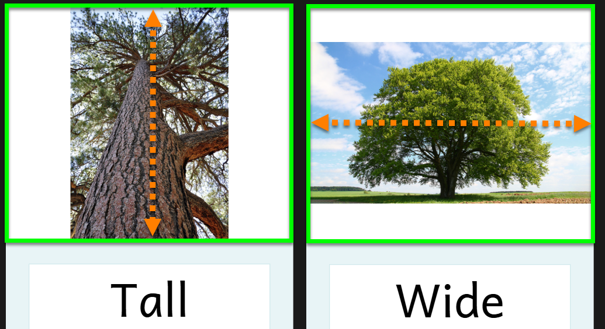
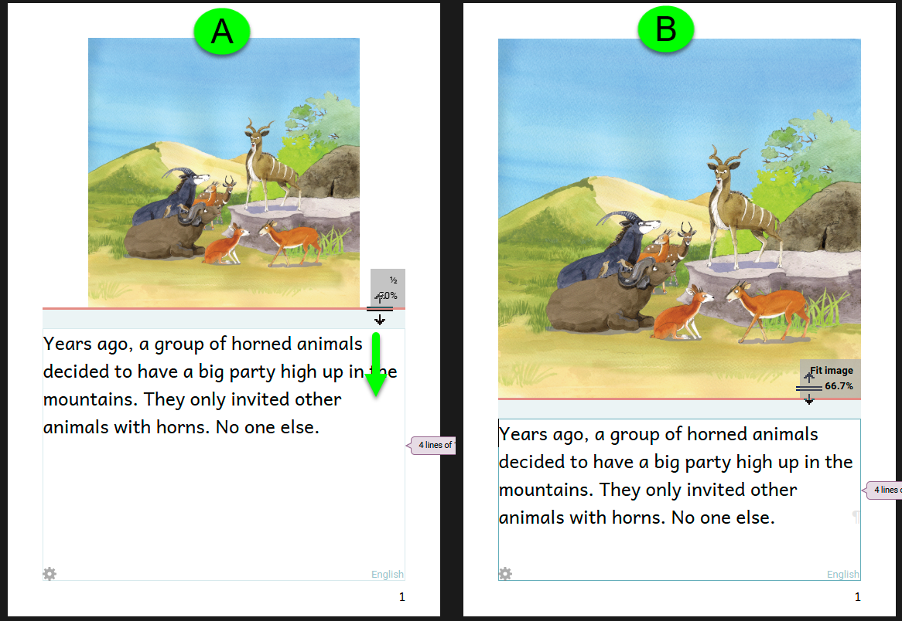
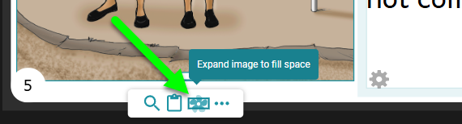
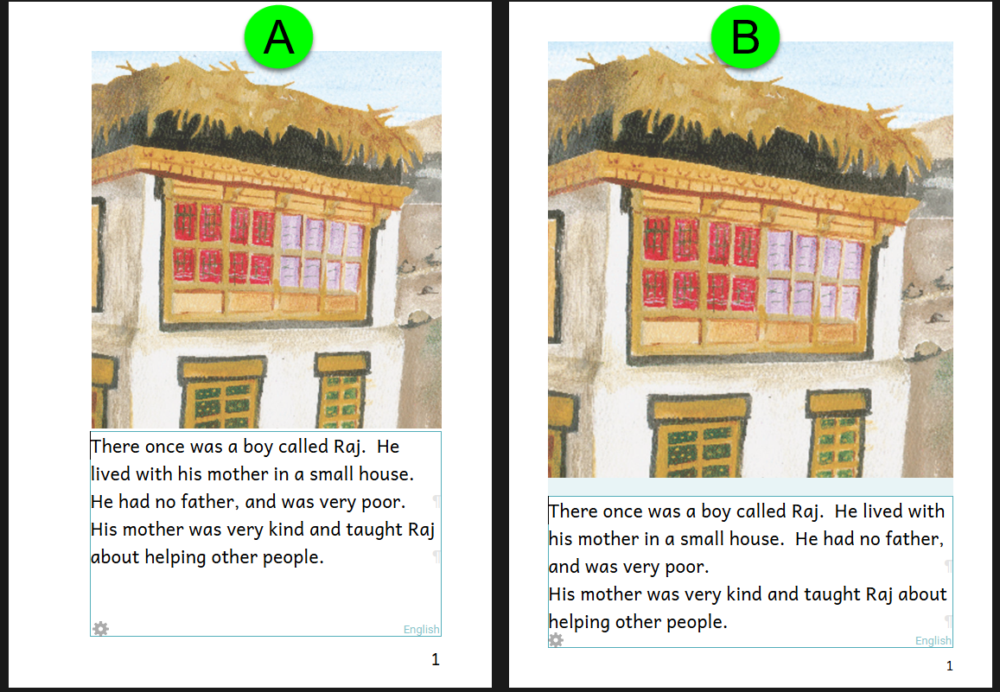

## Default Image Fill {#2a14bb19df12801f8b10e92df250ef45}

When you paste an image into an image container, the image will fill the container as much as possible, given the container's constraints.

This means that a **tall image** will expand to the full height of the container, and a **wide image** will expand to the full width of the container. The image will be centered:

For the tall image, notice that there is **white space** on the left and right sides, while the wide image has **white space** on the top and bottom.

Generally, it is best to avoid white space around your images. 

## Fit Image {#2a14bb19df128095a480e700c134a4f8}

Consider the (A) and (B) versions of this page from a book called “No Pigs Allowed”:

In version **A**, note that the image’s sides do not align with the text below it. This doesn’t look professional.

In addition, we can see that the image in version **A** is smaller than the image in **B**. Version **B** devotes more of the page’s “real estate” to the image, and so there is “more image” for readers to enjoy.

Both of these observations demonstrate that version **B** is more visually appealing than version **A**. This improvement can be achieved with an effortless adjustment:

1. Hover your mouse over the **page divider** between the image and the text box.
2. Drag the page divider down to increase the size of the image until you see the message “Fit Image”.

## Expand Image to Fill {#2a14bb19df1280469d45e37a4d0a0d84}

If the amount of text already fills the text box, adjusting the page division will not work because it will cause text overflow. In this situation, you may consider using the “Expand Image to File” option for the image.

Consider the A and B versions of this page from a book called “Big Blue Bus”:

In version A, the top and bottom of the image do not align with the frame borders (shown in light blue). But since the text practically fills the space, that space cannot be shrunk; otherwise, the text will be too crowded and may even overflow.

In this case, it may be best to choose the Expand Image to Fill Space option. This option causes the image to fill the allotted space both vertically and horizontally. In so doing, Bloom silently crops the picture to fit the space exactly (version B).

To do this:

1. Select the image.
2. Click on the icon to **`Expand image to fill space`**.

## Update older books {#2a14bb19df12808aa973cd4453060490}

If you published books to Bloom Library using a version of Bloom before version 6.0, you may consider updating and revising these books to take advantage of Bloom’s new Appearance System.

In Bloom 6.0, we introduced several changes to the default margins of books and we added padding between images and text. The result of changing from the old system to the new is very often more visually pleasing. 

Compare A (old, legacy system) with B (new appearance system):

:::tip

When updating a book to the new appearance system, you will want to take advantage of the simple tricks mentioned above: Fit Image and Expand Image to fill.

:::

